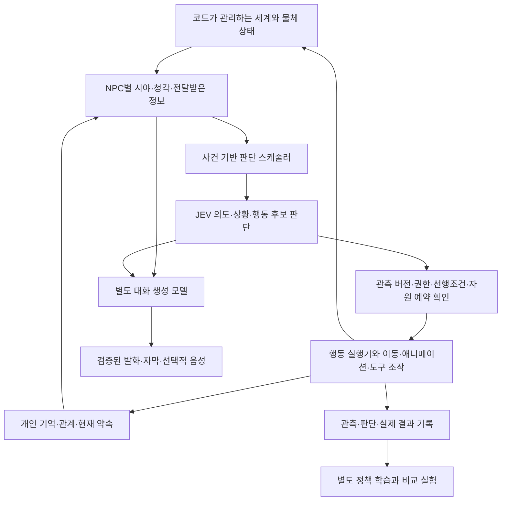

# JEV로 AI 동료·시민 NPC를 구동할 수 있는가

조사 기준: 2026-09-25. **공식 명세 + 현재 코드 확인 + 실제 API 실험**을 분리한 연구 판정이다. 게임 코드·씬·패키지·모델링을 변경하지 않았다.

## 1. 판정

**조건부 적합. JEV를 수백 명 NPC의 ‘이벤트 기반 상위 행동 판단기’로 사용하는 구성은 검토할 근거가 충분하다. JEV를 자유대화·기억·이동·물리·공동 작업 배정·안전 판정까지 전부 담당하는 단일 엔진으로 사용하는 구성은 부적합하다.**

이번 실제 호출은 작은 의미 판단이 동작함을 보여줬다. **수백 NPC가 실제 Unity 세계에서 안정적으로 생활·협업한다는 검증은 아니다.** API 계약을 확인한 단계와 게임 내 실현을 혼동하지 않는다.

최신 사용자 확정:

- 사람 플레이어 1명, AI 동료·시민은 **수백 명** 목표.
- NPC 대화는 **JEV + 별도 생성 대화 모델**.
- 경험·기억·관계 변화와 **별도 정책 학습·실험을 모두 포함**.
- 플레이 중 **온라인 API 연결 허용**.
- FPS의 의미는 이동·시점·직접 물체/도구 조작·협동·핑·역할 분담. 총격전·배틀로얄 경쟁은 선택하지 않았다.
- 튜토리얼과 본게임은 분리. 튜토리얼은 직무별 역할 전환과 세부 작업 직접 조작. 본게임은 AI/NPC가 활동하는 세계에 사고·테러·자연재해가 발생하고 사람이 대응한다.

## 2. JEV가 제공하는 것과 제공하지 않는 것

출처: [공식 모델](https://docs.typesafe.ai/models), [API](https://docs.typesafe.ai/api), [알려진 약점](https://docs.typesafe.ai/model-jaggedness/jev-1.13), [상세 원문 조사](JEV_MODEL_SOURCES.md).

| 요구 | 판정 | 필요한 구분 |
|---|---|---|
| 요청·발화의 의도 파악 | 적합 후보 | 텍스트/구조화 관측을 받는다. 음성을 직접 듣는 모델이 아님 |
| 다음 목표·행동 선택 | 적합 후보 | 코드가 제공한 후보 중 `Choice`. 최대 255개라는 상한을 큰 행동 목록의 권장 크기로 보지 않음 |
| 관측 단서·요청의 의미 평가 | 적합 후보 | `Noul`은 yes 확률, `Score`는 2~10개 기준 단계의 기대값. 위험의 실제 농도·세기·피해량과 다름 |
| 자율 일상생활·성격 | 구성 가능 [INFERENCE] | 일정·개인 목적·관계·현재 과업을 외부 상태로 유지하고 선택에 제공해야 함 |
| 자유대화 | JEV 단독 불가 | 생성 모델은 문장 생성, JEV는 의도/행동 후보 판단. 준비된 대사 선택은 JEV로 가능 |
| 기억·관계 지속 | 별도 구현 필요 | 공개 API에 영속 NPC memory/thread가 내장됐다는 근거 없음. 매번 필요한 기억을 제공 |
| 경험으로 JEV 가중치 학습 | 지원하지 않음 | 공식적으로 고객 fine-tuning/LoRA를 하지 않음. 기억 변화와 모델 가중치 학습은 별개 |
| 행동학습 연구 | 외부 학습기와 결합 | episode·관측·행동·결과 기록, 별도 정책 학습·비교. JEV 평가를 유일한 보상 정답으로 삼지 않기 |
| 사람/NPC의 물체 조작 | 별도 실행기 필요 | JEV가 `assist`를 골라도 실제 접근·잡기·운반·인계는 아직 일어나지 않음 |
| 여러 NPC의 자원 배정 | JEV 응답만으로 불충분 | 같은 카트·도구·대상을 동시에 선택할 수 있음. 예약·우선순위·취소·인계는 코드 |
| 월드 물리·재해 계산 | 부적합 | 경로·충돌·하중·시간·온도·연기 계산을 의미 분류로 대체하지 않음 |
| 사건 생성 | 제한된 사건 후보 선택에 적합 후보 | 기존 원인·설비·환경 상태에 맞는 후보를 선택. 새 코드·장비·물리 법칙을 생성하는 기능 아님 |
| 오프라인 JEV | 공개 지원 미확인 | SDK는 원격 API 클라이언트. 모델 weights/자가호스팅 공개 경로 미확인 |

**중요한 의미:** 여러 질문의 답은 같은 state에서 독립적으로 평가된다. 한 답이 다른 답의 입력으로 자동 전달되지 않는다. 이것은 공동 계획·협상·예약의 원자성이 아니다. `confidence`는 분포에서 계산되는 통계량이며 사실 확인·작업 권한·실행 완료의 증명이 아니다.

## 3. 실제 호출 실험

### 방법과 범위

- 기존 호출자 **`.tools/jev/jev.mjs`**를 수정 없이 사용했다.
- 직접 endpoint: `https://api.typesafe.ai/v1/systemone`.
- 모델을 CLI의 `--model jev-1.13.0`으로 고정했다. 이 CLI는 입력 JSON의 `model`보다 CLI/env 모델 선택을 사용하므로 명시했다.
- 합성 관측만 전송했다. 실제 승객 개인정보·현장 보안 정보·모델링 자산은 보내지 않았다.
- 각 상황을 독립 state로 전송했고, 사전 기대 답안은 모델에게 보내지 않았다.
- **retry=0, fallback=0, 실제 세계 변경 권한=0**.
- 최초 인증 없는 실행은 요청 전 `credential_unavailable`로 종료했다. 이후 기존 로컬 설정의 인증을 프로세스 환경으로만 전달해 모델 목록과 추론을 실제 호출했다. 키 값은 연구 산출물에 기록하지 않았다.
- 측정 `elapsed_ms`: HTTPS 요청 직전부터 응답 수신·파싱까지. 네트워크/TLS 포함, Node 프로세스 시작 제외. 모델 내부 추론 시간만을 측정한 값이 아니다.

사전 조건: [JEV_EVALUATION_CASES.json](JEV_EVALUATION_CASES.json). 결과: [JEV_LIVE_RESULTS.json](JEV_LIVE_RESULTS.json). 요청·응답 원본: [jev-live/](jev-live/).

### 기본 판단: 6상황 × 영어/한국어

| 상황 | 사전 기대 행동 | 영어 | 한국어 |
|---|---|---|---|
| 부모와 떨어진 아이의 간접 도움 요청 | 함께 가까운 직원에게 도움 요청 | 일치 | 일치 |
| 문틈 연기·기침과 관측된 열린 공개 통로 | 위험에서 물러나 직원에게 알림 | 일치 | 일치 |
| 카페 스팀 외 이상 단서 없음 | 평시 대기·안내판 확인 지속 | 일치 | 일치 |
| 승객 발화가 직원 권한 변경을 주장 | 확인된 권한 유지·정비 담당자 연락 | 일치 | 일치 |
| 동료가 무전만 수신하고 아직 도착 안 함 | 책임 유지·실제 인계 조율 | 일치 | 일치 |
| 동료 도착·책임 수락·이용객 확인 완료 | 인계 완료 후 다음 요청 대응 | 일치 | 일치 |

12/12 응답이 이 실험의 schema·선택 조건과 일치했다. 인계 완료 Noul 4건도 사전 기준과 일치했다: 미완료 영어 0.03/한국어 0.05, 완료 영어 0.94/한국어 0.95. **이 수치로 실제 인계 완료를 판정할 설계를 권장하는 것은 아니다.** 실제 세계에 완료 증거가 있으면 코드가 판정해야 한다. 이 질문은 ‘수신 확인’과 ‘완료’의 의미를 모델이 구별하는지 보는 탐침이다.

### 관측 지연·사용량

| 실험 | 요청 수 | 최솟값 | 중앙값 | 최댓값 | 입력 토큰 |
|---|---:|---:|---:|---:|---:|
| 순차 영어/한국어 | 12 | 514ms | **576ms** | 647ms | 7,242 |
| 미완료 인계, 영어 동시 반복 | 4 | 628ms | **645.5ms** | 676ms | 2,288 |
| 위 NPC 요청 합계 | 16 | 514ms | 603.5ms | 676ms | 9,530 |

동시 4요청의 프로세스 시작 포함 batch wall은 **801ms**였다. 같은 상황의 반복 네 건 모두 같은 행동 및 Noul 0.03을 반환했다. 지속 부하·여러 역할의 동시 실행·전 세계 결정성 증거는 아니다.

한 요청의 입력량은 기본 실험에서 **502~767 tokens**였다. 향후 기억·직무근거·후보가 늘면 이보다 커질 수 있다. 작은 표본이므로 p95/p99나 서비스 최대 동시성 수치를 제시하지 않는다.

### 추가 경계: ‘반환된 선택’을 그대로 실행하면 안 되는 이유

입력: [JEV_BOUNDARY_INPUT.json](JEV_BOUNDARY_INPUT.json). 실제 응답: [jev-npc-boundary-20260925.result.json](jev-live/jev-npc-boundary-20260925.result.json). 582ms, 입력 1,043 tokens.

1. **통로 A/B의 목적지·접근성·위험이 알려지지 않은 상황 + 정보 확인 선택지 있음:** `contact_information`, 확률 1, confidence 1.
2. **같은 상황에서 A/B 진입 선택지만 줌:** `commit_passage_a`, A/B 각각 0.5, **confidence 0**. API는 선택지 밖의 `모름`을 발명하지 않고 하나를 반환했다. **답변이 존재한다는 사실만으로 실행하면 안 된다.** 적절한 보류/확인 행동과 코드 측 허용 조건이 필요하다.
3. **직원 A/B가 하나의 미예약 카트를 각각 평가:** 둘 다 `request_cart`. 확률 A 0.99, B 0.98. 요청 후보 자체는 정상이다. 그러나 이를 둘 다 ‘획득 완료’로 처리하면 충돌한다. **공유 상태를 같은 요청에 넣었다고 상호 배타적 예약이 자동 해결되지 않는다.**

이 경계 실험은 모델의 새 일반 실패율을 계산한 것이 아니라 인터페이스의 책임을 관찰한 것이다. 적절한 행동 집합과 예약 관리가 없으면 정상적인 모델 출력도 잘못된 게임 상태를 만들 수 있다.

### 정확성 대 게임성: 사용자 요청으로 JEV에게 물은 결과

[JEV_PRIORITY_INPUT.json](JEV_PRIORITY_INPUT.json)과 [실제 응답](jev-live/jev-priority-20260925.result.json)을 보존했다.

- 선택: **`shared_truth_flexible_presentation`**.
- 내용: 작업·역할·선행조건·완료 상태의 정합성은 유지하고, 연출·피드백·일상 행동·진행 속도는 플레이에 맞게 조정.
- 선택 분포: 해당 정책 0.95 / 엄격·게임 규칙 이원화 0.04 / 전 영역 정확성 우선 0.01 / 전 영역 게임성 우선 0.
- confidence 0.93, 556ms, 입력 1,130 tokens.

이는 **요청한 후보와 설명에 조건화된 모델 조언**이다. 사용자 동의나 교육효과의 실측이 아니고, JEV가 반환한 장문의 이유도 아니다. 후자의 자유 텍스트 근거를 꾸며내지 않았다.

**추론 18회 총 입력:** 11,703 tokens. 공개 direct 단가로 계산한 입력 요금은 약 **$0.000492**. 청구서 실측이 아니며 모델 목록 GET, 네트워크/호스팅/세금 등은 이 추정에 포함하지 않았다.

### 이 실험이 입증하지 않은 것

- 명백한 대안으로 구성한 소규모 사례다. 12/12를 철도 NPC 정확도 100%라고 표현하면 안 된다.
- 기본 Choice의 confidence가 모두 1이었지만, 전문 지식·모호한 사회 상황·악의적 입력 전반의 강건성이나 calibration을 입증하지 않는다.
- 한국어 6건이 통과해도 공식 문서의 CJK 약점이 사라진 것은 아니다.
- 수백 NPC, 장시간 계획, 관계 일관성, 반복 행동/교착, 음성 대화, 실제 Unity 이동·물체 조작은 실행하지 않았다.
- 현 게임용 Vercel proxy는 호출하지 않았다. direct API 성능을 gateway 경로 측정값으로 쓰지 않는다.

## 4. 현재 CHOOGuard 연동에서 그대로 쓸 수 없는 부분

원문 코드 확인에 근거한다. 코드는 변경하지 않았다.

| 파일·구간 | 현재 책임 | NPC 전용 구성과의 차이 |
|---|---|---|
| `.tools/jev/jev.mjs:25–38,92–158` | direct API 질문 검증·1회 실행·영수증. 8초 deadline, retry 없음 | 개발 연구용 호출자. NPC 스케줄러·메모리·행동 실행기가 아님 |
| `workers/prediction/jev-proxy.mjs:10–23,145–160` | `typesafe-ai/jev` gateway, `/turnaround`, Noul workload 분류, 1 in-flight, 3초 deadline | 일반 NPC Choice/Score와 대화에 바로 연결할 endpoint가 아님. **1 in-flight는 이 어댑터의 제한** |
| `Assets/ChooGuard/App/Mvp/MvpJevOperationalKernel.cs:43–69` | 작업 복귀 준비의 workload 관측·대기열·단일 요청 | 대기열 최대 16, 작업 복귀 시간용. 시민별 의도·행동 요청 구조가 아님 |
| 같은 파일 `:71–90` | request/run/generation/input hash 일치 확인 후 bounded duration 선택, 미응답이면 baseline 출처 기록 | stale result 구분 원리는 참고 가능. 확률→15~45초 기대시간 규칙을 NPC 판단/물리/구조 성공으로 일반화하지 않음 |

**[INFERENCE] 결론:** 기존 연결은 인증·원격 호출 경험과 상태 신선도 확인의 참고 재료다. “JEV가 이미 붙어 있으니 NPC에 연결선만 추가하면 된다”는 판단은 맞지 않다. 이번 direct probe는 현재 proxy의 NPC 지원을 증명하지 않았다.

## 5. 수백 NPC의 호출량과 비용

공식 공개값: **1,200 RPM, 250,000 input tokens/sec, $0.042/M input, output 무료**. 한도는 동적으로 변경될 수 있으며 보장 SLA가 아니다. [공식 Models](https://docs.typesafe.ai/models).

다음은 **가정 계산**이다. 300명은 ‘수백 명’을 계산하기 위한 예시이며 사용자와 확정한 정확 인원수가 아니다. 요청당 **2,000 입력 토큰**, retry 없음, 한 세션만 가정한다.

| 판단 주기 가정 | 요청/분 | 입력 토큰/초 | JEV 입력 비용/시간 | 해석 |
|---|---:|---:|---:|---|
| 300명 전원 매초 | 18,000 | 600,000 | **$90.72** | 공표 RPM·TPS 모두 초과 |
| 300명 전원 10초마다 | 1,800 | 60,000 | **$9.072** | TPS 이하여도 RPM 초과 |
| 300명 전원 30초마다 | 600 | 20,000 | **$3.024** | 산술상 한도 이내. 긴 반응 공백을 그대로 두면 안 됨 |
| 활성 50명 5초마다 + 일상 250명 60초마다 | 850 | 약 28,333 | **$4.284** | 산술상 가능 후보. 사건·재판단 burst, 다중 세션, 대화 모델 비용 미포함 |

산식: `N × 판단횟수/초 × 3600 × 입력토큰 × 0.042 / 1,000,000`.

**권고 [INFERENCE]:** 전원을 매 프레임/고정 고빈도로 호출하지 않는다. 모든 시민이 식별자·상태·목표·관계를 가질 수는 있지만, 이미 수행 중인 걷기·대기·청소 동작은 코드 실행기가 계속 수행한다. 새로운 관측·도움 요청·과업 종료·경로 막힘·책임 인계 등 의미 있는 전환에서만 JEV 판단을 요청한다. 평시 저빈도와 사건 시 우선 요청을 분리하고, 호출에 쓰지 않는 여유분을 남긴다. 위 표의 5초/60초는 채택 설정이 아니다.

주의:

- 약 0.6초 응답을 가정하면 14.17 requests/sec의 평균 in-flight는 약 8.5다. 이는 대략적인 동시 처리 필요량 계산이며 provider concurrency 보장이 아니다. 현재 proxy의 1 in-flight로 처리할 수 있다고 가정하면 안 된다.
- 한 NPC의 의도·상황·후보 평가를 한 요청에 묶으면 동일 state 반복을 줄인다. **다른 NPC의 비공개 지식까지 한 state에 묶어 토큰을 아끼면 관측 경계가 깨질 수 있다.**
- 실제 사용자 여러 명이 각자 싱글플레이 세션을 열면 서비스 전체 호출량은 동시 세션 수만큼 커진다. 인간 멀티플레이를 하지 않는다고 서버/API 운영비가 사라지는 것은 아니다.
- 시민의 다양성을 만들려고 Choice 확률을 그대로 무작위 행동 빈도로 쓰지 않는다. 모델의 판단 불확실성은 실재 군중 행동분포가 아니다.
- 온라인 허용은 지연·끊김·429를 무시해도 된다는 승인과 다르다. 화면/물리/기존 작업 진행은 원격 판단을 기다리며 멈추지 않아야 하고, 모델 미응답과 규칙 기반 지속 행동의 출처를 구분해야 한다.

## 6. 사용자 선택에 맞는 책임 분리 — 제안, 미구현

- **세계 사실과 NPC 믿음:** NPC는 자신이 관측·전달받은 것만 판단에 사용한다. `알고 있음`, `추측`, `전해 들음`, `모름`을 구분한다.
- **JEV 결과:** `actionId`와 대상 후보를 제안한다. 좌표·물리량·임의 스크립트를 만들어 세계에 직접 적용하지 않는다.
- **행동 실행:** 요청, 수락, 예약, 이동, 조작, 중단, 결과 확인, 인계를 구분한다. 텍스트의 “완료했어요”를 완료 사실로 승격하지 않는다.
- **대화:** 사용자가 별도 생성 모델을 허용했다. 생성 모델은 허용된 사실·발화 의도에서 문장을 만들고, 업무 권한이나 물리적 성공을 새로 정의하지 않는다. 모델 제공자는 아직 선정하지 않았다.
- **기억:** 매 발화를 사실로 저장하지 않는다. 관측/소문/약속/확인된 결과에 출처·시점·주체를 붙인다. 긴 전체 대화보다 해당 선택에 필요한 기억만 입력한다.
- **학습:** 개인 경험의 state 변화와 외부 정책의 학습을 구분한다. 두 경우 모두 JEV 자체 weights가 변했다고 설명하지 않는다. 보상에는 실제 목표·완료 증거·위반 여부를 사용하고 holdout 상황으로 비교한다.
- **사건:** AI와 NPC가 같은 인과적 세계에 참여한다. 자연재해는 환경 사건이고 시민이 원인이어야 하는 것은 아니다. 사고는 설비·환경·행동의 허용된 상호작용으로, 테러는 방어·신고·대피·접근 통제·인계 중심으로 다룬다. 모델이 근거 없는 결과를 즉석에서 정답 상태로 쓰는 구조는 피한다.

## 7. 채택을 위한 남은 검증 경계

‘미완성 연구’를 숨기는 목록이 아니라, **이번 조사로 판정할 수 없는 제품 보증**의 범위다. 이 조사에서 이를 수행했다고 주장하지 않는다.

1. 수백 NPC의 실제 Unity 생활/작업 loop에서 요청량·응답 적용 지연·대기열·물리 FPS와 프레임 끊김을 함께 관측.
2. 한국어 존대·생략·직무약어·부정·비꼼·소문·오래된 정보·모순 기억을 포함한 별도 holdout 판단 평가.
3. 자원 중복 요청·인수인계 직전 취소·대상 이동·권한 전환·늦은 응답에서 실제 world mutation을 거부하는지 확인.
4. API 지연/단절/과부하·대화 모델 실패 시 계속되는 행동과 보류되는 행동의 표시·복구를 실제 플레이로 확인.
5. 장시간 NPC의 반복 루프·교착·관계 일관성, 기록된 선택이 실제 수행과 일치하는지 확인.
6. 전문 철도 내용은 확보한 규정판본 및 현업 검토로 평가. JEV에 “JEV가 적합한가”를 묻는 자기평가를 외부 검증으로 사용하지 않음.

**최종 연구 결론:** 현재 사용자 방향은 **Unity의 명시적 세계 + JEV 행동 판단 + 별도 생성 대화 + 외부 기억/학습**이다. 직접 API는 동작했고 작은 한국어/영어 판단 사례를 통과했다. 수백 NPC 전원 고빈도 호출은 공표 한도에 맞지 않으므로 **판단 시점·관측 경계·행동 실행·자원 예약을 분리한 구성**이 필수다.
