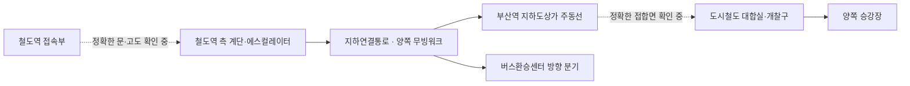

# 부산역 철도역–도시철도 실제 연결 복원

2026-09-21 사용자 교정 반영. 현재 상태: **자료 기반 새 통로 모듈 제작, 실제 씬 접속은 미확정**. 기존 `Exit6→작성 통로→승강장`은 실제 연결 복원으로 인정하지 않는다. 캐릭터 통과는 해당 프로토타입의 충돌 검증에 한정한다.

## 확보한 실제 자료

| 자료 | 확인한 내용 | 적용 한계 |
|---|---|---|
| [부산시 2019-06-28 개통 발표와 원본 HWP](https://www.busan.go.kr/nbtnewsBU/1382448) | 2019-07-01 개통, 광장 지하를 관통하는 연결통로, 위치도 및 양방향 내부·철도역 측 사진 | 2026년의 변경 여부와 양 끝 문 좌표는 별도 확인 |
| [2018-405호 실시계획 변경 고시](https://eum.go.kr/web/gs/gv/gvGosiDet.jsp?mobile_yn=&seq=387876) 첨부 PDF 2쪽 | 주통로 길이99.6m·내부 폭8m·내부 높이4.37m. 별도 출입구 길이23.7m·내부 폭3m·내부 높이5m. E/S1200형2기,800형2기,E/V1기,M/W2기 | 3쪽의 관계도면은 게재 생략. 내부 높이는 지하 깊이가 아님 |
| [부산시설공단 2021년 광고시설물 위치도 원본 HWP](https://bisco.or.kr/Web-App-BSMA/download.asp?idx=29116) | 치수 있는 실제 평면도. 지하도상가 접속, 긴 통로 양쪽 무빙워크, 버스환승센터 분기, 철도역 측 계단·에스컬레이터, 승강기와 기능실 위치 | 상세 CAD 치수와 그림 추적치를 구분. 단면·절대고도 없음 |
| [부산역 지하도상가 공식 안내도](https://www.bisco.or.kr/undershop/images/map_n24/busan_main.png) | 상가 주동선에서 `부산역 연결통로`가 분기. 상가 출구1–8 | HTTP 수정일2024-07-01. 방위·축척·도시철도 개찰구와의 접합면 생략 |
| [도시철도 부산역 공식 안내도](https://www2.humetro.busan.kr/servlet/DownloadServlet?file_name=113.gif&file_name_origin=113.gif&upload_dir=stationmap) | 상대식 승강장, 상부 대합실·개찰구·계단·승강기, 도시철도 출구1–7 | 배포 중인 공식 그림이나 작성일·축척·상가 접속 상세 없음 |
| [2019년 현장 사진 기사](https://www.newsbusan.com/news/view.php?idx=3475) | 철도역·도시철도 방향 표지, 실제 실내 연결, 무빙워크와 버스 방향 분기 | 사진 모음이며 끊김 없는 보행이나 현재 상태의 증거는 아님 |

2013년 계획의85.8m와 준공 이후99.6m를 혼용하지 않는다. 부산시설공단 `present_form.pdf`는 파일 생성일2020-03-11이며, 검색엔진의 최근 색인 날짜를 현장 갱신일로 쓰지 않는다. 에스컬레이터 총4기를 철도역 쪽4기로 배치하지 않는다. 평면도 철도역 측은 중앙2기와 양옆 계단으로 판독되며, 나머지 설비 배치는 별도 판독 대상이다.

## 실제 동선 구조

도시철도 출구 번호와 지하도상가 출구 번호는 서로 다른 체계다. 예를 들어 지하도상가8번을 도시철도8번으로 자동 치환하지 않는다. `출구6의 목적지=부산역광장`이라는 설명은 지하연결통로의 실제 배치·형상을 증명하지 않는다.

## 현재 제작물

Astra low가 평면도 치수와 공식 내부 사진을 기반으로 로컬 통로 모듈을 새로 제작했다. 주통로 내부 폭8m/높이4.37m, 양옆 무빙워크 배치, 중앙 보행·점자 유도선, 벽·천장 패널을 모델링했다. CAD 표기의 전체99.571m, 무빙워크 구간50.800m와 발표문의 반올림 수치를 분리 기록했다. 도면을 따라 추적한 평면 위치는 실측치로 승격하지 않는다.

- 모형·렌더·치수 및 객체별 출처: `.planning/2026-09-21-fps-reposition/actual-transfer/model/`
- 철도역 측 고저차, 버스 분기의 수직 형상, 기능실과 승강기 상세는 미확정 도형으로 별도 보존하고 FBX에서 제외했다.
- 월드 위치·지하 깊이·기존 모델 접속은 적용하지 않았다. 현재 Unity 씬의 임의 연결 통로가 이 모듈로 대체됐다는 뜻이 아니다.

## 다음 구현의 조건

1. 도면의 지하도상가 접속부와 도시철도 대합실의 실제 접합을 대조한다.
2. 철도역 쪽 정확한 접속 위치·문·단차를 도면과 관찰 자료로 확정한다.
3. 출처가 다른 역사·도시철도 모델의 기준점을 따로 검증하고, 실제 연결망에 맞춰 배치한다.
4. 자료가 빠진 높이·방향을 편의상 조절하거나 벽을 뚫어 보행 통과만 만들지 않는다. 확인 사실·사진 기반 추정·미확정을 모델 명세에서 구별한다.
5. 위 구조를 먼저 수용한 뒤 Unity에서 실제 경로·충돌·시야를 검수한다. 전체 게임 및 현장 물리 정확도는 여전히 NOT_A다.

영상 후보2건은 스트림403으로 프레임을 확인하지 못했다. 영상 제목·썸네일을 동선 관찰로 바꾸지 않았다. 원본·해시·실제 판독·부족한 구간은 `actual-transfer/root-evidence-graph.json`, `official-metro/source-graph.json`, `walk-evidence/source-graph.json`, `model/model-graph.json`에 보존한다.
