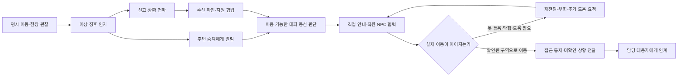

# 부산역·KTX 현장 대응 FPS 제안

2026-09-21 조사·제안. 실제 게임 구현 완료나 현행 부산역 내부 매뉴얼 인증을 뜻하지 않는다.

권장하는 중심 경험은 **역무 직원이 현장을 관찰하고, 정보를 전달하고, 사람을 움직이고, 결과를 확인하는 FPS**다. 이동·시점·상호작용의 접근성은 대표 FPS에서 가져오고, 할 수 있는 일과 완료 조건은 철도 대응 역할에서 가져온다. 매뉴얼을 기억하는 효과는 플레이 과정에서 발생한다. 별도 복기 화면·퀴즈·학습 모듈은 추가하지 않는다.

사용자 확정 범위는 싱글플레이, 코레일 역무 직원, 부산역·KTX 및 도시철도 부산역의 환승 통로·인접 선로다. 부산교통공사의 설비와 업무는 해당 직원 NPC와의 인계로 연결한다. 도시철도 전체 노선 확장은 포함하지 않는다. 기존 RTS 기관 지시 화면과 남포·북항 도시 운영 범위는 이전 설계 이력이다.

**찾은 자료는 역할과 장소에 따라 다르게 사용한다.** 코레일 자료 8개, 게임 6종의 공식 자료 13개, 내부 공간 후보 8개를 출처 그래프로 정리했다. 영상의 실제 관찰 구간과 문서 페이지를 기록했으며, 자료 개수 자체를 충분한 정확도의 증거로 삼지 않았다.

| 자료 | 직접 확인한 내용 | 이번 설계에서의 용도와 한계 |
|---|---|---|
| [코레일 철도안전관리체계 프로그램, 2017 변경승인본](https://info.korail.com/mbs/www/jsp/contents/images/2017_26.pdf), PDF 166–167·인쇄 14–15쪽 | 터널 여객열차 화재 F133의 초기대응팀, 인접역, 소방·경찰 등 역할 분리 | 신고·대피 지원·외부기관 인계 구조의 근거. 여러 직종의 초기대응팀 전체를 역무원 한 명으로 합치지 않는다. 현재 부산역 역사 매뉴얼로 취급하지 않는다. |
| [KOTI 연구에 수록된 코레일 2013 매뉴얼 비교표](https://www.codil.or.kr/filebank/original/RK/OTKCRK180540/OTKCRK180540.pdf), PDF 104·인쇄 80쪽 | 역무원의 전파, 방송, 피난 유도, 담당 방재업무, 게이트·접근 통제 | 플레이 동사 후보를 뽑는 역사적 2차 근거. 현재 설비 조작권, 방송 문안과 부산역별 경로는 추가 확인 대상이다. |
| [코레일 2022 안전한국훈련 영상](https://www.youtube.com/watch?v=xo5sFNFlLwM), 01:28–02:16 | 금정터널 KTX 지진·화재 가정에서 운영자 초기 대응→초기대응팀→유관기관→시설복구 | NPC가 도착·행동·인수하는 인계 흐름의 관찰 근거. 터널 지형과 업무를 부산역에 그대로 복사하지 않는다. |
| [2015 부산역 대테러 합동훈련 보도](https://www.nspna.com/country/?mode=view&newsid=149961) | 부산역 직원 초동조치 후 경찰특공대·탐지견의 대응 | 부산역에 실제 있었던 훈련 사례. 직원이 폭발물을 탐지·해체하는 역할이라는 근거는 없다. 세부 초동조치나 현재 절차까지 확정하지 않는다. |
| [행정안전부 2026 철도 위험물 사고 훈련](https://www.mois.go.kr/frt/bbs/type010/commonSelectBoardArticle.do?bbsId=BBSMSTR_000000000008&nttId=126762) | 기관사·철도 초기대응팀·소방·경찰의 역할과 수습 단계 | 사고 주체가 다른 경우에도 역할 경계를 유지해야 한다는 비교 근거. 화물열차 절차를 여객역에 대입하지 않는다. |

현재 부산역 역무원의 최신 내부 절차 전체는 확보하지 못했다. 따라서 아래 내용은 확인된 공통 역할과 사례를 바탕으로 한 게임 설계 제안이다. 구체적인 조작권·전파 문안·안전거리·집결지·운행 재개 조건을 새로 만들어 공식 절차라고 제시하지 않는다.

**대표 게임이 현실을 게임 규칙으로 바꾸는 방식에서 다음을 가져온다.** 공식 문서·개발자 설명을 분석한 결과이며, 해당 게임들을 이 환경에서 직접 실행해 입력 지연이나 현재 버전의 모든 동작까지 재현한 결과는 아니다.

| 레퍼런스 | 현실 개념 → 게임의 추상화 | 우리 게임의 입력·제약·피드백 |
|---|---|---|
| [PUBG 이동](https://support.pubg.com/hc/en-us/articles/360002074913-What-are-the-basic-game-commands)·[핑](https://pubg.com/en/news/1725) | 몸의 이동과 위치 전달 → 간결한 이동 조작, 가리킨 위치의 공유 | 현장을 직접 보고 위치를 지정해 보고한다. 보고 내용은 관찰한 사실과 불확실성을 구분하고, 수신 NPC의 복창으로 전달 결과를 확인한다. |
| [PUBG 공간 압박](https://pubg.com/en/game-info/overview) | 시간이 지나면 선택지가 줄어드는 압박 → 이동 경로의 가치 변화 | 연기·혼잡·통제 상태 때문에 사용할 수 있는 동선이 달라진다. 시간을 쓰면 무엇이 바뀌었는지가 공간에 보이게 한다. 파란 원이나 임의 체력 감소를 화재 물리 모델로 사용하지 않는다. |
| [서든어택 전투 화면](https://guide.sa.nexon.com/guide/31)·[청각/무전 기능](https://guide.sa.nexon.com/guide/48) | 이동 중 주의 배분 → 짧은 상태 표시와 소리·무전 단서 | 중앙 상호작용 표시, 현재 행동, 필요한 통신만 간결하게 배치한다. 경보·방송·승객 호출은 방향과 한국어 자막으로 함께 전달한다. |
| [Ready or Not 공간 제작](https://voidinteractive.net/vol-82-ready-or-not-development-briefing/)·[NPC/경로 변수](https://voidinteractive.net/vol-90-ready-or-not-development-briefing/) | 문·시야·통로와 사람의 반응 차이 → 경로 선택과 가변적 NPC 행동 | 먼저 문턱·통로·시야·NPC 추종을 검증한다. 승객이 못 들었는지, 길이 막혔는지, 일행을 기다리는지 관찰할 수 있게 한다. 경찰의 수색·제압 업무는 역무원 임무로 옮기지 않는다. |
| [Alien: Isolation의 시스템적 행동](https://blog.playstation.com/2014/10/07/alien-isolation-out-today-on-ps4-ps3/) | 불완전한 정보 속 판단 → 소리와 반응을 이용한 추론 | 플레이어가 모든 위험 위치와 사람 수를 처음부터 알지 못한다. 직접 본 정보, 무전으로 들은 정보, 확인된 정보를 구별한다. |
| [Half-Life: Alyx의 공간 상호작용](https://www.half-life.com/en/alyx) | 도구의 형태와 손의 행동 → 눈앞 물체의 사용 가능성이 보이는 조작 | 무전기·방송 설비·문·차단 도구가 실제 위치에 있다. 가까이 보고 조작하며, 손이 닿지 않거나 벽 뒤인 대상은 사용할 수 없다. VR 손동작 전체를 데스크톱에 강요하지 않는다. |
| [Firefighting Simulator의 동료와 장비](https://www.astragon.com/news/detail/firefighting-simulator-the-squad) | 협업·준비 조건 → AI 동료의 이동과 실제 작업 | 직원 NPC는 요청을 받았다고 즉시 완료되지 않는다. 수신→이동→수행→결과 확인이 보인다. 소방관 장비·권한 전체를 역무원에게 부여하지 않는다. |

게임의 재미는 장비를 많이 누르는 횟수보다 **어디로 가서 무엇을 확인하고, 어떤 정보를 누구에게 전달하며, 어느 사람부터 도울 것인지**에 둔다. 같은 출입구라도 시야·혼잡·동료 위치가 달라지면 판단이 바뀐다. 승객은 모두 비이성적으로 뛰는 군중으로 만들지 않고, 이해 여부·이동 제약·동행자·보유 정보에 따라 반응하게 한다.

보고는 긴 문서 작성 화면이 아니라 짧은 현장 행동으로 만든다. 예를 들어 보이는 위치를 가리켜 무전을 시작하면 장소가 붙고, 목격한 상태를 전달한다. 불확실한 신고를 금지하거나 정확한 원인 확인을 위해 접근을 강요하지 않는다. 부족한 정보가 있으면 상대가 현장에서 추가 확인을 요청한다. 이 입력 방식은 설계 제안이며 실제 코레일 정형 문안을 확인했다는 뜻은 아니다.

**첫 미션은 역사 출입구·맞이방 인접 구역의 연기 신고와 대피 협력을 우선 제안한다.** 역사적 자료에서 역무원의 행동 범위가 비교적 구체적이고, 신고·방송·동선 판단·NPC 협업·접근 통제를 하나의 사건 안에서 경험하게 할 수 있다. 다만 공간이 검증된 구역부터 묶고, 화재 원인과 위험 수치를 현재 참조 홀 결과로 대신하지 않는다.

첫 제작본은 이 흐름이 실제로 한 번 작동하는 짧은 구간으로 만들고, 이후 사용자가 정한 20–30분 한 판으로 확장한다. 시간을 채우기 위한 대기나 임의 카운트다운 대신 여러 승객 집단, 막힌 통로, 통신 확인, 인계 상황이 플레이 시간을 만든다.

이 그림은 단일 정답 버튼 순서가 아니다. 허용된 병행 행동과 상황별 선행 조건을 표현하는 내부 실행 그래프다. 안내 요청만 했는데 NPC가 갇혀 있으면 완료되지 않고, 잘못 전달된 위치는 복창에서 드러나며, 길이 막히면 이동·호출·무전으로 다시 판단한다. 이런 장면 자체가 매뉴얼을 떠올리고 적용하는 경험이 된다. 끝에 별도 복기 기능을 붙이지 않는다.

| 플레이 선택 | 눈앞에서 보여줄 결과 | 잘못된 학습을 피하는 조건 |
|---|---|---|
| 위치와 목격 사실을 분명하게 전달 | 담당자가 같은 위치를 복창하고 그곳으로 움직임 | 관찰하지 않은 발화 원인·피해 규모를 자동 확정하지 않음 |
| 통로를 확인하고 사람을 안내 | 시야와 경로가 이어지는 승객이 실제로 따라옴 | 지시 입력이나 타이머 만료만으로 대피 완료 처리하지 않음 |
| 통제 지점을 맡길 동료 선택 | 해당 직원의 도착과 통제 행동이 보임 | 세계 어디서든 즉시 업무가 완료되는 RTS식 버튼을 남기지 않음 |
| 이동이 어려운 승객을 발견하고 도움 연결 | 필요한 지원이 도착하며 다른 승객 동선도 조정됨 | 자격·장비 없는 위험한 구조 행동을 강제하지 않음 |
| 전문 대응자 도착 시 상황 인계 | 알려진 상황·미확인 사항을 받은 NPC가 후속 역할을 수행 | 대피 완료를 화재 진압·의료 회복·운행 재개와 동일시하지 않음 |

후속 사건 후보는 부산역 의심물품 상황과 KTX 재난 상황이다. 전자는 실제 부산역 훈련 사례의 직원 초동조치→전문기관 인계를 살리고, 후자는 승무원·기관사·역무원의 서로 다른 역할을 협업으로 표현한다. 현재 확보한 터널 지진·화재 영상을 역사 내 현행 절차로 복사하거나 역무원 한 명이 모든 역할을 맡게 하지 않는다. 도시철도 연결 구간에서도 플레이어의 소관이 자동 확장되지는 않는다.

**Jev는 위 후보를 실제 출처 요약과 비교했다.** 054 호출은 현장 협업 중심 루프, 현재 역할·권한의 근거 보완, 실제 월드 결과에 의한 완료 판정을 선택했다. 055 호출은 첫 후보로 역사 화재·대피를 선호했고, 도면으로 확인된 모듈을 정합해 확장하는 공간 제작과 현장 안에서의 수정 피드백을 선택했다. 첫 후보의 출력은 선택 확률 0.93·confidence 0.89였으나 이는 모델의 비교 출력이며 정확도나 학습 효과의 측정치가 아니다. 왕복 시간은 각각 1.980초와 1.103초였다.

실시간 Jev의 제안 역할은 혼잡 변화·지시 전달 지연·지원 소요 같은 불확실한 값을 내부 계산에서 보조하는 것이다. 렌더링과 플레이어 이동은 네트워크를 기다리지 않는다. 출처가 정한 행동 제약과 실제 이동·수신·작업 완료는 결정론적 실행 기록으로 확정한다. Jev가 매뉴얼의 정답을 새로 만들거나, 보지 못한 상황을 확정하거나, 버튼 클릭을 실제 행동의 완료로 바꾸지 않는다. 새 FPS 연결은 아직 구현·보정되지 않았다.

**학습과 최신 기술에 관한 근거도 효과의 범위를 나누어 해석했다.** Chittaro의 2024 보조 대피 게임 연구와 저자 발표는 인쇄물보다 지식 유지에 유리한 결과를 보고한다. 이는 플레이 기반 학습을 지지하는 선행 근거이지, 우리 게임의 현장 수행 효과를 입증한 결과는 아니다. [논문](https://pubmed.ncbi.nlm.nih.gov/37405887/), [저자 발표](https://www.himss.org/sites/hde/files/proffesor-luca-chittaro-virtual-reality-and-serious-gaming-for-health-lessons-from-aviation-safety.pdf)

반대로 2025년 VR 정보 계층 연구에서는 34명 중 다수가 문 표시를 도움이 된다고 느꼈지만, 세 가지 상황 중 두 가지에서 이동 시간·거리가 길어졌다. 따라서 과도한 레이더·정답 경로·전지적 위험 표시를 추가하는 것을 곧바로 학습 개선으로 보지 않는다. 관찰 가능한 정보와 간결한 피드백을 우선한다. 데스크톱 FPS에 그대로 같은 효과가 난다고 주장하지 않는다. [연구](https://doi.org/10.1016/j.array.2025.100457)

사진·영상 복원에서는 [VGGT](https://arxiv.org/abs/2503.11651), [MASt3R-SLAM](https://arxiv.org/abs/2412.12392) 같은 공개 기하 복원 기술을 후보로 검토한다. 얻은 카메라·점군은 벽·바닥·문을 재구성할 입력으로 사용하고, 실제 도면 치수와 기준점으로 축척을 고정한다. 영상에서 보이지 않은 방이나 절대 층높이가 자동으로 증명되는 것은 아니다. 이 프로젝트의 M1 환경에서 실행 성능이나 공간 정확도를 확인하기 전에는 ‘가장 최신이므로 바로 정밀한 디지털 트윈’이라고 평가하지 않는다.

**부산역 내부는 입점 매장 도면부터 연결할 수 있다.** [원 설계자 Grid-A의 B&C 부산역점 자료](https://grida4u.com/2022/12/19/bc%EC%A0%9C%EA%B3%BC-%EB%B6%80%EC%82%B0%EC%97%AD%EC%A0%90/)에서 평면도·천장도·입면도와 사진 34장을 확보했다. 도면에는 57.0㎡, 약 7.49×8.127m의 치수 사슬, 입면 높이 3.47m와 인접 계단·방화문 관계가 보인다. 도면은 1층, 소개 메타데이터는 2층으로 적혀 있어 현재 층과 위치를 독립 사진으로 맞추기 전에는 역사 전체의 확정 구조로 확대하지 않는다. 제안 도면이라는 사실도 유지한다.

| 공간 | 확보 상태 | 다음 제작 단위 |
|---|---|---|
| 부산역 외관·광장 | 공식 원본을 Unity에 반영한 이력이 있음 | FPS 시점의 실제 충돌·출입구·지면 지지 확인 |
| 매장 내부 | 치수 있는 원 설계 제안 도면·사진 확보 | 원점 분리 매장 모듈 제작, 현재 위치 확인 후 결합 |
| 대합실·3층 | 완전한 현행 측정 도면은 미확보 | 공통 기둥·문·계단이 겹치는 사진/영상 구간부터 복원, 미관찰 구역과 구분 |
| KTX-산천 | 사용자 제공 BVE 원본에서 10량 편성과 일반실의 좌석·통로·승강구를 변환·시각 확인 | 실제 미터 축척·문 개구부·승강장 높이·캐릭터 통과를 Unity에서 확인 |
| KTX 참고 자료 | [코레일 공식 VR](https://info.korail.com/info/contents.do?key=1512)의 KTX·산천 각 7개 파노라마와 [산천 시설 배치도](https://info.korail.com/info/contents.do?key=1504) | 모델의 정확한 차종·개정 상태와 객실 설비를 대조 |
| 도시철도 부산역 | 사용자 자료의 부산역 구간, 공식 출구·대피 도식, 플랫폼 모델 확보 | 광장→4/6번 출구→대합실→개찰구→승강장을 연결. 지하 제작 높이와 측량 높이를 구분 |

입수한 BVE 자산은 원본 크레딧과 수정·재배포 조건을 함께 보존한다. 로컬 파일을 검사·변환한 사실을 서비스 배포 권한까지 확보한 것으로 표시하지 않는다. 현재 도시철도 지상 0·대합실 -3.5·승강장 -8m는 연결용 제작값이다. 정차 위치와 일반 역 위치처럼 의미가 다른 기준점의 차이를 측량 오차라고 단정하지 않는다.

첫 구축 묶음은 **검증한 부산역 구역–환승 구간–KTX 객실의 1인칭 이동과 상호작용, 그리고 하나의 연속 대응 미션**으로 유지한다. 작은 스토리 수십 개로 나누지 않는다. 지금 확보한 모델이나 연구 자료만으로 FPS 게임·훈련 정확도·품질 A가 완성된 것은 아니다. 실제 통행, NPC 행동, 역할에 맞는 명령, 끊김 없는 입력과 원인에 맞는 결과를 확인하면서 이 제안을 구현한다.

추적 자료: `.planning/2026-09-21-fps-reposition/`의 `korail-training-source-graph.json`, `fps-benchmark-source-graph.json`, `tenant-interior-source-graph.json`, `ktx-interior-source-graph.json`, `fps-ktx-import-graph.json`, `fps-metro-import-graph.json`, Jev 054·055 응답 파일. 기존 RTS 검증은 FPS 검증으로 재사용하지 않는다.
