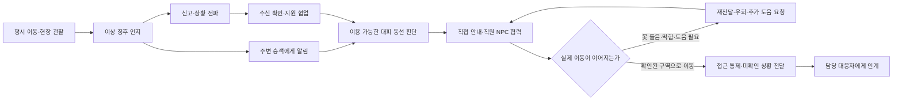

# 본편 미션 설계

2026-09-24 · CS-EXEC.01.01 · 품질 영역 **G1**의 정본 문서 · 담당 Adrianaline

이 문서는 새 설계를 제안하지 않는다. [`FPS_RESEARCH_PROPOSAL.md`](FPS_RESEARCH_PROPOSAL.md)(2026-09-21)의 제안과 그 문서가 인용한 Jev 054·055 판정을 **채택 기록으로 고정**해, G1이 평가할 대상을 확정한다.

`TUTORIAL_MAINTENANCE_DESIGN.md`가 G9의 정본인 것과 같은 자리다. 제안만 있고 채택 기록이 없으면 평가를 시작할 수 없다 — A-FPS-1 루브릭도 같은 이유로 `A-FPS-1-PROPOSED` 상태에 멈춰 있었다.

## 1. 확정

| 축 | 확정 내용 | 근거 |
|---|---|---|
| 플레이어 | 역무 직원 1인. 1인칭 | `MVP_DIRECTION.md` |
| 동사 | 관찰·신고·전달·유도·접근 통제·인계 | `FPS_RESEARCH_PROPOSAL.md` |
| 첫 미션 | **역사 화재·대피** | Jev 055 — 선택 확률 0.93, confidence 0.89 |
| 루프 형태 | 현장 협업 중심 | Jev 054 |
| 완료 판정 | 실제 월드 결과 | Jev 054 |
| 후속 후보 | 부산역 의심물품 상황, KTX 재난 상황 | `FPS_RESEARCH_PROPOSAL.md` |

Jev 판정은 모델의 비교 출력이며 정확도나 학습 효과의 측정치가 아니다. 이 문서는 그것을 방향 결정의 근거로만 쓴다.

## 2. 첫 미션의 실행 그래프

`FPS_RESEARCH_PROPOSAL.md`의 그래프를 그대로 채택한다.

**이 그림은 정답 버튼 순서가 아니다.** 허용된 병행 행동과 상황별 선행 조건을 나타내는 실행 그래프다. 안내 요청만 했는데 NPC가 갇혀 있으면 완료되지 않고, 잘못 전달된 위치는 복창에서 드러나며, 길이 막히면 다시 판단한다.

`H` 분기가 이 미션의 중심이다. 지시를 입력했는가가 아니라 **사람이 실제로 움직였는가**를 본다.

## 3. 완료 판정 규율

튜토리얼 계층이 이미 이 규율로 서 있다(`TutorialSession.Advance()`가 효과 적용 후 월드를 다시 읽어 커밋한다). 본편도 같은 규율을 쓴다.

| 하지 않는 것 | 대신 |
|---|---|
| 지시 입력을 완료로 처리 | 승객이 확인된 구역으로 실제 이동 |
| 타이머 만료를 대피 완료로 처리 | 미도달 인원이 0 인지 월드에서 확인 |
| 세계 어디서든 즉시 완료되는 RTS식 버튼 | 요청받은 직원 NPC의 도착과 행동이 보임 |
| 대피 완료를 진압·의료 회복·운행 재개와 동일시 | 각각을 별개 결과로 유지 |

마지막 줄이 특히 중요하다. 대피가 끝났다고 불이 꺼진 것이 아니다.

## 4. 플레이 선택과 그 결과

`FPS_RESEARCH_PROPOSAL.md`의 표를 채택한다. 오른쪽 열은 **잘못된 학습을 만들지 않기 위한 금지 조건**이다.

| 플레이 선택 | 눈앞에서 보여줄 결과 | 금지 |
|---|---|---|
| 위치와 목격 사실을 분명하게 전달 | 담당자가 같은 위치를 복창하고 그곳으로 움직임 | 관찰하지 않은 발화 원인·피해 규모를 자동 확정하지 않음 |
| 통로를 확인하고 사람을 안내 | 시야와 경로가 이어지는 승객이 실제로 따라옴 | 지시 입력이나 타이머 만료만으로 대피 완료 처리하지 않음 |
| 통제 지점을 맡길 동료 선택 | 해당 직원의 도착과 통제 행동이 보임 | 세계 어디서든 즉시 완료되는 버튼을 남기지 않음 |
| 이동이 어려운 승객을 발견하고 도움 연결 | 필요한 지원이 도착하며 다른 승객 동선도 조정됨 | 자격·장비 없는 위험한 구조 행동을 강제하지 않음 |
| 전문 대응자 도착 시 상황 인계 | 알려진 상황·미확인 사항을 받은 NPC가 후속 역할을 수행 | 대피 완료를 진압·의료 회복·운행 재개와 동일시하지 않음 |

## 5. G1이 요구하는 세 세션과의 대응

> G1 PASS: 재난 1종과 테러 관련 대응 1종을 포함하는 릴리스 미션 집합. 정상·경로 차단·통신 지연/누락 변형이 플레이 가능하고 교정 가능해야 한다.

| G1 요구 | 배정 | 상태 |
|---|---|---|
| 재난 1종 | 역사 화재·대피 (첫 미션) | 설계 확정, 미구현 |
| 테러 관련 1종 | 부산역 의심물품 상황 | 후보, 설계 미착수 |
| 변형 — 정상 | 화재·대피의 기본 흐름 | 설계 확정, 미구현 |
| 변형 — 경로 차단 | 그래프의 `H → I` 경로(막힘) | 설계 확정, 미구현 |
| 변형 — 통신 지연/누락 | 그래프의 `H → I` 경로(못 들음) | 설계 확정, 미구현 |

의심물품 상황은 2015년 부산역 합동훈련 사례를 근거로 삼되, **직원이 폭발물을 탐지·해체하는 역할이라는 근거는 없다**(`FPS_RESEARCH_PROPOSAL.md`). 직원 초동조치 후 전문 대응자 인계까지가 범위다.

KTX 재난 상황은 승무원·기관사·역무원의 서로 다른 역할을 협업으로 표현하는 후보이며, 역무원 한 명이 모든 역할을 맡지 않는다.

## 6. 튜토리얼 계층과의 연결

`layer_coupling = state_carryover`(0.63)에 따라, 튜토리얼 결과가 본편 초기 조건이 된다.

이미 구현된 쪽: `TutorialCarryoverStore`가 설비별 결과(판정·교체 여부·점검표 부착·인계 결과 확인)를 남긴다.

**아직 없는 쪽:** 본편이 그 기록을 읽는 경로. 예컨대 점검하지 않았거나 부적합인데 교체되지 않은 소화기는 본편 화재 상황에서 비어 있어야 한다. 이 연결이 생기기 전까지 `2026-09-24-carryover.json`의 `Carryover into live layer` 체크포인트는 `NOT_VERIFIED`로 남는다.

## 7. 현재 구현 상태 (2026-09-24 실측)

**본편은 코드가 0 이다.**

| 요소 | 상태 |
|---|---|
| 신고·무전·전달 | 없음 |
| 승객 NPC | 없음 |
| 직원 NPC 협업 | 없음(튜토리얼의 `TechnicianDispatch`는 상태 기계만 있고 몸이 없다) |
| 접근 통제 | 없음 |
| 오디오 | `AudioSource` 0건 |
| 1인칭 이동·시선·상호작용 | **있음** — `FirstPersonResponder`, `FpsInteractable`, `FirstPersonInteractionHud` |

`App/Fps/` 전체에서 신고·무전·대피·통제·승객이 걸리는 파일은 전부 튜토리얼 계층의 절차 텍스트와 감사 문구다. 본편 행동을 구현한 파일은 없다.

즉 **본편이 서 있는 것은 이동·시선·상호작용 기반뿐이고, 그 위에 올릴 미션 동사는 하나도 없다.**

## 8. 다음 작업 순서

1. **승객 NPC와 유도** — `H` 분기가 이 미션의 중심이므로, "사람이 실제로 움직였는가"를 판정할 대상이 먼저 있어야 한다. 못 들음·막힘·동행 대기를 구분할 수 있어야 한다.
2. **신고·전달과 복창** — 위치를 가리켜 전달하고 수신자가 같은 위치를 복창한다. 잘못 전달된 위치가 복창에서 드러나는 것이 이 미션의 학습 지점이다.
3. **오디오** — 경보·방송·승객 호출을 방향과 한국어 자막으로. G3 요건이기도 하다.
4. **직원 NPC 협업과 인계** — `TechnicianDispatch`의 수신·이동·수행·결과 주기를 본편 인계로 확장한다. 몸을 주는 작업과 함께 간다.
5. **이월 연결** — 본편이 `TutorialCarryoverStore`를 읽어 초기 조건으로 삼는다.

## 9. 현재 판정

**G1: NOT_VERIFIED.** 이 문서로 평가할 대상이 생겼으나, 본편 행동이 한 줄도 구현되지 않았으므로 PASS와는 거리가 멀다. 설계 문서가 생긴 것과 플레이가 되는 것은 다르다.
