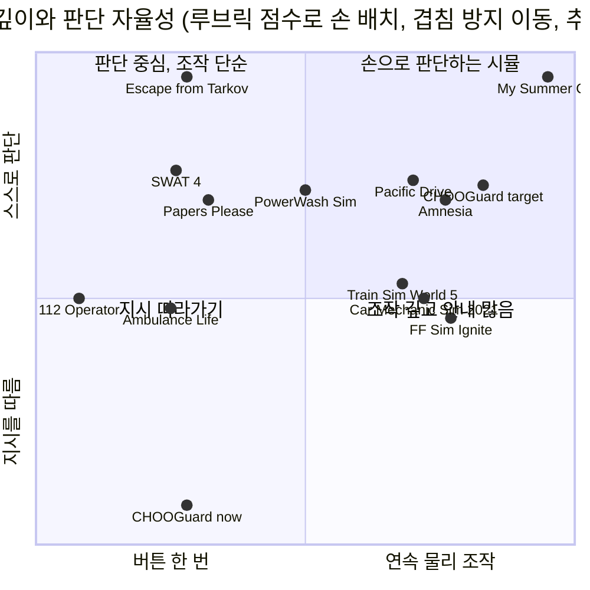
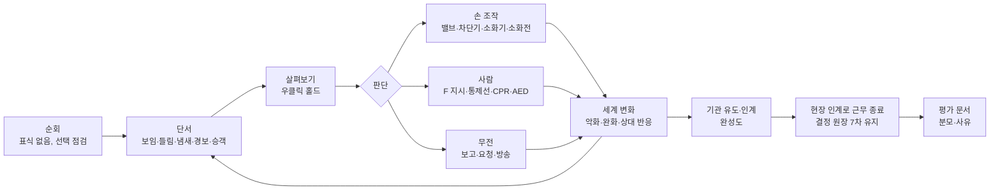

# CHOOGuard 조작·진행 방식 재제안 — 손 조작 시뮬레이션 정밀 벤치마크

기준일 2026-10-04. 출발점은 사용자 플레이 피드백 "복잡한 조작이나 게임보다는 지시대로 진행하는 수준"과 후속 요청 "마이썸머카 같은 시뮬레이션 게임들을 선행조사·정밀분석해서 벤치마킹한 게임조작법이나 방법을 다시 제안해"다. **2026-10-05 사용자가 "진행해"로 승인했다: §12 권장안 D1–D7을 채택하고 S1·S2를 구현했다(§13 구현 상태, 결정 원장 9차). S3·S4는 플레이테스트 뒤에 한다.**

- 게임별 상세 근거(출처표·조작표·프레임 시점·적용표): `.planning/2026-10-04-sim-controls-benchmark/findings-A.md`~`findings-D.md`
- 현행 코드 진단과 교차검증·국내 공개 행동요령: 같은 폴더 `findings.md` §0·§2·§3
- 증거 표기: **[공식]** 개발사·스토어·패치노트·공식 문서·공식 소스, **[2차]** 위키·가이드·커뮤니티, **[관찰 URL t=mm:ss]** 영상 프레임을 직접 확인, **[추론]** 해석·제안. 타 게임 영상·프레임은 저장소에 커밋하지 않았다(`.planning/**/media/`는 git 제외).

---

## 0. 결론

**왜 지시를 따르는 느낌인가.** 현행 근무는 `인지 → 무전 보고 → (방송) → 기관 도착 → 현장 인계 E → 종료`의 사다리이고, 각 칸의 정답이 다섯 곳에서 미리 주어진다. ① 상호작용 프롬프트가 정답 행동 이름을 말하고 맞을 때만 뜬다(`가스 중간밸브 잠그기`). ② 역무실 무전 답변이 보고마다 다음 할 일을 명령한다. ③ Q 무전 휠은 지금 맞는 다음 문장만 보여 준다(오답 없음). ④ Tab 상황판이 ○/● 조치 체크리스트다. ⑤ 길 안내가 기본 켜져 있다. 여기에 조작은 약 30개 중 25개가 E 한 번이고, 실패·체력·평가가 없으며, 방치해도 역무실·시민·기관이 대신 신고·처리하고 기관 도착 100초 뒤 자동 종료된다. (§1, 코드 근거)

**벤치마크 18종이 공통으로 하는 것.** 정답 행동을 문장으로 알려 주지 않고 **대상의 이름과 상태만** 보여 준다(MSC 커서 아래 부품 이름, TSW `Master Key  Off`). **도구·손이 대상에 맞는지만** 검증한다(MSC는 규격 맞는 렌치일 때만 볼트가 초록). **연속 입력이 물리 상태를 만든다**(MSC 휠 틱, Amnesia 마우스 원 그리기로 밸브). 결과는 **나중에, 세계를 통해** 돌아온다(MSC 덜 조인 바퀴가 주행 중 빠짐, PS:PO 사후 `Justified:` 한 줄). 안내는 **꺼낼 수 있는 문서·계기·노브**이고(PD 해금형 매뉴얼, Hitman `FULL/MINIMAL/OFF`), 평가는 **항목·분모·사유가 있는 문서**다(SWAT 4 `Report status to TOC 7/7`, Ignite 3체크). 정답 이름이 붙은 프롬프트·다음 단계 체크리스트는 이들 게임에서 **튜토리얼이나 보조 모드에만** 있다(Ignite, Ambulance Life, PS:PO). (§3·§4)

**재제안 요약.**
1. **손 조작 문법**: E 탭=손으로 집기·누르기, **E 홀드=손잡이를 잡고 마우스로 돌리기·당기기**(밸브·차단기·문·소화전 밸브), 휠=미세 조정, 좌클릭=든 도구, **우클릭 홀드=살펴보기**, **F=사람에게 손짓·지시**, C=웅크리기. 부분 상태(반만 잠긴 밸브)가 존재하고 결과는 세계로 드러난다. (§5·§6)
2. **표시는 이름+상태**: 중앙 프롬프트에서 정답 동사를 없애고, 조작 가능 여부는 손 모양 글리프로만 알린다. 처음 만난 설비는 공개 행동요령 카드가 수첩에 해금된다. (§6.1·§8)
3. **보고는 내가 본 사실로 조립**: 무전 휠은 항상 같은 `보고/요청/방송/응답` 전체 목록(오답 포함). 역무실은 **접수와 자기 조치만** 말하고, 내가 요청하지 않은 기관은 오지 않으며(시민 신고·역무실 지연 신고는 별개), 틀린 요청은 엉뚱한 출동과 지연으로 돌아온다. (§6.9)
4. **사람을 직접 다룬다**: 손짓으로 대피 방향 지정, 차단봉·라바콘을 들고 직접 통제선 설치, 쓰러진 사람은 반응·호흡 확인 → 지정 요청(119·AED) → 리듬 가슴압박 → AED 음성 지시에 따른 패드·분석·충격. (§6.6~§6.8)
5. **대신 해 주던 것을 줄이고 결과를 만든다**: 근무는 지금처럼 현장 인계로 끝나되(결정 원장 7차), 인계 없이 100초 만에 끝나던 자동 종료는 늦추고 '인계 실패'로 기록한다. 역무실 자동 신고는 현장 응답이 없을 때만 늦게 한다. 기관은 보고 정확도·안내·인계 품질에 따라 늦거나 빨라진다. 연기·열 노출은 기침·시야·움직임으로 드러나고 한계에서 현장 이탈. (§7)
6. **안내 수준 노브(견학/표준/실전)와 근무 평가 문서**: 표준은 위 1~5를 적용, 견학은 현행 안내를 유지. 종료 화면은 인계 기본점+비례 항목+결과 기준 감점+사유 줄, 분모는 **플레이어가 지각한 것만**. (§8·§9)

결정이 필요한 항목은 §12다(기본 안내 수준, 사망 결과, 등급 표시, 놓친 위험 공개, 첫 구현 범위, 4차 HUD 결정 변경, 근무 종료 방식).

---

## 1. 현행 진단 — 코드 근거

경로 접두 `Assets/ChooGuard/App/Fps/`. 원 감사 결과는 `findings.md` §0.

| 원인 | 코드 | 플레이어가 겪는 것 | 벤치마크의 대조 |
|---|---|---|---|
| 상호작용 계약이 탭 하나 | `IFpsInteraction.cs:3-8`(`CanInteract`/`TryInteract`), E 상승 에지 `FirstPersonResponder.cs:130-132` | 홀드·드래그·조준·타이밍을 표현할 수 없음. 약 25개 조작이 E 한 번 | Frictional: 같은 LMB 홀드가 문·레버·휠마다 다른 마우스 제스처 [공식 AMfP 매뉴얼] |
| 프롬프트=정답, 맞을 때만 표시 | `Equipment/Kitchen/GasValvePoint.cs:44`, `FirstPersonResponder.cs:161-167`, `Emergency/Responders.cs:212` | 무엇을 할지 고민할 필요가 없음 | MSC: 커서 아래 부품 이름만, 맞는 공구일 때만 초록 [관찰 ZVpLCoOwHBs t=2:25] |
| 역무실이 다음 할 일을 명령 | `Emergency/Hazards.cs:268-269`(`초기 진화 가능하면 시도하고 무리하지 마십시오.`), `:560-562`, `FacilityHazards.cs:406,475`, `IncidentDirector.KitchenGas.cs:169,181,193` | 무전이 곧 퀘스트 로그 | SWAT 4 TOC: `Roger that. Trailers standing by.` 확인응답만 [관찰 TiuBdq7O5XE t≈2:16] |
| 무전 휠에 오답이 없음 | `IncidentDirector.cs:522-537`, 재구성 `EmergencySession.cs:338-344` | 고르는 행위가 판단이 아님 | PS:PO 방사형은 해당 없는 위반까지 전부 나열 [관찰 p46792Lsswo 22:30]; 112 Operator CPR 안내에 틀린 선택지 [관찰 Tj9O-DDGXHY t≈28:33] |
| ○/● 조치 체크리스트 | `IncidentDirector.cs:878-891` | 남은 정답 단계가 보임 | Hitman `MINIMAL`의 체크리스트 잔존이 불만 [2차 Steam 토론]; Phasmophobia 저널은 플레이어가 직접 체크 [2차 위키] |
| 길 안내 기본 켜짐 | `Shell/GameSettings.cs:31` | 현장 찾기가 사라짐 | Squad `Hide Objective Indicators` [공식 Mission Update #1]; Tarkov 목표 마커 없음 [관찰 eEx40JSuDKU t≈2:23] |
| 대신 처리·자동 종료 | `IncidentDirector.Facility.cs:381-396`, `Responders.cs:273-283`, `IncidentDirector.cs:176-182` | 손 놓아도 근무가 끝남 | SWAT 4·RoN: 미완 상태로 끝내면 점수로 깎임 [공식 매뉴얼; 관찰 BRw8-_1WinI `End The Mission?`] |
| 실패·평가 없음 | 비네트만 `Hud/GameHud.cs:192-194`, `Emergency/ShiftLog.cs:348` `No score` | 잘했는지 알 수 없음 | Ignite 종료 카드 3체크 [관찰 OqOfD9CK3iU t=7:36] |

**이미 깊이가 있어 살릴 것**: 소화기(안전핀 0.8 s 홀드·조준 거리/각도/불 아랫부분·14 s 약제·숨은 불량, `StaffTools.cs:15-47,274-336`), 약제 규칙(`FireHazard.Oil.cs:41-53`)과 살아 있는 공급원(`FireHazard.Feed.cs`), 옥내소화전 30 m 줄·전기에 물=감전(`StaffTools.cs:349-376`), 분전반 메인/분기·잠금표·재투입 재발화(`IncidentDirector.ElectricPlaza.cs:259-312`), 시야 기반 발견(`IncidentDirector.cs:456-477`), 환자 0–4단계(심정지 포함, `IncidentDirector.Casualty.cs:42-79`).

---

## 2. 조사 범위와 방법

| 레인 | 게임(버전·확인일) | 무엇을 정밀 분석했나 | 직접 본 결정적 프레임(예) |
|---|---|---|---|
| A 손 조작 정비 | My Summer Car(1.0 2025-01-08), My Winter Car(EA 2025-12-29, v.260917-01), Car Mechanic Simulator 2021(1.0.40), Pacific Drive(v1.15.0) | 손/도구 모드, 볼트 규격 게이팅, 휠 틱, 지연 결과, 검사 영수증, 정보량 난이도, 해금형 매뉴얼, 진단 문장 빌더 | MSC 볼트 초록 t=2:25, CMS `part not discovered` t=0:18, PD Tinker `Submit Diagnosis? You have 5 guesses remaining.` t=1:12 |
| B 물리 손·운전실·잔여 피드백 | Amnesia TDD/AMfP/Bunker(Frictional), Train Sim World 5(+6 화면), PowerWash Simulator, Escape from Tarkov(1.1.x) | 홀드+마우스 제스처, 이름+값 툴팁, 어시스트 프리셋, 잔여 하이라이트·ding, 정보 정밀도 단계, 노-HUD | Frictional 레버·밸브 t≈1:37–1:46, TSW `Master Key  Off→On` t≈0:21, PWS `Rail Cleaned! +$10.00` t≈6:14 |
| C 현장 대응 | Firefighting Simulator The Squad / Ignite(2025-09-09, Update #9), Ambulance Life(Patch 1.4), Police Simulator: Patrol Officers(1.0 2022-11-10), Arma 3 ACE3 3.21 + KAT/KAM AED | 호스·노즐·소화전, 연기 노출·웅크리기, 집중검사 홀드, CPR 4가지 입력 모델, AED 음성 절차, 사건 완료도 막대, 결과 중심 평가 | Ignite 종료 카드 t=7:36, Ambulance Life CPR 확인창 ≈48:31, PS:PO `Justified:` 23:10, KAT AED 단계 ≈1:06:15 |
| D 절차·판단·보고 | SWAT 4, Ready or Not(v1.4.3a), Papers, Please, 112 Operator(+911 Operator), Hitman WoA, Phasmophobia | 보고=지각 대상+입력, 확인응답, 분모 사후 공개, 오답 포함 선택지, 원인만 알리는 사후 통지, 안내 노브와 보상 배율 | SWAT 4 디브리핑 ≈3:09, RoN 점수 화면 ≈3:50, 위반 통지서 ≈0:12, 112 `DUTY SUMMARY` ≈19:00 |

- Main 교차검증: MSC t=2:25, RoN 점수 화면, Ignite 종료 카드 프레임을 직접 열람했고 Frictional 제스처 문장을 공식 매뉴얼 PDF에서 직접 추출했다(`findings.md` §2).
- 역무원 동사의 현실 근거는 국내 공개 행동요령으로 확인했다: 소화기(행정안전부), 옥내소화전(국민재난안전포털), 가스 누출(한국가스안전공사), 심폐소생술·AED(보건소 공개 자료, 2025 가이드라인에 대한 질병관리청 2026-01-29 카드뉴스) (`findings.md` §3).
- 한계: 직접 플레이하지 않았다. 영상은 ≤480p라 작은 글자는 확대 판독했고 일부 키 바인딩은 2차 표다. 소리는 듣지 못했다. 손맛 수치(이득·데드존·저항)는 프로토타입에서 맞춰야 한다. 관찰 프레임 일부는 표의 버전과 다른 빌드다(MSC는 2022 업데이트 영상, Tarkov는 0.12.12, TSW는 TSW6 시대 Class 375/3, RoN 점수 화면 하나는 2023-12 빌드). 각 레인 파일의 '미확인' 절을 따른다.

---

## 3. 비교 분석

### 3.1 루브릭 점수 [추론: 아래 근거로 매긴 판단값]

| 축 | 1 | 3 | 5 |
|---|---|---|---|
| 조작 깊이 | 버튼 한 번 | 핵심 동사에 홀드·조준·순서 | 대부분의 동사가 연속 물리 조작+부분 상태+지연 결과 |
| 판단 자율 | 다음 할 일을 항상 지시 | 목표만 제시, 방법은 자유 | 목표·방법·진단 모두 플레이어 몫, 안내는 문서뿐 |
| 결과 강도 | 없음 | 소프트 실패·경제적 손실 | 영구 손실 |
| 평가 해상도 | 없음 | 요약 통계 | 항목별 점수+분모+사유 |

| 게임 | 조작 | 자율 | 결과 | 평가 | 한 줄 근거 |
|---|---|---|---|---|---|
| My Summer Car | 5 | 5 | 5 | 3 | 휠 8틱 볼트·튜닝 나사, 튜토리얼 없음, 영구사망 선택, 검사 영수증 항목별 X [공식 changelog; 2차 위키; 관찰] |
| Car Mechanic Simulator 2021 | 4 | 3 | 3 | 3 | 홀드 분해·윤곽 색, Normal은 `part not discovered`, 크레딧 손실, `EXAMINED PARTS REPORT` [2차; 관찰] |
| Pacific Drive | 4 | 4 | 3 | 2 | 물리 정비, 키워드 진단 UI, 런 손실, 점수 없음 [공식 인터뷰·패치노트; 관찰] |
| Amnesia (Frictional) | 4 | 4 | 3 | 1 | 문·레버·휠 제스처, 첫 필요 시 힌트, 사망=세계 변화, 점수 없음 [공식 매뉴얼] |
| Train Sim World 5 | 4 | 3 | 3 | 4 | 캡 조작·안전장치 응답, 어시스트 프리셋, 비치명 고장 [공식 지원 문서; 관찰], 점수 분해(TSW2020 [공식], TSW4+ [2차], TSW5 항목 미확인) |
| PowerWash Simulator | 3 | 4 | 1 | 3 | 노즐 폭·회전·거리, 요청식 잔여 하이라이트, 무실패, 부위 % [공식 Dev Log] |
| Escape from Tarkov | 2 | 5 | 5 | 2 | 메뉴·조사 홀드 위주, 마커 없음, 전부 상실 [공식 스토어; 2차 위키; 관찰] |
| Firefighting Sim: Ignite | 4 | 3 | 4 | 4 | 호스·노즐 패턴·소화전 링, 목표 한 줄, 임무 실패, 3체크+통계 [공식; 관찰] |
| Ambulance Life | 2 | 3 | 4 | 4 | 도구 선택·짧은 미니게임, Simulation은 추천 목록 끔, 환자 사망, 환자별 등급 [공식 패치노트; 관찰] |
| Police Simulator: PO | 2 | 3 | 4 | 4 | 방사형·집중 홀드·콘 배치, Casual만 마커, CP 0=해고, `Justified:` 줄 [공식; 관찰] |
| ACE3 의료 | 2 | 4 | 4 | 2 | 진행바 행동, 병명 미표시, 사망, 활동 로그 [공식 문서·소스] |
| SWAT 4 | 2 | 4 | 4 | 5 | 홀드 구속, 맵 목표 마커 미확인 [추론], 임무 실패, 분모·감점·통과선 [공식 매뉴얼; 관찰] |
| Ready or Not | 2 | 4 | 4 | 5 | 보고·구속·증거 분리, 숨은 소프트 목표 사후 공개 [관찰] |
| Papers, Please | 2 | 4 | 4 | 4 | 규칙집 참조, 원인만 적힌 통지서 [공식 devlog; 관찰] |
| 112 Operator | 1 | 3 | 3 | 4 | UI 클릭, 오답 포함 안내, `Preventable deaths` 집계 [공식; 관찰] |
| **CHOOGuard 현재** | **2** | **1** | **1** | **2** | 소화기·호스·분전반 외 E 탭, 정답 프롬프트·명령형 무전·체크리스트, 자동 처리, `No score` (§1) |
| **CHOOGuard 제안 목표** | **4–5** | **4** | **4** | **4–5** | 본 문서 §5~§9 |

### 3.2 위치

CHOOGuard 현재는 '지시 따라가기' 사분면의 바닥이다. 사용자가 든 My Summer Car는 반대 끝에 있다. 목표는 MSC의 손 조작 문법과 SWAT 4·PS:PO의 절차·평가 문법을 합친 1사분면이다. MSC의 '구글 없이는 못 하는' 무지시 학습은 역무원 시뮬에 맞지 않으므로, 판단 자율은 PD 해금형 매뉴얼·Hitman 노브로 받친다(§8). 점은 §3.1 점수 위치에서 겹치지 않게 ±0.05 안에서 옮겼다. My Winter Car(=MSC), PS:PO(≈Ambulance Life), ACE3·Ready or Not(≈SWAT 4)은 가독성 때문에 생략했다.

### 3.3 게임별 가져올 것·버릴 것

| 게임 | 가져올 것 | 버릴 것 |
|---|---|---|
| My Summer Car / My Winter Car | 이름만 표시+맞는 공구일 때만 하이라이트, 휠 틱 연속 조작과 한계 정지음, 조용한 불완전 상태와 지연 결과, 검사 영수증식 평가, 두 손이 차면 다른 일 불가 | 영구사망 기본, 욕구 6종, 위키 필수 학습 |
| Car Mechanic Simulator 2021 | 정보량 난이도(Easy 전부 공개 ↔ Normal `part not discovered`), 윤곽 색 3종(가능/막힘/고착), 점검 모드 홀드 | 크레딧·XP 경제, Test Path식 팝업 따라 누르기 |
| Pacific Drive | 첫 조우에 해금되는 매뉴얼, 키워드 문장 빌더(보고 슬롯의 원형), 프리셋 7종+HUD 요소별 끄기 | 숨은 규칙 맞히기 그대로, 제작 경제 |
| Amnesia (Frictional) | 홀드+마우스로 문·레버·휠, 어디를 잡아도 됨, 한계는 보이는 기구, 홀드→토글 접근성 | 던지기·세게 밀기, 정신력 |
| Train Sim World 5 | `이름  현재값` 툴팁, Beginner/Standard/Expert 어시스트와 항목별 HUD 토글, 비치명 고장+물리 단서, 시간 제한 확인 | 상태 지정형 목표 문구(`Set Reverser to Forward`) |
| PowerWash Simulator | 이미 인지한 미해결 대상만 요청식 하이라이트, 하위 완료마다 ding, 도구 적합은 실패 대신 느린 진행 | 무결과 설계 전체 |
| Escape from Tarkov | 정보 정밀도 단계(대략→정확), 시간 드는 조사 홀드, 대상이 허용하는 동사 전체를 휠로, 상태는 지각 단서로 | 전부 상실, 파괴 진입 |
| Firefighting Sim Ignite / Squad | 탭=장비·홀드=게이지의 일관 표기, 노즐 직사↔분무, 웅크리기로 연기층 아래, 도구 한 개 독점, 3체크 종료 카드, `Hide Objective Indicators` | SCBA·열화상·할리건·파괴 진입, 시간 메달, 탭/홀드 혼재 |
| Ambulance Life | 집중검사 홀드+증거 칩, CPR의 기회비용, 오용은 허용하되 경고, 결과(바이탈) 중심 점수, Simulation에서 추천 목록 끄기 | 1클릭 CPR+파트너 인계, 수동 패들, 미니게임 `Perfect` 판정 |
| Police Simulator: PO | 집중 0.75 s, 오답 포함 방사형, 사후 `Justified:` 줄, 군중 명령(대기/이동/우회)과 콘 배치, 사건 완료도 4단계 막대(인계 품질로 전용 [추론]) | 사전 열거 법규표 감점(16개 규칙 되돌림), 해고·되감기, 체포·무기 |
| ACE3 / KAT | 병명 대신 관찰 문장, 의식 없으면 CPR 항상 노출, 숨은 심정지 시계와 CPR 중 감속, AED는 기기 음성이 유일한 지시, 비일시정지 메뉴 | 의료인 시술, 4색 트리아지 |
| SWAT 4 / Ready or Not | 보고=지각 대상 응시+입력, 확인응답만, 분모는 디브리핑에서만, 기본점+비례+감점+통과선, 숨은 소프트 항목 사후 공개, 미완 종료는 점수로 반영 | 분대 지휘, 12단계 칭호 |
| Papers, Please | 원인만 적힌 사후 통지, 규칙집은 참조 도구, 같은 실수 반복 시 계단식 관용 | 의식적 마찰 추가 |
| 112 Operator | 오답 포함 안내 선택지와 상대 반응, `Preventable deaths` 분리 | 지도 유닛 경영·재무 |
| Hitman / Phasmophobia | 안내 노브가 무엇을 숨기는지 문장으로 명시, 노브↔평가 배율 실시간 표시, 플레이어 소유 저널 | 벽 너머 강조(Instinct) — 미지각 위험 노출 |

---

## 4. 도출한 설계 원칙

| # | 원칙 | 근거 |
|---|---|---|
| P1 | **이름+상태를 보여 주고 동작은 말하지 않는다.** 동작 가능 여부는 글리프(손·점)로만 | MSC 부품 이름 [관찰 V-A1 t=0:56]; TSW `Master Key  Off` [관찰 Zt3L8xbqIg8 t≈0:21]; PWS 부위명·% [관찰] |
| P2 | **맞음(fit)만 검증한다.** 손·도구가 대상에 맞을 때만 하이라이트, 틀리면 무반응이거나 결과 | MSC `All bolts are now accessible only with correct size spanner` [공식 changelog BUILD 159]; CMS 윤곽 색 [2차] |
| P3 | **연속 입력이 물리 상태를 만들고 부분 상태가 남는다** | Frictional 레버·휠 제스처 [공식 매뉴얼]; MSC 볼트 8틱 [2차]; Ignite 소화전 링 [관찰 QHg_V0neE3Q t=8:15] |
| P4 | **결과는 나중에, 세계로.** 실수 직후 정답 토스트 대신 악화·소리·연기·상대 반응, 원인 설명은 사후 | MSC `Many of the parts … can now drop off if bolts are too loose` [공식 BUILD 162]; Papers Please 통지서 [관찰 l9mVDhPMbHI t≈0:12] |
| P5 | **판단하려면 오답이 선택지에 있어야 한다** | PS:PO 방사형 [관찰]; 112 Operator CPR 분기 [관찰]; ACE3 `canCPR` 기본값 [공식 소스] |
| P6 | **정보는 요청식이고 정밀도에 시간이 든다** | PS:PO Focus 1.25→0.75 s [공식 2021-06-17]; Tarkov 탄창 확인 단계 [2차]; Ambulance Life `Focus (Hold)` [관찰] |
| P7 | **안내는 노브와 학습 채널로 분리한다.** 안내 노브(무엇을 말해 주는가)와 현실성 노브(조작 간소화·위험 강도)를 나누고, 어느 쪽도 할 수 있는 일(권한)은 바꾸지 않는다 | Hitman 설명문 [관찰 Yixn6FiXkUw]; TSW Player Assist [공식]; ACE3 'Basic vs Advanced 폐지, 설정 묶음' [공식 2019-12-18]; PD User Manual 해금 조건 [2차] |
| P8 | **대신 해결하지 않는다.** 방치는 세계 악화로, 미완 종료는 평가로 | SWAT 4 디브리핑 전 보고·확보 권고 [공식 매뉴얼]; PS:PO는 방치해도 세계가 악화되지 않는 구조 [공식 핸드북; 2차] |
| P9 | **평가는 결과+분모+사유. 사전 열거 규칙표는 피한다** | SWAT 4 디브리핑 [관찰]; Ignite 3체크 [관찰]; PS:PO CP 규칙 16개 되돌림 `Losing CP isn't fun` [공식 2025-11-05] |
| P10 | **한 화면에서 탭/홀드를 섞지 말고, 모든 홀드에 토글 대안** | Ignite 혼재가 사용성 불만 1순위, 퍼블리셔 인정 [공식 Steam 토론]; Bunker 접근성 패치 [공식 2024-01-08] |

---

## 5. 재제안 ① 조작 체계

| 입력 | 현행 | 제안 | 근거 |
|---|---|---|---|
| WASD / Shift | 이동 / 달리기 | 유지. 소화기·호스 등을 들면 달리기 불가·감속 | Frictional 무거운 물건 감속 [공식]; Tarkov 상태 패널티 [2차] |
| **C** | 없음 | **웅크리기(토글)**: 눈높이가 연기층 아래로 내려가 노출 감소, 이동 느림 | Ignite Ctrl 웅크리기·연기 속 이동 [2차·공식 Update #7]; MSC C [2차] |
| 마우스 | 시점 | 유지. 손잡이를 잡는 동안은 시점 고정, 마우스가 손잡이를 움직임(`SuppressLookInput`) | Frictional [공식 매뉴얼] |
| **E 탭** | 유일한 상호작용 | **손: 집기·순간 누르기·말 걸기 같은 단발 동작**(여닫이 문·덮개 버튼은 E 홀드) | MSC LMB 집기 [2차]; PD E [2차] |
| **E 홀드** | 없음(계약상 불가) | **손잡이 잡기 → 마우스로 돌리기·당기기·밀기**. 놓으면 그 자리에서 멈춤(부분 상태). 대상마다 문법은 하나만 | Frictional 문·레버·휠 [공식 매뉴얼]; Ignite 홀드 게이지 [관찰] |
| **마우스 휠** | 없음 | 손잡이를 잡은 동안 틱 단위 미세 조정(제스처 대안), 관창을 든 동안 노즐 끝 돌리기(직사↔분무) | MSC 휠 틱 [2차]; 국민재난안전포털 "노즐의 끝부분을 돌려서 분무 또는 직선" |
| 좌클릭 | 든 도구 | 유지: 소화기 레버, 관창 개방, 차단봉 놓기, AED 버튼, 가슴압박 | 현행 `EmergencySession.cs:275-276` |
| **우클릭 홀드** | 없음 | **살펴보기**: 0.75 s부터 관찰 문장, 오래 볼수록 정밀. 도구를 든 채 가능 | PS:PO Focus [공식]; Ambulance Life [관찰]; Tarkov [2차] |
| R | 역무원 열쇠 동작(3곳) | **열쇠**: 홀드로 열쇠 돌림(분전반·조작함·열쇠 스위치·에스컬레이터 재가동) | Tarkov 자물쇠 [공식 1.1.0.0]; 현행 `IFpsSecondaryInteraction` |
| **F** | 없음 | **사람에게**: 탭=마주 본 사람·무리 주목("잠시만요!"). 홀드=지시 링(Q 무전 휠과 같은 방향 선택): `이쪽으로 이동` / `그 자리 대기` / `이 길 쓰지 마세요` / `119 신고해 주세요` / `AED 가져와 주세요` / `이 일 맡아 주세요` / `이쪽입니다(기관 안내)`. `이쪽으로 이동`은 놓은 뒤 바닥·출구를 가리키고 좌클릭으로 지점 확정(우클릭 취소) | PS:PO Give Traffic Orders [공식 2022-05-31]; MSC 손 흔들기 [공식] |
| G | 내려놓기 | 유지. 손이 차 있으면 손잡이·CPR·AED 불가 | MSC 두 손 규칙 [공식]; ACE3 Holster Required [공식 소스] |
| Q 홀드 | 무전(정답만) | 무전 4갈래 `보고/요청/방송/응답` 전체(§6.9) | SWAT 4·RoN·PS:PO [관찰] |
| Tab | 상황판(조치 체크리스트) | **수첩**: 내가 확인한 사실(시각 포함), 보고·요청 기록, 해금된 행동요령 카드, 내 상태 | Phasmophobia 저널 [2차]; Frictional Mementos [공식]; PD Logbook [2차] |
| M | 역사 안내도+경로선 | 안내도. 표준·실전은 경로선 없음 | Tarkov·MSC 마커 없음 [관찰·2차] |
| 휠 클릭 | 없음 | 핑: 지금 보는 곳을 나침반에 표시(기억 보조) | Ignite 핑 [2차, 저신뢰 표] |
| 접근성 | — | 홀드↔토글(동사군별), '간편 조작'(제스처를 시간 홀드로 대체), 손잡이 감도·축 반전, 십자선 숨김 | Bunker [공식]; Ignite `Simplified inputs` [공식 Update #6] |

결정 원장 4차의 "지적확인 빼기 — E 상호작용만"은 유지한다. 지적확인 동사를 되살리지 않고, E 안에서 탭과 홀드만 구분한다.

---

## 6. 재제안 ② 동사별 조작

공통 규칙: ① 표시·하이라이트·판정은 **플레이어가 지각한 대상**에만 한다. ② 모든 메커니즘은 `Hazard` 공통 정보(`Position`·`Where`·`Label`·`Visible`·`State`·`DangerRadius`·`Clearance`·`Irritates`·`Involves`·`Localized`·`Scene`·`Announcement`)로 동작하고, 종류별 값이 필요하면 모르는 종류에 안전한 기본값을 둔다. ③ 부가 기능은 디렉터·`StationWorld.Random`을 쓰지 않는다(필요하면 기능별 시드 파생 난수열). 수치는 모두 **초기값·튜닝 대상**이다.

### 6.1 살펴보기 (관찰·점검)
- **입력**: 시야 안 6 m 이내 대상에 우클릭 홀드. 0.75 s에 첫 관찰, 2–3 s 유지 시 정밀 관찰.
- **피드백**: 중앙 아래에 관찰 문장(색 채널: 사람=파랑, 내 안전=빨강), 수첩에 시각과 함께 자동 기록. 예: `검은 연기가 천장을 따라 번진다`, `반응이 없고 숨이 고르지 않다`, `지시압력계 바늘이 빨간 구간`, `차단기 3 이름표: 자판기`. 병명·정답 행동은 쓰지 않는다(ACE3 `checkResponse` 문장 방식).
- **정밀도**: 첫 관찰은 대략(`불이 작다/크다`, `숨을 쉬는 것 같다`), 유지하면 정확(Tarkov `Full/Nearly full/…`→정확값 단계). 보고 슬롯의 선택지 품질이 여기서 정해진다.
- **실패**: 살펴보지 않은 소화기를 들면 숨은 불량을 현장에서야 안다(현행 규칙 유지). 살펴보는 동안 무방비(시간 비용).
- **근거**: PS:PO Focus [공식], Ambulance Life `New Evidence` 칩 [관찰 s_H7wv4PrSs t≈2:17], CMS 점검 모드 [관찰 t=1:02], Tarkov Mag Drills [2차], ACE3 [공식 소스].
- **코드 접점**: `FirstPersonResponder`(우클릭 홀드), `Hazard.Visible`/`State`에 정밀도 인자를 받는 가상 메서드(기본=`Visible`), 환자 `States[level]`, 소화기 `PressureOutOfRange`(현재 사용 후에만 노출), `IncidentDirector.LookAround`의 시야 조건 재사용.

### 6.2 손 조작 — 밸브·레버·차단기·문·누름 버튼
- **입력(E 홀드 후 마우스)**, 대상 유형별 한 가지 문법:
  - **1/4회전 밸브**(가스 중간밸브·화구 코크): 손잡이 회전 방향으로 끌기, 90°에서 딸깍. 손잡이가 배관과 직각=잠김은 현행 피드백 문구(`GasValvePoint.cs:58`)와 일반 볼밸브 관례에 따른 것이다 [추론: 부산역 실제 설비 형식 확인 필요].
  - **다회전 밸브**(옥내소화전 개폐밸브): 마우스로 원 그리기(시계 반대=열림, 일반 밸브 관례 [추론]), 회전 수에 비례해 수압 상승. 휠 틱으로 대체 가능.
  - **레버**(차단기): 아래로 끝까지 끌기, 끝단에서 걸림.
  - **여닫이**(문·소화전함·분전반 문): 열고 싶은 방향으로 끌기, 어디를 잡아도 됨.
  - **누름 버튼**(에스컬레이터 비상정지·발신기): E를 누른 채 0.8 s에 눌린다. 중간에 놓으면 눌리지 않는다(오조작 방지). 처음 제안한 '0.3 s에 덮개가 올라감' 단계는 덮개의 현장 관찰 근거가 없어 넣지 않았다(§13).
- **피드백**: 손잡이가 실제로 움직임, 틱 소리, 끝단 정지음과 무음, 굳은 밸브는 같은 마우스 이동에 덜 돈다. 중앙은 `가스 중간밸브 · 반쯤 열림`처럼 상태만.
- **실패·결과**: 반만 잠그면 누출이 줄 뿐 계속된다(냄새 유지). 다른 점포 밸브를 잠그면 누출은 그대로이고 시간만 간다. 잠근 뒤 다시 열면 재누출. 전원이 살아 있는 채 물 사용은 감전(현행 유지).
- **근거**: Frictional 문·레버·휠 [공식 AMfP 매뉴얼; 관찰 2ve0eVwjv5k t≈1:37–1:46], MSC 휠 틱·한계 무음 [2차; 공식 MWC 패치 v.260917-01], Ignite 소화전 링 [관찰], MSC 수면·유리 깨기·봉투 2초 홀드 [공식 changelog 2019-05-09](되돌리기 어려운 조작에 홀드를 쓰는 것은 [추론]).
- **코드 접점**: `IFpsInteraction` 옆에 조작 계약 추가(유형·진행도 0–1·시작/구동(마우스 Δ·휠·dt)/종료), `FirstPersonResponder.Simulate`의 E 홀드 분기와 `SuppressLookInput`, 대상: `Kitchen/GasValvePoint`·`KitchenAppliancePoint`·`ElectricPlaza/BreakerSwitch`·`ElectricBoardUnit`·`ShutterButton`·`EscalatorStopButton`·`Facilities/StationDoor`(여닫이)·`StationFixture`(발신기). 누출·공급 차단은 진행도에 비례하도록 `IncidentDirector.KitchenGas`·`FireHazard.Feed`에서 받는다.

### 6.3 소화기
- **유지**: 안전핀 홀드, 조준 품질, 약제량, 약제 규칙, 공급원 미차단 시 잔불.
- **추가**:
  - 집기 전 살펴보기로 지시압력계 확인(불량 회피가 판단이 됨).
  - 들면 달리기 불가.
  - **쓸기 커버리지**: 불 바닥면을 칸으로 나누고 좌우로 쓸어 덮은 칸만 줄인다. 한곳만 쏘면 옆에서 되살아난다.
  - 표준에서는 사용 직후 정답 토스트(`K급 소화기를 쓰세요`)를 없애고 결과로만 보여 준다(불꽃이 튐·커짐). 원인 설명은 종료 평가 사유 줄로 미룬다.
- **근거**: 행정안전부 "빗자루로 쓸듯이" 행동요령; PowerWash 노즐 폭과 오염층 [공식 Dev Log #4·#10]; Ignite 약제 규칙 [2차 3개 가이드 일치]; Papers Please 사후 통지 [관찰].
- **코드 접점**: `StaffTools.Extinguisher`·`StaffHands.AimQuality`, `FireHazard.SuppressWith`(면적 마스크), `IncidentDirector.KitchenGas.cs:311` 등 정답 토스트를 안내 수준으로 분기.

### 6.4 옥내소화전
- **순서(공개 행동요령 그대로)**:
  1. 소화전함 문 열기(여닫이 끌기).
  2. 관창·호스 꺼내기(E).
  3. 꼬이지 않게 펴며 불 가까이: 30 m 줄(현행). 새 규칙 제안 [추론]: 기둥을 감아 꺾이면 수압이 준다.
  4. 개폐밸브를 원 그리기로 열기: 수압이 서서히 오른다.
  5. 노즐 끝을 휠로 돌려 직사/분무 선택 후 좌클릭 방수.
- **판단**: 혼자면 '밸브 먼저 열고 무거운 호스를 끌고 갈지', '호스를 편 뒤 밸브로 되돌아올지'를 고른다. 주변 직원·승객에게 F 지시 링의 `이 일 맡아 주세요`로 밸브를 맡길 수도 있다(응하는지는 그 사람의 판단).
- **실패**: 전원이 살아 있는 설비에 물이면 감전·관창 놓침. 기름에 물이면 불이 커짐(현행). 밸브를 덜 열면 물줄기가 약하다.
- **근거**: 국민재난안전포털 옥내소화전 사용방법; Ignite 소화전 링·노즐 RMB 패턴 [관찰 QHg_V0neE3Q t=4:00, 8:15]; Squad 6단계 호스는 소방관 절차라 제외 [관찰 zM6On8oXhYU].
- **코드 접점**: `StaffTools.HydrantHose`(꺼내기·줄·조준), 소화전함 문과 밸브를 6.2 조작 대상으로 분리, 수압을 `HoseAimQuality` 효과에 곱한다.

### 6.5 전기 (분전반·차단기·전원)
- **입력**: R 홀드로 분전반 자물쇠 → 문 끌어 열기(불꽃·연기 중이면 열리지 않음, 현행) → 차단기 이름표를 살펴보기로 읽기 → 해당 레버 끌어내리기 → 좌클릭으로 잠금표 걸기.
- **판단**: 메인을 내리면 확실하지만 같은 분전반의 다른 부하도 꺼진다. 분기는 이름표를 읽어야 맞힐 수 있다.
- **실패**: 엉뚱한 분기를 내리면 잔불이 살아난다. 점검 전 재투입은 재발화(현행 유지).
- **근거**: TSW 퓨즈 패널 고장 절차 [공식 지원 문서]; MSC 배터리 (+)먼저/(−)나중의 순서 위반 결과 [2차]; Tarkov 자물쇠 [공식].
- **코드 접점**: `ElectricBoardUnit`(열쇠·문), `BreakerSwitch`(레버 조작), `IncidentDirector.ElectricPlaza.cs:259-312`.

### 6.6 접근 통제 (통제선)
- **입력**:
  1. 역무실·비품 위치에서 차단봉(스탠션 벨트) 또는 라바콘 묶음을 집는다(한 손 한 종류, 최대 4개).
  2. 좌클릭으로 바닥에 놓는다(배치 미리보기).
  3. 3 m 이내 차단봉끼리 벨트가 자동 연결된다. E로 회수.
- **판정**: 벨트 선을 따라 내비메시를 깎아 승객이 돌아가게 한다(현행 원형 통제 `IncidentDirector.cs:776-791`을 선분으로 일반화). 효과는 지각한 위험의 `Clearance` 안으로 들어간 승객 수로 잰다. 빈틈이 있으면 그리로 들어온다. 호기심 많은 승객이 넘는지는 그 승객의 JEV 판단이다(현행 `Touched` 전개와 연결).
- **견학 모드 대체**: 현행처럼 위험 표식에 E 한 번으로 원형 통제.
- **근거**: PS:PO 콘·바리케이드 배치와 군중 명령 [공식 2022-05-31]; Frictional 든 물건이 십자선을 대체하고 범위에서 점멸 [공식 매뉴얼].
- **현장 근거 공백**: 부산역의 차단봉·라바콘 실제 보관 위치는 미확인. 무료 에셋으로 비품을 추가하되 위치는 사진 근거로 정한다(결정 원장 7차 '설비·모델' 행).

### 6.7 대피 유도·군중
- **입력**:
  - F 탭: "잠시만요, 주목해 주세요!" — 들린 승객이 멈추고 돌아본다(주목 상태 수 초).
  - F 홀드 → 지시 링에서 `이쪽으로 이동`: 놓은 뒤 바닥이나 출구를 가리키고 좌클릭하면 내비메시 위에 표식이 생기고, 주목한 승객에게 그 지점으로의 직원 지시가 간다.
  - 같은 링의 `그 자리 대기`·`이 길 쓰지 마세요`는 놓는 즉시 주목한 승객에게 간다.
- **결과**: 지시는 승객의 관측으로 들어가고 따를지는 그 승객이 판단한다(현행 '직원 지시' 관측 재판단, 결정 원장 7차 승객 행). 위험 쪽이나 막힌 길을 가리키면 따라간 사람이 노출되거나, 위험을 본 사람이 거부한다. 방송(§6.9)과 겹치면 효과가 커진다.
- **현행 대체**: 승객에 E → 반경 5 m 전원이 미리 계산된 출구로 이동(`Passenger.cs:1230`, `CrowdDirector.cs:370`)을 견학 모드로 내린다.
- **근거**: PS:PO 군중·차량 명령 목록 [공식]; Ignite 요구조자 따라오기/대기 [공식 Rescue 트레일러 설명]; 112 Operator 안내 분기의 상대 반응 [관찰].

### 6.8 쓰러진 사람 (반응·호흡 확인 → 요청 → CPR → AED)
절차는 국내 공개 행동요령을 따른다(광진구·서대문구 보건소, 2025 가이드라인에 대한 질병관리청 2026-01-29 카드뉴스, `findings.md` §3). 역무원은 훈련받은 일반인 구조자 범위다.
1. **반응 확인**: 환자에 E 탭(어깨 두드리며 "괜찮으세요?") → 대답·움직임 관찰 문장.
2. **호흡 확인**: 반응을 확인하면서 가슴 움직임을 우클릭 홀드로 수 초 살펴본다 → `숨을 쉬지 않는다/헐떡인다/고르게 쉰다`. `심정지` 라벨은 쓰지 않는다(ACE3 기본값).
3. **지정 요청**: 구경꾼을 보며 F 홀드 → 지시 링의 `119에 신고해 주세요`/`AED 가져와 주세요`. 지정된 사람이 실제로 걸어가 행동한다. 따를지는 그 사람의 판단이다. 무전으로 역무실에 요청해도 된다.
4. **가슴압박**: 환자 옆에서 E 홀드로 무릎 꿇기 → 좌클릭 리듬 압박. 분당 100–120회 템포 피드백은 압박음과 손 모션으로만 준다. 압박 중에는 다른 일을 못 한다(기회비용). 응한 승객에게 F 지시 링 `이 일 맡아 주세요`로 교대를 넘길 수 있다.
5. **AED**(기기 음성이 유일한 지시, 실제 AED와 같음):
   1. 보관함에서 가져와 환자 옆에 두고 E로 켠다.
   2. 패드 두 장을 가슴의 두 지점(오른쪽 빗장뼈 아래 / 왼쪽 겨드랑이 중간선)에 좌클릭으로 붙인다. 틀린 위치는 분석 지연.
   3. `"분석 중..."` 음성이 나오면 압박을 멈추고 손을 뗀다(서대문구 보건소 자료). 멈추지 않으면 분석이 지연된다 [추론: 게임 규칙]. 충전되는 수 초 동안은 가능한 한 압박한다(같은 자료).
   4. "심장충격이 필요합니다"면 깜빡이는 버튼을 누르기 전에 주변 접촉이 없어야 한다.
   5. 즉시 압박 재개. AED는 2분마다 재분석한다.
- **결과 모델**: 악화·회복은 지금처럼 JEV가 판단하는 전개(`condition_worsens`/`condition_eases`, `IncidentDirector.Casualty.cs:321-324`)로 둔다. 하드룰상 쓰러짐의 전개도 JEV 판단 대상이기 때문이다.
  - CPR·AED는 그 판단의 입력이 된다. `staff_response`에 환자별 사실(가슴압박 중인지, 압박이 끊긴 시간, AED 충격 횟수)을 더한다.
  - 심정지(4단계)의 회복 후보는 압박·충격이 실제로 있을 때만 성립하는 물리 전제로 연다. 지금은 4단계 회복 후보가 없다(`c.Level > 0 && c.Level < 4`).
  - 사망(§12 D2)도 같은 방식의 전개 후보로만 둔다. 코드가 고정 시계로 사망 시각을 정하지 않는다.
  - ACE3의 심정지 300 s 시계·CPR 중 ×0.5는 '압박이 악화를 늦춘다'는 설계 참고일 뿐 수치로 가져오지 않는다.
  - AED의 충격 권고 여부는 기기 규칙으로, 환자 상태에서 결정적으로 계산한다. 결과는 구급대 인계 시 상태로 기록된다.
- **오용**: 숨을 쉬는 사람에게 압박을 시작하면 그 사람이 반응하고 시간만 잃는다(Ambulance Life 경고 문구처럼 허용하되 결과로).
- **근거**: ACE3 `checkResponse`·`canCPR`·심정지 상태기계 [공식 소스]; KAT AED 단계 [공식 KAM 문서; 관찰 tH15xkWFTr8 ≈1:06:15]; Ambulance Life CPR 기회비용·경고 [관찰 5G1Ucc8zF6I ≈48:31]; PS:PO 박자 CPR [공식 2024-03-13; 관찰 5XxJS1q_D3k]; 112 Operator 안내 분기 [관찰].
- **코드 접점**: `IncidentDirector.Casualty.cs`(단계·악화·`AedSetDown`), `Emergency/Aed.cs`, `StaffTools`(AED 운반), `Passenger.cs:1198-1231` 프롬프트, 활동 기록 `ShiftLog`.

### 6.9 무전 — 보고·요청·방송·응답
- **입력**: Q 홀드 → `보고 / 요청 / 방송 / 응답` → 하위 링.
  - **보고**: 수첩의 지각 대상(위험·사람) 선택 → 슬롯 `[어디][무엇][상태][인원]` 선택.
    - 위치는 내가 본 곳의 역 지명(`Hazard.Where`)이나 현 위치.
    - 상태는 살펴보기로 얻은 관찰어 중에서 고른다.
    - 인원은 내가 확인한 수만큼(`0/1/2/3+/모름`).
    - 문장이 조립되어 내 목소리로 나간다: `역무실, 2층 맞이방 편의점 앞 연기, 불 커지는 중, 쓰러진 사람 1명.`
  - **요청**: 항상 같은 목록. 119 소방, 119 구급, 112, 철도경찰, 시설·전기·도시가스·승강기 담당, 열차 출발 보류, 에스컬레이터 정지, 수신기 복구, CCTV 확인, 방화셔터 복구.
  - **방송**: `주변 통로 비우기 / 구역 대피 / 역 전체 대피 / 침착 안내` × `현 위치 / 보고한 위험 위치`.
  - **응답**: 역무실의 되묻기에 `예/아니오/확인 중`.
- **역무실 답**: 접수와 자기 조치만 말한다. 예: `역무실 수신. 119 소방 출동 요청했습니다.` 다음 할 일은 말하지 않는다.
  - 슬롯이 비거나 앞뒤가 맞지 않으면 되묻는다(`위치가 어디입니까?`, `부상자 있습니까?`).
  - 위험한 요청에는 확인 질문을 한 번 한다. 예: 불이 꺼졌는지 확인하지 않은 `수신기 복구` → `불 꺼진 것 확인했습니까?`
- **출동 판정**: 플레이어 무전 기준으로 기관은 **요청한 것만** 온다.
  - 요청에는 대상(수첩의 지각 대상 또는 현 위치)을 붙이고, 출동한 팀은 그 대상으로만 간다. 플레이어가 요청한 팀이 지각하지 않은 위험으로 가는 일은 없다(미지각 위험 노출 방지). 지각한 것이 없으면 역무실은 `현장 확인 후 다시 보고 바랍니다`로 답한다.
  - 필요 여부는 팀 단위로 판정한다. 현행 `Hazard.Involves(Agency)`는 기관 5종 단위라, `Team` 12종(소방·구조·화학·구급·철도경찰·지구대·특공대·시설·승강기·가스·전기·승무원) 단위의 공통 판정(이 팀이 이 위험에서 할 일이 있는가, 기본값=팀이 속한 기관의 `Involves`)을 더한다.
  - 필요한 팀을 요청하지 않으면 오지 않는다. 시민 신고(JEV 판단)와 역무실의 지연 후속 신고(§7)는 별개로 남는다. 불필요한 팀은 와서 할 일이 없다.
  - 요청 적합성 평가는 지각한 위험만 기준으로 계산한다.
  - 방송 범위가 `Hazard.Announcement.Scope`보다 크면 혼잡·넘어짐 위험, 작으면 노출이 남는다.
- **근거**: SWAT 4 보고=대상 지목+Use, TOC 확인응답 [공식 매뉴얼; 관찰]; RoN `PRESS … TO REPORT EVIDENCE` [관찰 NBlCbWl4xFA]; PD 4열 문장 빌더 [관찰 S-AW-OG2UQc t=1:12]; 112 Operator 유닛 선택 [2차]; PS:PO 전체 방사형+사후 줄 [관찰].
- **코드 접점**: `IncidentDirector.Radio()`·`Report()`(`IncidentDirector.cs:522-558`), 각 `Hazard.OfficeReply`를 '접수(공통)'와 '조언(견학 전용)'으로 분리, `Hud/RadioWheel.cs`를 2단 링으로, `Hazard.Dispatch` 자동 출동을 요청 기반으로 교체, `IncidentDirector.Compose.cs`의 `staff_response`(JEV 입력)는 실제로 한 일을 그대로 전달.

### 6.10 현장 인계
- **입력**: 도착한 기관 선두에게 E → 인계 링에서 수첩 항목을 골라 말한다. 항목은 위치·무엇·인지 시각·사람 수와 상태·내가 한 조치(밸브 잠금 시각, 차단기, CPR 시작·AED 충격 횟수, 통제선, 방송)·남은 위험.
- **피드백**: 완성도 4단계 막대(`부족/충분/상세/완전`)만 보이고 빠진 항목 목록은 보이지 않는다. 완성도가 낮으면 기관의 초기 대응이 늦다(재확인 시간).
- **기관 유도**: 기관은 역 출입구에 도착한다. 마중 나가 F 지시 링의 `이쪽입니다`로 안내하거나 보고 위치가 정확하면 빨리 도착하고, 둘 다 없으면 찾는 시간이 든다. 환자 곁을 지킬지 마중을 나갈지가 판단이 된다 [추론: 마중 역할의 실제 규정은 확인하지 않음].
- **근거**: PS:PO 사건 완료도 4단계 막대(Poor/Sufficient/Extensive/Complete, 증거·확인 행동으로 채워짐) [공식 핸드북]를 인계 품질 막대로 전용 [추론]; ACE3 활동 기록·트리아지 카드 [공식 소스]; Ambulance Life의 '암묵 인계'가 불분명하다는 개발사 인정 [공식 포럼].
- **코드 접점**: `IncidentDirector.HandOver`(`:813-845`), `Responders`(도착·탐색 지연), `ResponderTeams.Delay`.

### 6.11 길 찾기
- 표준·실전은 바닥 점선·지도 경로선을 끈다. 나침반은 표준에서 내가 찍은 핑과 보고한 위험, 실전에서 핑만 표시한다(§8). 견학은 현행 경로 안내를 유지한다(지각한 위험만 쓰는 현행 규칙 `INTERACTION_TUTORIAL.md` §8 그대로).
- 근거: Squad `Hide Objective Indicators` [공식], Tarkov·MSC 마커 없음 [관찰·2차], Hitman 안내가 지각으로 해금 [2차].

### 6.12 본인 위험 (연기·열)
- **모델**:
  - 눈 위치에서 `Hazard.Irritates(eye)`가 참이면 호흡 노출, 위험의 `DangerRadius` 안이면 열·부상 노출이 쌓인다. 몸의 감각(기침·열기)은 그 자체로 지각이므로 안내 표식과 달리 미지각 노출 규칙에 걸리지 않는다.
  - 웅크리면 눈높이가 내려가 연기층 아래가 될 수 있다(연기층 높이는 `FireHazard.Irritates`가 세기에 따라 내려오도록).
  - 노출 시계는 결정적 함수다(난수 없음).
- **피드백**: 수치 바 없이 기침, 시야 가장자리 흐림·색 바램, 걸음 느려짐, 손잡이 조작 떨림. Tab 수첩에 `내 상태` 한 줄.
- **한계 도달**: 쓰러짐 → 동료가 부축해 현장 이탈 → 그 근무는 `현장 이탈`로 끝나고 평가에 기록된다(인계할 수 없으므로). 영구 사망은 두지 않는다.
- **근거**: Ignite "If you don't wear [the mask] in fire and smoke situations you will get hurt" [공식 개발자 답변], 웅크리기 [2차]; ACE3 효과 연출, HP 바 없음 [공식 소스]; Tarkov 지각 단서 [2차]; PD 치명 시 복귀 [2차].
- **코드 접점**: `FirstPersonResponder`(C 웅크리기: `CharacterController.height`·눈높이), `Hud/GameHud.cs:192-194` 비네트를 노출 종류별로 분화.

---

## 7. 재제안 ③ 진행 방식 — 근무 루프

**순회 시간에도 할 일**: 첫 30초(현행 조용한 구간)와 사건 사이에 *선택* 점검이 있다. 소화기 압력계, AED 보관함, 방화문 닫힘 상태를 살펴보면 수첩 순회 기록과 평가 보너스가 남는다. 지시가 아니라 근무일지의 선택 항목이며, 설비 위치를 몸으로 익히는 학습 채널이다. 근거: PS:PO 비필수 보너스·`Show police presence` [공식 핸드북], TSW 차장 모드 평시 업무 [공식].

**대신 해 주던 것의 변경**

| 현행 | 제안 | 근거 |
|---|---|---|
| 지휘 기관 도착 100 s 뒤 인계 없이 자동 종료(`IncidentDirector.cs:176-182`) | 근무는 지금처럼 현장 인계로 끝난다(결정 원장 7차). 다만 기관 선두가 무전으로 인계를 요청한 뒤 더 오래(초기값 300 s) 기다리고, 그래도 인계가 없으면 '인계 실패'로 끝나며 평가 기본점이 0이 된다 | SWAT 4·RoN 미완 종료의 점수 반영 [공식·관찰]; 결정 원장 7차 |
| 감지기 경보 뒤 역무실 자동 119(`IncidentDirector.FireSafety.cs:130-135`, 화재 감지 30 s·비화재보·스프링클러 40 s → `Facility.cs:381-387`) | 역무실은 `현장 확인 바랍니다`만 하고 기다린다. 현장 응답이 없을 때만 늦게(초기값 90 s) 직접 신고하고 그 사실을 기록한다. 지진·정전 후속 호출(`Facility.cs:132,267,396`)도 같은 원칙 | P8 |
| 역무실이 보고마다 기관 자동 출동(`Hazard.Dispatch`) | 요청 기반(§6.9). 시민 신고는 JEV 판단대로 유지되지만 정보일 뿐, 기관 유도는 여전히 필요 | 112 Operator [2차] |
| 기관이 현장을 스스로 찾아 처리 | 처리 능력은 그대로. 도착·착수 시점이 보고 정확도·유도·인계 품질에 따라 달라진다 | PS:PO 사건 완료도 막대를 전용 [공식 핸드북; 추론] |
| 실수 직후 정답 토스트 | 표준: 세계 결과만, 원인은 종료 평가 사유 줄에서. 견학: 현행 유지 | Papers Please [공식 devlog] |

JEV 합성 규칙은 바뀌지 않는다. 디렉터는 지금처럼 맵의 사람·물건에서 만든 후보의 임박도를 판단하고, 플레이어가 실제로 한 일(보고·통제·방송·밸브·차단기 등)이 `staff_response`로 그 판단에 들어간다.

---

## 8. 안내 수준 노브

| 항목 | 견학 | **표준(권장 기본)** | 실전 |
|---|---|---|---|
| 바닥 점선·지도 경로 | 켬(현행) | 끔 | 끔 |
| 나침반 사건 표식 | 인지 즉시(현행) | 보고한 위험·내 핑 | 내 핑만 |
| 중앙 표시 | 이름+동작(현행) | 이름+상태+글리프 | 이름+글리프(상태는 살펴보기로) |
| 역무실 답변 | 조언 포함(현행) | 접수·자기 조치만 | 같음 |
| 무전 휠 | 지금 가능한 것만(현행) | 전체(오답 포함) | 전체 |
| Tab | 조치 체크리스트+사실 | 사실·보고 기록·행동요령 카드 | 사실·보고 기록·행동요령 카드(직접 열람) |
| 첫 만남 행동요령 카드 알림 | 켬 | 켬 | 끔(카드는 수첩에 쌓이고 알림만 없음) |
| 살펴보기 정밀도 | 즉시 정확 | 시간 비례 | 시간 비례(느림) |
| 단순 조작(E 한 번) | 손잡이 조작을 E 한 번으로 대체 가능 | 손잡이 조작 | 손잡이 조작 |
| 본인 위험 | 연출만, 쓰러지지 않음 | 한계에서 현장 이탈 | 같음, 회복 느림 |
| 평가 | 사실만 | 등급+사유 | 등급+사유, 평가 배율 표시 |

- 설정 화면은 노브마다 **무엇을 숨기는지 문장으로** 보여 준다(Hitman 설명문 방식). 노브를 바꾸면 평가 배율을 바로 표시할 수 있다(Phasmophobia `Rewards ×N.NN`).
- 노브는 두 종류다. **안내 노브**(경로·표식·중앙 표시·역무실 조언·무전 필터·체크리스트·카드 알림·평가 표시)는 '게임이 무엇을 말해 주는가'만 바꾼다. **현실성 노브**(간편 조작, 본인 위험, 살펴보기 속도)는 손맛과 위험을 바꾼다. 어느 쪽도 역무원이 할 수 있는 일(권한)은 바꾸지 않는다(ACE3 원칙). 프리셋은 둘을 묶은 것이고 항목별로 바꿀 수 있다.
- **학습 채널**: 처음 지각한 설비·상황 속성(연기, 가스 냄새, 쓰러진 사람, 살아 있는 전원)마다 공개 행동요령 카드가 수첩에 해금된다. 예: `가스 누출 — 점화콕·중간밸브·용기밸브를 잠가 공급을 막고 창문·출입문을 열어 환기한다. 환풍기·선풍기 같은 전기 스위치는 쓰지 않는다(한국가스안전공사).` 카드는 '지금 이걸 하라'가 아니라 배경지식이다. 카드는 '공개 행동요령'으로 표기하고 코레일 내부 SOP라고 쓰지 않는다. 근거: PD User Manual 해금 조건 [2차], Ignite `Glossary entry unlocked` [관찰], Papers Please 첫날 규칙 두 줄 [공식 devlog].

---

## 9. 근무 평가

종료 화면은 현행 `ShiftResult`(`ShiftLog.cs:349-396`)의 타임라인·사실을 유지하고 아래를 더한다.

| 구성 | 내용 | 근거 |
|---|---|---|
| 기본점(전부 아니면 0) | 지각한 사건마다 현장 인계 완료 | SWAT 4 `Mission completed 40` [관찰]; RoN 주요 목표 [관찰] |
| 비례 항목 `n/m` | 보고(지각 후 보고까지의 시간), 보고 정확도(슬롯 일치), 요청 적합성(팀 단위 판정, §6.9), 사람 보호(지각 후 `Clearance` 안 노출·새 부상), 응급처치(지각한 심정지의 압박·충격까지 시간), 확산 억제(지각 후 위험 세기 변화·공급 차단), 본인 안전 | SWAT 4 `Report status to TOC 7/7`; Ambulance Life 바이탈 중심 [공식]; Ignite 3체크 |
| 결과 기준 감점 | **플레이어 행동이 직접 만든 악화**(세기 상승·새 부상·감전·혼잡)에만 건다. 종류별 규칙표가 아니라 '행동 직후 그 대상이 나빠졌는가'의 일반 판정이며, 예로 전원이 살아 있는 데 물(감전), 기름에 물(확대), 점검 전 재투입(재발화), 근거 없는 대규모 대피 방송(혼잡)이 이렇게 잡힌다 | SWAT 4 ROE의 결과 기준 [2차]; PS:PO 규칙표 실패 [공식] |
| 예방 가능했던 악화 | 지각 이후의 지연·오조치로 생긴 악화만 귀책. `발견 시 이미 심정지`처럼 불가항력은 따로 표기 | 112 Operator `Preventable deaths` [관찰] |
| 숨은 항목 사후 공개 | `가스 밸브 완전 잠금`, `AED 패드 위치 정확`, `통제선 빈틈 없음`처럼 이름 자체가 행동인 보너스 | RoN `REPORTED INCAPACITATED VETERAN` [관찰] |
| 사유 줄 | 항목마다 한 줄: `근거 충분: 짙은 연기를 직접 보고 구역 대피 방송을 요청`, `근거 부족: …`. 다음에 무엇을 하라는 지시가 아니라 무엇이 일어났는지 | PS:PO `Justified:` [관찰]; Papers Please 통지서 [관찰] |
| 등급 | S/A/B/C/D 5단계. 표시 여부는 노브(§8)와 §12 D3 | SWAT 4 칭호 12단계는 과함 [D 레인] |

- **분모는 플레이어가 지각한 대상만**이다(SWAT 4 ESC 카운터가 닿지 않은 민간인까지 센다는 누수 보고를 피함 [2차 GameSpot 가이드]). 근무 중 Tab에는 `미보고 n건`처럼 개수만, 위치 없이.
- 시간 기준은 **지각 시점에서의 상대 시간**으로 잰다. 사건 종류별 고정 시간 임계는 두지 않는다(하드룰, Ignite 시간 메달 비채택).
- 평가 판정은 사건 종류 규칙표가 아니라 **지각 태그(본 것·들은 것·확인한 것)와 결과(세기·부상·노출)**로 한다. LLM이 즉석 합성하는 사건에 사전 열거 표는 쓸 수 없다(PS:PO 16개 규칙 되돌림).
- 배점 초안(합 100): 인계 30 · 보고 시간 10 · 보고 정확도 10 · 요청 적합성 10 · 사람 보호 15 · 응급처치 10 · 확산 억제 10 · 본인 안전 5. 해당 대상이 없는 항목(예: 심정지 없음)은 분모에서 빼고 나머지를 100으로 환산한다. 숨은 항목·순회 점검은 최대 +10 보너스, 감점은 건당 −5이며 모두 플레이테스트로 맞춘다.

---

## 10. 하드룰·권한 점검

| 제안 | 종류·장소·시각·개수 비고정 | 미지각 비노출 | 난수 | 역무원 권한 |
|---|---|---|---|---|
| 살펴보기 | `Visible`/`State` 기본값으로 모든 종류 | 시야·거리 조건, 벽 너머 없음 | 없음 | 관찰 |
| 손 조작 | 설비 단위(밸브·차단기·문), 사건 종류 무관 | 설비 위치는 공개 시설 | 없음 | 가스안전공사 행동요령, 현행 7차 역무원 조치 |
| 소화기·옥내소화전 | 현행 약제·공급원 규칙 | 해당 없음 | 쓸기 마스크는 결정적 | 관계인 초기 소화(공개 행동요령) |
| 통제선·대피 유도 | `Clearance`·`Localized`·`Announcement` | 지각한 위험 기준 판정 | 승객 순응은 JEV 판단 | 안내·통제(물리력 없음) |
| CPR·AED | 원인 무관(연기·낙상·질환). 악화·회복·사망은 JEV 전개 후보이고 CPR·AED는 그 입력(§6.8) | 지각한 사람만 | 부가 기능 난수 없음(전개 추첨은 기존 디렉터 경로, AED 권고는 결정적 기기 규칙) | 일반인 구조자(보건소·질병관리청 자료) |
| 무전 슬롯·요청 | 관찰어와 팀 단위 공통 판정 | 수첩의 지각 대상만 선택지, 요청 팀은 지각 대상으로만 출동 | 없음 | 보고·요청 |
| 노출·웅크리기 | `Irritates`·`DangerRadius` | 노출은 내 몸의 감각 | 없음 | 자기 보호 |
| 평가 | 지각 태그·결과 기준 | 분모=지각 대상, 진행 중 위치 비공개 | 없음 | — |

제외(권한 밖): SCBA·열화상·문 파괴·할리건·유압 구조(소방), 약물·삽관·4색 트리아지(구급), 수색·체포·수갑·무기(경찰), 수상한 물건 열기·분해.

---

## 11. 구현 순서와 검증 (승인 후)

| 단계 | 내용 | 주 접점 | 수용 기준 |
|---|---|---|---|
| S1 안내 걷어내기와 바탕 | 안내·현실성 노브, 중앙 이름+상태, **기본 살펴보기**(우클릭 홀드, 관찰 문장·수첩 기록), 무전 2단 링(보고 슬롯·요청 기반 출동·접수형 답변), Tab 수첩, 무인계 종료 연장과 '인계 실패' 기록 | `IFpsInteraction.cs`, `FirstPersonResponder.cs`, `Hud/GameHud.cs`, `Hud/RadioWheel.cs`, `Hud/BoardOverlay.cs`, `IncidentDirector.cs`, `Hazards.cs`·`FacilityHazards.cs`·`SecurityHazards.cs`·`TrackHazards.cs`(OfficeReply 분리), `Shell/GameSettings.cs`·`SettingsPanel.cs` | 표준에서 디렉터가 실제로 합성한 여러 종류의 사건마다: 무전 답에 명령문 없음, 요청 안 한 팀 미출동, 요청 팀이 지각하지 않은 위험으로 가지 않음, 인계 없이 짧게 끝나지 않음, 견학은 현행과 동일 |
| S2 손 조작 | 조작 계약·E 홀드·휠, 가스 밸브·화구, 차단기·분전반(열쇠·문), 덮개 버튼, 여닫이 문, 옥내소화전 함·밸브·노즐, 소화기 압력계·쓸기 | `Equipment/**`, `Facilities/StationDoor.cs`, `Emergency/StaffTools.cs`, `IncidentDirector.KitchenGas.cs`·`ElectricPlaza.cs`, `FireHazard.*` | 반만 잠근 밸브에서 누출 지속, 잘못된 분기 차단 시 잔불 유지, 수압 비례 방수, 토글·간편 조작으로 같은 결과 |
| S3 사람 | 살펴보기 정밀도 단계, F 주목·지시 링, 통제선 비품·배치, 쓰러짐 체인(반응·호흡·지정 요청·CPR·AED 음성 절차, CPR·AED를 JEV 입력으로) | `Passenger.cs`, `CrowdDirector.cs`, `CrowdMind.*`, `IncidentDirector.Casualty.cs`·`Compose.cs`, `Aed.cs`, 비품 에셋 | 지시 방향에 따라 군중 결과가 달라짐, 통제선 빈틈으로 진입 발생, AED 분석 중 접촉 시 지연, CPR·AED 사실이 전개 판단 입력에 들어감, 결과가 인계 기록에 남음 |
| S4 위험·평가 | 노출·웅크리기, 기관 유도·인계 품질 막대, 종료 평가(분모·사유·숨은 항목·등급) | `GameHud.cs`, `Responders.cs`, `ResponderTeams.cs`, `ShiftLog.cs` | 노출 한계에서 현장 이탈, 인계 품질이 기관 착수 시간을 바꿈, 평가 분모가 지각 대상만 셈 |

- 검증은 하드룰 6항대로 한다. 규칙 단위 시험은 특정 `Hazard`를 직접 만들 수 있고, 기능 시험은 `IncidentDirector`가 실제로 합성하는 여러 종류·장소의 사건으로 불변조건을 검사한다. 특정 사건을 기대값으로 두지 않는다.
- 단계마다 열린 에디터에서 실제 근무를 재생해(JEV 연결) 화면을 확인하고, 기존 PlayMode 묶음(`FpsPromptPipelineTests`, `KitchenGasRulesTests`, `FireSafetyEquipmentTests` 등)에서 깨지는 계약 시험을 새 동작에 맞춘다. 문자열·배선 단정 시험은 남기지 않는다.
- 성능: 근무 p95 프레임 시간은 기존 벤치마크 대비 5 % 이내(결정 원장 7차). 손잡이 구동·살펴보기는 매 프레임 할당 0을 목표로 한다.

---

## 12. 결정이 필요한 항목

| # | 질문 | 선택지 | 권장 |
|---|---|---|---|
| D1 | 기본 안내 수준 | 표준 / 견학 | **표준**: 사용자 피드백의 직접 원인(①~⑤)을 기본에서 제거. 견학은 첫 플레이·시연용으로 남김 |
| D2 | 환자 사망 결과 | 허용(심정지를 오래 방치했을 때만, 노브로 끄기) / 불허(위독까지만) | **허용+노브**: CPR·AED의 시간 압박이 생기는 유일한 근거. 연출은 구급대 인계 시 결과 서술로만 |
| D3 | 종료 평가 등급 | S–D 등급+사유 / 사실·사유만 | **등급+사유**(노브로 숨김 가능) |
| D4 | 근무 종료 후 '놓친 위험' 공개 | 개수만 / 상세 / 없음 | **개수만**: 진행 중 비노출 규칙의 취지를 유지하면서 '놓쳤다'는 결과는 남김 |
| D5 | 첫 구현 범위 | S1+S2 먼저 / S1~S4 순서대로 전부 | **S1+S2 먼저**: '지시대로'와 '조작이 단순함'을 직접 해소하고 플레이로 확인한 뒤 S3·S4 |
| D6 | 4차 결정의 HUD 변경 | `TAB 작업지시서`→`수첩`, `상단 나침반+업무 마커`→`핑·보고한 위험만`, `중앙 대상명+행동·홀드 링`→`대상명+상태+글리프` / 유지 | **변경**: 작업지시서·업무 마커·중앙 행동 문구가 곧 체크리스트·경로 안내·정답 프롬프트라 피드백과 충돌. 견학에서는 유지 |
| D7 | 근무 종료 방식 | 현장 인계로 종료(결정 원장 7차 유지) + 무인계 종료를 늦추고 '인계 실패' 기록 / 인계 후 플레이어가 종료를 따로 선택 | **7차 유지**: 이번 피드백과 충돌하지 않음. 바꾸는 것은 '손 놓아도 100초면 끝나던' 무인계 종료뿐 |

---

## 13. 구현 상태 (2026-10-05, S1·S2)

사용자 승인(D1–D7 권장안) 뒤 S1·S2를 구현했다. 수치는 모두 초기값이다. 견학은 이전 동작을 그대로 둔다(경로 안내, 조언이 든 역무실 답, 지금 맞는 무전, 동작 이름 프롬프트, 100초 무인계 종료, E 한 번).

| 항목 | 구현 | 제안과 다른 점·남은 것 |
|---|---|---|
| 안내·현실성 노브 | `Shell/GameSettings.cs` `GuidanceLevel`(견학·표준·실전, 기본 표준). 길 안내·간편 조작은 수준의 기본값을 따르고 따로 바꿀 수 있다. 설정 화면이 수준마다 보이고 숨기는 것을 문장으로 보인다(`SettingsPanel`) | 홀드↔토글, 손잡이 감도·축 반전, 십자선 숨김, 평가 배율 표시는 아직 없다 |
| 중앙 표시 | `Hud/GameHud.cs`: 견학 `[E] 동작`, 표준 `이름 · 상태`와 입력 모양(`[E]`, 손잡이는 `[E 누른 채 · 끌기/휠]`·`[E 누른 채 · 끌기]`·`[E 누른 채 · 원 그리기/휠]`·`[E 누른 채]`, 열쇠 `[R]`), 실전 이름과 입력 모양. 상태는 새 계약 `IFpsStated`, 입력 모양은 `IFpsHoldInteraction.HoldStyle`. 손잡이를 잡은 동안은 잡은 것을 계속 보인다 | 글리프는 텍스트다 |
| 살펴보기 | 우클릭을 같은 대상에 0.75 s, 6 m. 설비는 `IFpsObservable`(밸브 손잡이 방향, 차단기 레버·표지, 소화기 압력계, 문), 위험은 `Hazard.Visible`, 부상자는 보이는 상태. 시야 규칙은 `LookAround`와 같다. 수첩에 시각과 함께 남고 보고 [상태]가 된다 | 정밀도 단계(첫 관찰→정밀)는 S3 |
| 무전 | 2단 링(Q 누른 채 방향, 좌클릭 열기, 우클릭 뒤로, 떼면 보냄): 보고(지각 대상 최대 7 + 순회 이상 없음) · 요청·기관(119 소방·119 구급·112·철도경찰·시설·전기·도시가스·승강기) · 요청·설비(열차 출발 보류·에스컬레이터 정지·수신기 복구·CCTV 확인·방화셔터 복구) · 방송(4범위×현 위치/보고한 위치) · 응답(예·아니오·확인 중). 열차 문 앞이면 열차팀장 묶음 | 링 한 겹이 8칸이라 요청을 두 묶음으로 나눴다. 보고 슬롯은 수첩이 채운다(값을 고르는 UI와 정확도 평가는 S4) |
| 역무실 답 | 표준·실전은 접수·자기 조치·되묻기만 한다. 조언은 기존 `Hazard.OfficeReply`에 남기고 견학 보고에만 쓴다. 실수 직후 정답 토스트(K급, 통전 중 물, 비화재보 '보고하세요', 방화셔터 조작법, 차단기 재투입 경고, 협박 전화 지시)는 견학에서만 나온다 | |
| 출동 | 요청 기반. 요청은 지각 대상(최근 보고·살펴봄·지각 순)에 묶이고 팀은 그곳으로만 간다. 지각한 것이 없으면 `현장 확인 후 다시 보고 바랍니다`. 팀 적합성 `Teams.Fits`. 요청받은 구급대는 역무원이 확인한 부상자와 자기 눈앞(12 m)의 부상자만 처치한다 | 기관당 한 팀만 출동하는 기존 구조는 그대로다 |
| Tab 수첩 | 확인한 사실, 무전 기록(부른 기관의 출동·도착 포함, 남은 질문), 공개 행동요령 카드 5종(소화기·옥내소화전·가스 누출·심폐소생술·자동심장충격기, 일반 국민 행동요령으로 표기). 표준은 카드가 쌓일 때 알리고 실전은 알리지 않는다 | '내 상태'는 S4 노출 모델과 함께 |
| 종료·후속 신고 | 표준·실전: 지휘 기관 선두가 20 s 뒤 무전으로 인계를 요청하고, 300 s 뒤에도 없으면 `handover_failed`. 역무실 후속 신고는 최소 90 s 뒤, 그사이 현장 무전 응답이 있으면 보류하고 기록한다 | 평가 기본점 0은 S4 종료 평가에서 |
| 나침반·길 | 표준: 휠 클릭 핑과 보고한 위험, 실전: 핑만. 지도는 지각한 것을 계속 보인다. 경로선·바닥 점선은 견학 기본 | |
| 손 조작(S2) | `IFpsHoldInteraction`(E 누른 채 마우스·휠, `FirstPersonResponder`가 시점 대신 손잡이를 움직임): 가스 밸브·화구 코크(1/4회전, 반쯤 잠그면 냄새 퍼짐만 줄고 누출 계속), 차단기(85 % 넘기면 넘어감, 모자라면 되돌아옴), 분전반(R 열쇠 뒤 문 끌기, 60 % 이상 열려야 차단기에 손이 닿음), 여닫이 문, 발신기·에스컬레이터 비상정지(누른 채 0.8 s), 옥내소화전 개폐밸브(관창을 꺼낸 뒤 소화전함에서 시계 반대 원 그리기·휠, 물줄기 = 열림^0.7, 휠로 직사·분무). 소화기·관창·AED를 들면 달리지 못한다. 손 조작에서는 소화기로 불 바닥 5칸을 1.2 s 안에 쓸어야 제 효과가 난다 | 디지털 트윈 원칙(5c783468: 실측·위치 조사 없이 임의로 만든 물체는 넣지 않는다)에 따라 새 물체를 만들지 않는다. 소화전 밸브는 함 안에 있는 것으로 보고 모형 없이 소화전함에서 다루고, 버튼 덮개는 실측 근거가 없어 모형도 덮개 단계도 넣지 않았다. 에스컬레이터 비상정지 버튼은 관찰 레코드가 있는 8곳에만 있다(공개 영상·사진 원격 실측, [현장 근거 문서](WORLD_OBJECT_PROVENANCE.md)). 버튼이 없는 에스컬레이터에서는 승객이 비상정지를 누르는 전개도 없다. 간편 조작(견학 기본)에서는 E 한 번, 소화전 밸브 자동 개방, 쓸기 없음 |

**검증(2026-10-05)**: 에디터 컴파일 오류 0. PlayMode 19개 클래스 중 18개 통과, `CrowdEvacuationTests`는 변경 전 코드에서도 같은 자리에서 실패하는 기존 실패다. 열린 에디터에서 JEV 연결 근무를 표준 3회·견학 1회 재생했다. JEV가 합성한 쓰러짐·의심 물질마다 무전 답에 명령문이 없고, 요청하지 않은 팀은 오지 않았으며(시민 신고는 별개), 요청 팀은 지각 대상으로만 갔고, 인계하지 않으면 인계 요청 무전 뒤 약 300 s에 `인계 실패`로 끝났다. 견학은 이전 무전·상황판·길 안내·조언 그대로였다. 실제 역 씬에서 여닫이 문·에스컬레이터 비상정지·발신기·옥내소화전 밸브를 손으로 조작했다. 주방·전기 광장·감지기 배치는 5c783468에서 위치 조사 없이 만든 물체라 디지털 트윈 원칙에 따라 빠졌으므로, 가스 밸브·차단기·분전반은 실측 배치가 다시 들어올 때까지 PlayMode 시험으로만 확인한다. 기록은 `.planning/2026-10-04-sim-controls-benchmark/progress.md`.

---

## 14. 주요 출처와 한계

**게임(대표 1차 자료)**
- My Summer Car: https://www.amistech.com/msc/ · 변경 이력 https://www.amistech.com/msc/changelog.html · Steam https://store.steampowered.com/app/516750/My_Summer_Car/ · 관찰 https://www.youtube.com/watch?v=ZVpLCoOwHBs (t=2:25)
- My Winter Car: https://store.steampowered.com/app/4164420/My_Winter_Car/ · 패치 피드 https://api.steampowered.com/ISteamNews/GetNewsForApp/v2/?appid=4164420
- Car Mechanic Simulator 2021: https://store.steampowered.com/app/1190000/Car_Mechanic_Simulator_2021/ · 관찰 https://www.youtube.com/watch?v=KoS0PecyKy0 (t=0:18)
- Pacific Drive: https://www.gamedeveloper.com/business/how-pacific-drive-uses-a-diegetic-ui-to-help-players-fall-in-love-with-a-car- · 패치 피드 https://api.steampowered.com/ISteamNews/GetNewsForApp/v2/?appid=1458140 · 관찰 https://www.youtube.com/watch?v=S-AW-OG2UQc (t=1:12)
- Frictional: AMfP 매뉴얼 https://cdn.fastly.steamstatic.com/steam/apps/239200/manuals/Manual.pdf · https://frictionalgames.com/2010-09-lets-not-forget-about-physics · https://frictionalgames.com/2024-01-amnesia-the-bunker-accessibility-patch/ · https://youtu.be/2ve0eVwjv5k
- Train Sim World: https://support.dovetailgames.com/hc/en-us/articles/28572764655122 · https://support.dovetailgames.com/hc/en-us/articles/29235998868370 · https://live.trainsimworld.com/news/tsw-20-detail · 관찰 https://youtu.be/Zt3L8xbqIg8 (t≈0:21)
- PowerWash Simulator Dev Log 71: https://store.steampowered.com/news/app/1290000/view/4588693747026283654
- Escape from Tarkov: https://store.steampowered.com/app/3932890/ · https://escapefromtarkov.fandom.com/wiki/Mag_Drills [2차] · https://escapefromtarkov.fandom.com/wiki/Health_system [2차]
- Firefighting Simulator: Ignite https://store.steampowered.com/app/1669480/Firefighting_Simulator_Ignite/ · 변경 이력 https://www.firefighting-simulator.com/en/changelog.php · 관찰 https://www.youtube.com/watch?v=OqOfD9CK3iU (t=7:36) · The Squad https://store.steampowered.com/app/420560/
- Ambulance Life: https://store.steampowered.com/app/1926520/ · 관찰 https://www.youtube.com/watch?v=5G1Ucc8zF6I (≈48:31)
- Police Simulator: Patrol Officers: https://store.steampowered.com/app/997010/Police_Simulator_Patrol_Officers/ · 핸드북 http://news.patrol-officers.com/docs/Police%20Handbook%20Launch.pdf · 관찰 https://www.youtube.com/watch?v=p46792Lsswo (22:30, 23:10)
- ACE3: https://ace3.acemod.org/wiki/feature/medical-system · 소스 https://github.com/acemod/ACE3 · KAT AED https://github.com/KAT-Advanced-Medical/KAM/blob/dev-Tomcat/docs/en/Cardiac/02_aed_manual.md
- SWAT 4: 매뉴얼 https://archive.org/details/swat4instructionmanual · 관찰 https://www.youtube.com/watch?v=TiuBdq7O5XE (≈3:09)
- Ready or Not: https://store.steampowered.com/app/1144200 · 관찰 https://www.youtube.com/watch?v=PNZWrJcsP90 (≈3:50)
- Papers, Please: https://dukope.com/devlogs/papers-please/ · 관찰 https://www.youtube.com/watch?v=l9mVDhPMbHI (≈0:12)
- 112 Operator: https://store.steampowered.com/app/793460 · 관찰 https://www.youtube.com/watch?v=Tj9O-DDGXHY (≈19:00, 28:33)
- Hitman 옵션 설명문: https://www.youtube.com/watch?v=Yixn6FiXkUw · Phasmophobia: https://store.steampowered.com/app/739630 · https://www.youtube.com/watch?v=qzQyn7j3T9k

**국내 공개 행동요령**: 소화기 https://www.mois.go.kr/chd/sub/a06/fire_2/screen.do · 옥내소화전 http://mepv2.safekorea.go.kr/safety_guide/safeGuide/showDetail_02011_02.html · 가스 https://www.kgs.or.kr/kgs/abad/view.do · CPR https://www.gwangjin.go.kr/health/main/contents.do?menuNo=300180 · AED https://sdm.go.kr/health/contents/medicine/drug-safety/usingAutomatic · 2025 가이드라인 카드뉴스 https://www.kdca.go.kr/bbs/kdca/375/305503/download.do

**한계**
- 직접 플레이하지 않았고 영상 소리를 듣지 못했다. 손맛 수치는 모두 초기값이다.
- 일부 키 바인딩·수치는 2차 자료다(각 레인 '미확인' 절).
- 루브릭 점수와 사분면 위치는 근거 기반 판단값이다.
- 공개 행동요령은 일반 국민 대상이다. 코레일 역무원 내부 절차, 부산역 비품 위치, 확성기·차단봉 비치 여부는 확인하지 않았다. 해당 항목은 구현 전 현장·사진 근거가 필요하다.
