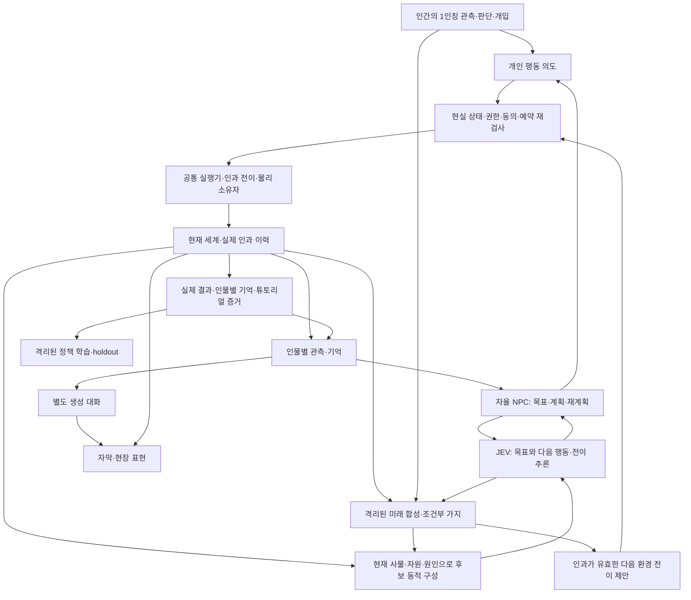

# FPS 비상대응·JEV 동적 미래·자율 NPC 정밀 설계

**상태: 2026-09-25 구현 및 부분 검증 수행, Unity Cloud 전환 중. 전체 제품 수용 미완료.** 원래 정밀 설계 요청 이후 사용자가 개발 구현을 지시했다. 실제 실행 결과와 미해결 경계는 [EXECUTION_PLAN.md §0](EXECUTION_PLAN.md#0-구현검증-체크포인트--2026-09-25)를 따른다.

이 문서는 [v5 활성 계획](../../plan.json)의 **설계 부록**이다. 새 활성 Story 체계, 별도 실행 장부, 단계별 승인·영수증 제도를 만들지 않는다. 기존 `CS-EXEC.01.01`의 구현 순서를 구체화한다. 구현 체크포인트는 기존 `state/progress.json`에 추가하며 모델링 진행 기록을 덮어쓰지 않는다. `.planning/.active_plan`과 병행 모델링 자산은 변경하지 않는다.

## 1. 결정의 우선순위와 범위

1. 현재 사용자 요청과 [세 차례 제품 역질의](../../../CHOOGuard_FPS_Prior_Research_20260925/DECISIONS_AND_DEVELOPMENT_STRUCTURE.md).
2. 이번 부록의 명시적 설계 선택. 선택한 것과 실행·검증된 것은 다르다.
3. v5의 native PC·uGUI/TMP/Input System, 기존 제품/안전 계약. Windows x64/Mono 빌드·실행 의무 유지.
4. 이전 FPS 제안과 v4는 충돌하지 않는 내용만 재사용. 역무원 단일 역할, JEV를 복귀시간 추정에만 사용하는 제한, 50명 고정, 4~7분 고정 사건 주기를 새로운 제품 요구로 계승하지 않는다.

**제품: FPS 기반 비상상황 대응 시뮬레이션 게임.** 한 명의 인간이 현장에서 관측·판단하고 도구·설비를 직접 조작한다. 정비·청소·승무·역무와 별도 튜토리얼은 이 경험을 뒷받침한다. 본게임의 수백 NPC는 각자 목표·관측·기억·계획을 가진 자율 AI 에이전트다. 플레이어 개입과 NPC 상호작용으로 현재 세계가 바뀌고, **JEV 기반 미래 합성 루프가 그때의 상태에서 다음 전개와 조건부 예측 미래를 계속 구성**한다. 사고·테러·자연재해는 미리 고른 완성 대본의 순서·결말로 진행하지 않는다.

**현재 기본 공간:** 기존 부산역·KTX·도시철도 부산역 접점 자산을 유지한다. 해당 모델의 정확한 차량/개정판과 작업 가능한 구역은 자료·모델 담당의 확인이 필요하다. 선로·도시 전체나 신규 엔진으로 범위를 확장하지 않는다.

**포함하지 않는 것:** 총격전·배틀로얄 경쟁, 인간 멀티플레이 인프라, 생성영상으로 물리 세계 교체, 현업 안전 인증, 내부 매뉴얼을 확보했다는 주장, 새 의무 퀴즈/복기 화면. 개발용 증거와 평가 도구는 플레이어용 학습 UI와 다르다.

**후속 사용자 정정이 우선한다:** “그때 마다의 변하는 상황과 예측미래를 정적으로 정해두는게 아니라 jev를 통해 바로바로 미래상황을 만드는거야”, “npc들도 ai에이전트로 자율적이게 움직이게 해서 실제 현실 상황처럼 만든 게임”. 따라서 이전의 ‘Scenic 사건 pack에서 실행할 사건 ID 선택’과 ‘플레이어 요청에만 반응하는 NPC’ 해석은 채택하지 않는다. 고정하는 것은 물리·인과·권한 규칙과 실행 가능한 행동이지, 미래의 장면·행동 순서·결말이 아니다.

JEV의 확인된 primitive는 Choice/Score/Noul이며 자유 텍스트·임의 수치 생성기나 물리 solver는 아니다. [공식 합성 지침](https://docs.typesafe.ai/concepts/how-to-build-with-system-one.md)과 [공식 한계](https://docs.typesafe.ai/model-jaggedness/jev-1.13.md)에 맞춰 **현재 상태에서 후보를 동적으로 구성 → JEV 추론 → 실제 규칙으로 다음 상태 계산 → 다시 추론**을 반복한다. 완성된 미래 대본 목록을 선택하는 것으로 이 요구를 축소하지 않는다. 이 결합 방식은 설계이며 미래 예측 정확도·현실 재현성은 아직 검증되지 않았다.

## 2. 문서·계약의 소유권

| 산출물 | 책임 |
|---|---|
| 이 문서 | 공통 상태 소유권·모듈 경계·기존 코드와의 통합 판단 |
| [OSS_INTEGRATION.md](OSS_INTEGRATION.md) | 기존 설치/선언, 실제 채택 위치, 참고 전용·보류, 플랫폼 검증 |
| [INTERACTION_TUTORIAL.md](INTERACTION_TUTORIAL.md) | 세밀한 조작·직무 절차·소모품·완료 증거·모델링 접점 |
| [NPC_SCENARIO.md](NPC_SCENARIO.md) | 자율 agent loop·JEV 동적 미래 합성·관측/기억·대화·사건·학습 |
| [contracts/npc-decision.schema.json](contracts/npc-decision.schema.json) | NPC 판단 경계의 **규범적 wire 형태**. C# client/Node broker 연결 및 strict 검증 구현; 실제 제공자 인증 검증은 별도 |
| [contracts/npc-decision.examples.json](contracts/npc-decision.examples.json) | 합성 정상/거부 사례. 실제 JEV 응답과 구별 |
| [contracts/future-step.schema.json](contracts/future-step.schema.json) | 동적으로 구성한 다음 전이 후보의 JEV 추론 요청/응답. 예측 전체나 world write 권한은 아님 |
| [contracts/future-step.examples.json](contracts/future-step.examples.json) | 동적 미래 경계의 합성 shape 사례와 구현 후 의미 검증 사례 |
| [EXECUTION_PLAN.md](EXECUTION_PLAN.md) | 구현 단위, 완료 기준, 실제 실행 검증, 롤백·미확정 값 |
| [work-packages.json](work-packages.json) | 요구사항→작업 단위→의존관계의 기계 판독 원본. 실행 승인/진척 장부 아님 |
| [VALIDATION.md](VALIDATION.md) | 이번 설계 산출물에 실제 수행한 검사와 미수행 경계 |

다른 문서의 예시·설명으로 wire 필드를 독자적으로 변경하지 않는다. 같은 Unity 빌드 내부에는 기존 C# 타입을 사용하고, 모든 내부 함수에 별도의 HTTP/JSON Schema를 만들지 않는다.

## 3. 설계 착수 시점의 코드와 목표의 차이

아래는 구현 전 관찰이다. 현재 구현·실행 결과는 [실행 체크포인트](EXECUTION_PLAN.md#0-구현검증-체크포인트--2026-09-25)가 우선한다.

| 현재 확인한 파일 | 확인한 동작/제약 | 설계상 처리 |
|---|---|---|
| `Assets/ChooGuard/App/Fps/FirstPersonResponder.cs` | CharacterController·raycast·상호작용 출발점 | 유지·확장. 새 FPS 컨트롤러 패키지로 교체하지 않음 |
| `App/Fps/Tutorial/TutorialSession.cs`, `Work/ProcedureRunner.cs` | 소화기 중심 world evidence; 역할/도구 전반 아님 | 절차 데이터·공통 조작으로 확장. unknown 조건, commit 재검사, 실제 rewind 보완 |
| `Contracts/OperationMessages.cs:85-107` | 기관·팀의 `CommandIntent`, `ReceiptKey`, `ReadSet` | 기관 업무는 유지. 시민에게 가짜 기관 ID를 붙여 재사용하지 않음 |
| `Application/OperationsSession.cs:57-61` | run별 독점 메모리 큐. 영속화·인가·중복 제거는 제공하지 않음 | 스케줄/순서 규칙 재사용. 큐 접수를 행동 승인·완료로 표시하지 않음 |
| `Persistence/SqliteRunStore.cs:13-17,53-55` | materializer가 실제 정책/효과를 검증해야 하는 원자적 저장 경계 | 새 메모리/자원 상태용 materializer와 인덱스 필요. 클래스 존재≠전체 저장 구현 완료 |
| `App/Mvp/MvpTeamNavigation.cs:19-40` | **DotRecast**로 실제 경로 질의, 2층 y=5.05·층간 링크 없음 | 기존 DotRecast를 확장. 새 Unity NavMesh와 이중 관리하지 않음 |
| `App/Mvp/MvpStationView.cs:101-126` | worker agent ID→시각 객체, 보간·애니메이션; 목록에서 빠지면 시각 객체 제거 | 인물 생애와 렌더 LOD를 분리. 화면/solver에서 사라져도 개인 기억·책임은 삭제하지 않음 |
| `App/Mvp/MvpTrainingDirector.cs:55-65,112-123` | 50명·참조 사건 두 종류·worker 응답 기반 시간 | 일반 본게임의 인물·사건·clock으로 직접 재사용하지 않음 |
| `App/Mvp/MvpJevOperationalKernel.cs` / `workers/prediction/jev-proxy.mjs` | 1 in-flight, `/turnaround`, Vercel workload Noul | 이 별도 기능은 유지. NPC Choice 경계와 혼용/별칭 처리하지 않음 |
| `workers/physics/worker.py`, `MvpPhysicsBridge.cs` | JuPedSim·FDS 참조 홀, 0~120초 화재장, POSIX venv 실행 경로 | 연구 profile 유지. 부산역 전체/Windows 런타임 지원을 별도 구현·검증 |
| `content/schemas/scenario.schema.json` | id/revision/site 참조만 정의한 후보 골격 | 사건 생성·원인·효과가 이미 구현됐다고 가정하지 않음 |

`graphify-out/GRAPH_REPORT.md`는 2026-09-21의 탐색 자료다. 현행 코드·패키지보다 우선하지 않으며 이번 작업에서 재생성하지 않는다.

## 4. 아키텍처 선택

### 4.1 모듈과 책임

이름은 **계획된 책임명**이다. 모두 이미 존재하는 클래스로 표시하지 않는다.

| 모듈 | 소유 상태·입력 | 출력·권한 | 금지 |
|---|---|---|---|
| `WorldSession` | run/generation, semantic tick, entity registry, revision | 논리 상태의 단일 writer, 이벤트 순서 | provider 응답에서 임의 world patch 적용 |
| `RolePolicy` | 현재 직무·자격·배정·기관 소관 | 수행/승인/요청 권한 판정 | 시민을 직원으로 승격, 직무 전환으로 권한 합산 |
| `InteractionRuntime` | focus·거리·가림·손·도구·접점 | 공통 `ActorActionIntent`·조작 진행 | 입력 이벤트만으로 작업 완료 |
| `ResourceLedger` | 도구·카트·작업점·대상 책임 | 원자적 예약/해제/책임 인계 | JEV 선택을 소유권 확정으로 간주 |
| `ActionExecutor` | 승인 의도·현재 상태·이동/조작 결과 | 상태 전이·완료 증거 | 애니메이션/타이머 종료=작업 성공 |
| `ProcedureRunner` 확장 | procedure revision·actor evidence | 가능한 단계·검수·미확인 항목 | UNKNOWN/CONFLICTED를 FALSE처럼 건너뛰기 |
| `NpcAgentRuntime` | 개인 관측·욕구·목표·약속·계획·행동 결과 | 자발적 목표/행동 선택, 정보 요청·협력·재계획 | 중앙 대본의 지시만 기다림, 숨은 world truth/미래를 사전 지식으로 사용 |
| `DecisionBroker` | NPC와 미래 추론의 공통 bounded queue·상관키·deadline·quota | JEV 응답 검증·선택/평가 결과 | 두 기능에 각각 한도를 복제, Unity main thread에서 원격 대기 |
| `DialogueDirector` | 관측 범위·발화 의도·실제 행동 상태 | 대사/자막, 대화형 요청 후보 | 대사의 약속/완료를 사실로 자동 commit |
| `AffordanceBuilder` | 현재 entity/관계/자원·전이 정의·관측 scope | 그 시점에 생성한 목표-행동/다음 전이 후보와 binding | 완성된 사건 대본 ID 목록으로 동적 합성을 대체 |
| `FutureComposer` | 현재 snapshot·가정한 개입·자율 agent 상태·모델 결과 | bounded 조건부 미래 가지, 다음 환경 전이 제안·무효화 | 예측을 실제 완료로 기록, 플레이어 행동이나 NPC 계획 강제 |
| `TransitionKernel` | 버전 있는 인과 연산자·실제/격리 상태·실행 결과 | 같은 규칙의 next-state 계산, 실제 적용 시 재검사 | JEV의 문장/확률을 새 물리 법칙·정밀 수치로 실행 |
| `RunEvidenceStore` | 상태전이·예약·관측·모델 provenance | SQLite 기록·검사 가능한 재생 자료 | 매 프레임 DB commit, 숨은 개인 정보 수집 |

### 4.2 단일 writer의 정확한 의미

- 논리 사실·소유권·작업 완료·인물 생애는 `WorldSession`이 순서대로 commit한다.
- 연속 위치/속도는 **선택한 물리·이동 소유자**가 계산한다. 읽은 결과를 세계의 물리 관측으로 수용한다. 모든 물리 프레임을 DB 이벤트나 의미 revision 증가로 바꾸지 않는다.
- 일반 gameplay NPC: DotRecast 경로 + 단일 local locomotion owner. PhysX의 충돌/물체 역학과 명시적으로 연결하며 Animator root motion이 별도 위치 writer가 되지 않게 한다.
- JuPedSim 과학 profile: 해당 actor cohort의 위치 소유자는 JuPedSim. 같은 actor에 local mover/DetourCrowd/NavMeshAgent를 동시에 적용하지 않는다.
- 프로필 전환은 정지 경계에서 actor ID·위치·목표·속도·포털 상태를 전달하고 기존 소유자를 해제한 뒤 수행. 지원되지 않는 상태는 전환 불가로 기록한다.

### 4.3 clock·revision

| 값 | 용도 |
|---|---|
| monotonic real clock | 입력 지연·HTTP deadline·API 호출량·벽시계 성능 측정 |
| `SimTick` microseconds | 승인된 게임 시간, 동작·사건·기억 순서. pause 동안 정지 |
| pose tick | 연속 이동/보간 샘플의 시점. 의미 상태 revision과 분리 |
| entity semantic revision | 문 개폐·예약·도구/작업/역할의 의미 있는 변화 |
| actor observation revision | 판단에 영향을 주는 새 관측·약속·목표·역할 변경 |
| run generation | 재시작·튜토리얼 rewind·checkpoint 복원 경계에서 증가 |

같은 seed는 같은 네트워크 답변·PhysX 비트 동일 재생을 보증하지 않는다. 기록된 관측/선택/궤적의 재생과 새로운 추론·물리 재계산을 구별한다.

## 5. 핵심 데이터와 불변조건

C# 내부에서는 `StableId`, `EntityRevision`, `ContentReference`, `RuleTruth`, `SimTick`를 재사용한다. NPC/미래 추론 wire의 64비트 revision/tick은 각 schema에서 **정규화된 10진 문자열**로 표현하고 범위를 검사해 변환한다. 기존 기관 command의 숫자 wire를 몰래 변경하지 않는다.

| 데이터 | 필수 의미 |
|---|---|
| `ActorState` | actor ID, role/profile revision, life-state, drives/goals, active plan/current task, movement owner, support needs, relationship/memory refs |
| `EquipmentState` | entity ID/revision, assembly/socket/fasteners, actual readings and unit, defects, owner/reservation, provenance |
| `ActorActionIntent` | run/generation, actor/intent ID, action definition revision, target IDs, relevant read set, input evidence, origin human/JEV/policy |
| `EnvironmentTransitionIntent` | run/generation/intent ID, 실제 원인 event refs, transition/binding/parameter fingerprint, ruleset/read set, 적용 시각. 가상 actor 행동을 대행하지 않음 |
| `ActionRecord` | phase, reservation, progress, cancellation reason, measured completion evidence, accepted sequence |
| `Observation` | perceiver, subject, predicate/value, TRUE/FALSE/UNKNOWN/CONFLICTED, source direct/report/inference/memory, observed time, expiry |
| `MemoryRecord` | owner, event refs, belief status, time, participants, salience, relation delta. 다른 인물의 비공개 정보 혼입 금지 |
| `TransitionDefinition` | 연산자 ID/revision, 적용 대상/전제, 원인, 실행할 효과 규칙, parameter provenance, 종료/검수 predicate. 완성 미래 대본 아님 |
| `InitialWorldSeed` | geometry/content revision, 초기 인물/설비/환경·seed streams. 미래 전개 순서·결말을 저장하지 않음 |
| `GoalPlan` | actor/goal ID, 생성 이유·관측 근거·목표 predicate, plan revision, 예상 다음 단계, 실패/재계획 조건, 실제 행동 이력 |
| `FutureBranch` | forecast/branch ID, basis snapshot/read set, 가정한 개입, horizon/step budget, 조건부 전이 이력·원인 참조, parent branch, expiry/status |
| `ModelDecisionRecord` | observation/candidate basis, exact model/provider, request/response hash, latency/usage/status, selection vs application result |

불변조건:

1. **한 인물의 존재는 GameObject/solver index와 독립.** 렌더 LOD 변경·층 이동·출구 도달이 관계/책임/기억을 지우지 않는다.
2. **설치≠체결≠검수 통과.** 실제 근거 없이 체결값·약품 농도·안전거리 등 철도 기준을 생성하지 않는다.
3. **수신≠수락≠도착≠인계.** 책임은 기존 담당자 유지→도착한 수신자의 수락→원자적 이전 순서.
4. **요청 수락≠행동 완료.** 완료 증거와 원자적 효과 적용이 실패하면 `COMPLETED`를 기록하지 않는다.
5. **취소≠세계 undo.** 소비·오염·부품 분리는 이미 일어난 상태로 유지. 본게임은 복구/보상 작업, 튜토리얼은 격리된 snapshot 복원.
6. **일부러 틀릴 수 있는 NPC와 강제 규칙을 구분.** 오해·지연·불완전한 도움은 가능하나 물리 불가능, 이중 소유, 권한 생성은 불가.
7. **관측은 참조 truth와 별개.** NPC가 믿는 값과 실제 세계값의 차이는 기록하되 숨은 정답을 입력에 주지 않는다.
8. **군중 출구 통과≠안전 인증·치료·영업 재개.** 각각 다른 완료 predicate와 담당 권한.
9. **예측≠발생.** 가정한 인계/대피/설비 변화는 실제 기록·기억·재고·예약을 바꾸지 않는다. 예측은 새 개입·상태 변화에 따라 폐기/재계산하며 예정된 결말을 강제하지 않는다.
10. **자율성≠무제한 권한.** NPC는 자기 목표를 고르고 실행·협상·재계획하지만 물건 복제, 임의 코드 실행, 플레이어 조종, 모델 자가승인 권한은 갖지 않는다.
11. **결정론적 인과≠원격 AI의 항상 같은 답.** 같은 입력·규칙·기록된 모델 결과의 의미 전이는 재현 가능하게 한다. 새 JEV 호출의 bitwise 동일성이나 PhysX/외부 solver의 완전 결정론은 보장하지 않는다.

## 6. 내부 계약과 외부 경계

### 6.1 기관 명령과 개인 행동

`CommandIntent`는 기관/팀의 운영 포트에 남긴다. 개인의 집기·걷기·청소를 억지로 기관 명령으로 포장하지 않는다. `ActorActionIntent`는 동일 run의 논리 writer에서 처리하되 다음을 공유한다.

- stable identity, 관련 entity read set, sequence, typed reason, 효과/자원 검증.
- 개인 action의 중복 키는 **`(runId, generation, actorId, intentId)`**다. old generation은 dedup 조회 전에 거부하고, 같은 generation의 동일 semantic fingerprint→같은 결과, 다른 fingerprint→충돌로 처리한다. 복원된 intent ID를 새 generation에서 다시 사용할 때 버린 분기의 receipt와 충돌하지 않아야 한다. actor receipt의 저장 인덱스에도 generation을 포함하며 기존 기관 `ReceiptKey`를 몰래 재정의하지 않는다. 이 보장은 기존 `OperationsSession.Enqueue`만으로 구현되지 않는다.
- 기관 명령이 직원 과업을 배정할 때 **기관 command receipt와 개인 action record를 연결**한다. 한쪽 성공이 다른 쪽 완료로 복제되지 않는다.
- 동일 프레임의 경합은 기존 mailbox의 sim tick/priority/sequence 규칙에 맞춰 한 순서로 해소. 시민·사람용 별도 writer를 추가하지 않는다.

### 6.2 개인 행동 생애

`REQUESTED → RESERVED → APPROACHING → EXECUTING → VERIFYING → COMPLETED`.

- 도구/작업점이 필요 없는 관찰은 예약·접근을 생략할 수 있다. 필요한 경우만 생략한다.
- `BLOCKED`는 이유와 재개 조건을 가진다. 새로운 세계 변화 없이 JEV를 반복 호출하지 않는다.
- `CANCELLED`/`FAILED`는 terminal. 재시도는 새 intent이며 기존 완료 증거를 재사용해 중복 소모하지 않는다.
- 실행 시작 전과 의미 효과 commit 전에 역할·도구·대상 revision·물리 조건 재검사.
- 작업 중 대상/안전 조건이 바뀌면 정의된 안전한 중단 지점으로 이행. ‘안전한 중단’ 자체의 장치별 근거가 없으면 일반 취소로 위험 제거를 가장하지 않는다.

### 6.3 JEV 판단 경계

새 제안: local worker의 `POST /npc/decision`, schemaVersion 1. 현재 `/turnaround`는 별도 사용처이므로 유지한다. `jev-1.13.0` direct API를 기본으로 pin하고 Vercel `typesafe-ai/jev`를 같은 모델명으로 정규화하지 않는다.

- 요청: 한 actor의 관측·목표·기억 요약 + 유한 후보. metadata/read set은 gate용이며 JEV에 전부 전달할 필요는 없다.
- 응답: 후보 ID, 확률 분포, confidence, model/usage/latency, 원요청 hash. 임의 좌표·코드·권한·world patch 없음.
- hash는 클라이언트가 전송한 UTF-8 body의 SHA-256이며, 응답 상관 metadata는 proxy가 구성한다. 모델에게 ID를 복창시켜 신뢰하지 않는다.
- schema 형태 검사와 runtime 의미 검사(후보 소속, 최신성, 권한, 원자적 예약)를 분리. 상세는 [NPC_SCENARIO](NPC_SCENARIO.md).
- 이 경계의 C#/Node DTO는 schema 기준으로 맞추고 실제 serializer→worker→consumer 경로에서 확인한다. schema만 통과했다고 런타임 호환 완료라 주장하지 않는다.

미래 합성의 별도 경계는 `POST /future/step`, [future-step schema](contracts/future-step.schema.json)다. 현재/격리 snapshot에서 동적으로 구성한 **한 단계의 전이 후보**를 평가한다. 요청의 `forecastId/branchId/stepSeq`, perspective와 basis/read set으로 NPC 실행과 예측을 격리한다. 원격 응답은 후보 선택/확률일 뿐이며 `FutureComposer`가 로컬 `TransitionKernel`로 다음 가상 상태를 계산한다. 다음 단계는 갱신된 가상 상태로 새로 묻는다. 같은 요청의 독립 질문끼리 앞선 답을 알고 있다고 가정하지 않는다.

NPC 실제 행동 선택은 `/npc/decision`을 유지한다. 미래 가지에서 가정한 NPC 판단은 `/future/step`의 actor perspective를 쓰므로 실제 actor의 최신 decisionSeq·목표·예약·기억을 소비하지 않는다. NPC/미래 요청은 **동일한 계정·세션 예산**을 공유한다. 두 endpoint는 동일 기능의 alias가 아니다.

### 6.4 모델링 담당과의 계약

게임플레이 담당은 원본 메시·재질·스캔·기하 복원 스크립트를 재작성하지 않는다. 받은 geometry revision에 대해 별도 gameplay prefab/authoring overlay에서 다음을 결속한다.

- stable object ID, 단위 m, 좌표계/변환, floor/zone ID, geometry digest와 관측/가정 구분.
- 작업 접점·손/도구 소켓·회전축·접근 위치·상호작용 collider.
- 층간 portal endpoint·폭/높이·방향·이동지원 제약, 문 상태와 연결되는 traversal 조건.
- 보이는 메시가 곧 통행 geometry라는 가정 금지. collider·경로·실제 통과를 별도 확인.

## 7. 플랫폼·성능의 구체적 설계 목표

아래는 **측정 전 개발 목표**이지 사용자와 합의한 SLA나 실측 결과가 아니다.

- 부하 행렬: 100 / 300 / 500명의 개별 인물. 300은 수백 명 요구의 대표 검증점, 500은 여유/한계 탐색이며 확정 상한이 아니다.
- 1080p, 60 FPS 지향. 목표 PC를 기록한 뒤 p95 frame time 16.7ms 목표를 평가. 현재 M1/macOS 결과를 Windows 결과로 대체하지 않는다.
- steady-state 입력·이동·가까운 상호작용 경로는 매 프레임 managed allocation 0B 목표. spawn/로드/비동기 serialization 비용과 구분한다.
- 사건 인지 시 local 중단·표현은 다음 simulation step에서 처리. 원격 고차 판단 목표는 queue 포함 p95 2초. 모델이 없어도 이미 안전하게 진행 가능한 행동은 지속하지만 원격 판단 성공으로 표시하지 않는다.
- 공통 broker 초기 실험 상한: **NPC 실제 판단과 미래 가지 추론 합산** 12 dispatch/sec, 12 in-flight, pending 128. actor당 실제 active decision 1, forecast scope당 active step 1, 자동 HTTP retry 0. 미래 합성이 NPC를 영구 대기시키지 않도록 priority/age/minimum service를 측정한다. 공표 한도와 실측에 따라 조정할 실험 설정이다.
- 온라인 비용 한도/공유 API 계정의 배분은 실행 전 구성해야 한다. 이 문서는 과금 호출·부하 실험을 승인하지 않는다.

현재 실측은 [JEV 선행검토](../../../CHOOGuard_FPS_Prior_Research_20260925/JEV_NPC_FEASIBILITY.md)의 18요청뿐이다. 이번 설계에서 다시 호출하지 않는다.

## 8. 저장·재생·학습

기존 SQLite 경계에 actor/goal/plan/memory/action/transition event projection과 forecast provenance를 추가한다. 새 벡터 DB·메시지 브로커·웹 microservice를 기본으로 설치하지 않는다.

- 실행 중 상태는 메모리에 유지. 의미 전이를 기록하고 관측/판단 trace는 bounded buffer로 기록한다. 매 프레임 전체 세계를 복사하거나 JSON 직렬화하지 않는다.
- 예약·재고·완료를 함께 바꾸는 commit은 같은 writer와 같은 원자적 저장 단위에 속한다. 이벤트 기록 실패를 완료 성공으로 표시하지 않는다.
- checkpoint에는 world content revision, actor identities, task/action states, physical checkpoint support, memory references, seed streams, provider/config provenance를 포함한다.
- exact resume는 엔진이 충분한 checkpoint를 제공한 범위만 가능. 의미 상태 복원, 기록 playback, seed 기반 재계산을 서로 다른 기능으로 표시한다.
- 재현 단위에는 JEV의 원 요청/응답 hash와 채택 결과·candidate bindings·규칙 버전·가정한 개입·실제 commit을 구별해 포함한다. 기록된 추론을 재생하는 것과 같은 seed로 원격 API를 다시 부르는 것은 다르다. 예측 snapshot은 실제 진행 상태를 덮어쓰지 않는다.
- 기억의 초기 기본 생애는 run 단위. 세션 간 동일 인물/관계의 유지 범위는 제품 결정 전까지 확정하지 않는다. 전체 자유대화 원문·개인정보를 자동 영구 저장하지 않는다.
- 정책 학습은 별도 환경에서 수행하고, 고정된 후보 정책을 평가 후 반영한다. 라이브 세션 중 JEV 가중치가 바뀌는 구조가 아니다.

## 9. 설계가 완료돼도 남는 실제 구현 선행조건

- 차종·장치별 승인 작업자료의 미확보 값: 해당 작업 콘텐츠의 공식 판정만 막는다. 공통 조작·NPC·authoring 도구 구현까지 막지는 않는다.
- 모델링 geometry/portal 미확정: 해당 구역의 통행·물리·현장 정확도만 보류. 별도 검증 환경은 실제 역이라고 표시하지 않는다.
- Windows SQLite ABI / worker 실행·의존성 배포: 실제 Windows 수용 시험 필요. macOS 성공을 승격하지 않는다.
- 생성 대화 모델 제공자, 음성, 세션 길이/세션 간 기억, 목표 GPU, 정확 NPC 수, 비용 한도는 미확정. 문서의 기본선은 선택을 숨기지 않고 후속 실험으로 좁힌다.

**구현 시작점:** 공통 인과/상태/행동 계약 이후 **플레이어 개입 → 자율 NPC 재판단 → JEV 기반 미래 재합성 → 실제 상태 변화**의 종단 경로를 먼저 입증한다. 네 직무·수백 NPC·학습 범위는 유지하되, 도구 수나 고정 시나리오 pack 수를 제품 완료로 세지 않는다. 상세 순서와 acceptance는 [EXECUTION_PLAN.md](EXECUTION_PLAN.md)에 있다.
