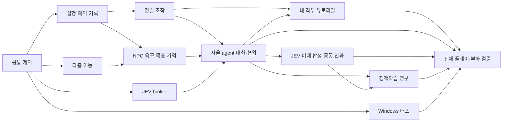

# 정밀 설계의 구현 순서와 수용 계획

**상태: 구현 및 로컬 검증 수행, 2026-09-25 사용자 요청으로 Unity Cloud 전환 중. 전체 수용은 미완료.** 상위는 [DESIGN.md](DESIGN.md), 구조화된 요구·의존관계·수용 기준 원본은 [work-packages.json](work-packages.json)이다.

12개는 **작업 묶음**이지 12개의 새 활성 Story/승인 gate/강제 PR 수가 아니다. v5의 `CS-EXEC.01.01`과 `state/progress.json` 한 곳의 실행 관리 원칙을 유지한다. 선행 산출물을 기술적으로 사용할 수 있을 때 다음 작업을 진행하고 과거 다단계 receipt 절차를 복원하지 않는다.

제품 완료의 기준은 **FPS 기반 비상상황 대응 시뮬레이션 게임**의 `플레이어 개입 → 자율 NPC의 관측·목표/계획 수정 → JEV 기반 미래 재합성 → 공통 실행기의 실제 세계 변화`다. 완성 사건 대본 선택, 대사 변형, seed 변경만으로 이 루프를 대체하지 않는다. 아래 순서는 기존 네 직무·상세 조작·별도 튜토리얼·수백 NPC·외부 기억·정책학습·Windows 범위를 유지한다.

## 0. 구현·검증 체크포인트 — 2026-09-25

원본 증거: [구현 체크포인트](../../state/evidence/fps-gameplay-20260925/implementation-checkpoint.json). 모델링 세션의 씬·prefab·메시를 변경하지 않고 별도 임시 Unity 프로젝트에서 실행했다.

- **Unity 6000.3.23f1, macOS arm64:** 최종 PlayMode 39/39 통과. 실제 물리 접촉·인계·동행·네 직무 절차·튜토리얼 물리/의미 상태 복원과 본세계 분리, 300인 진입/역할 전환/저장/재개를 실행했다. 화면은 실제 Camera 렌더이며 버튼 callback으로 조작했다. OS 입력 또는 Windows Player 수용 증거가 아니다.
- **선택한 EditMode 77/78:** 저장 실패·중복/세대·개인 기억/관측·미래 격리·strict wire·SQLite 재개 검증. 전체 EditMode 567개를 실행한 결과가 아니다. `GameplayNavigationTests.Portal_RequiresContinuousBakedGeometry_PreservesHeightAndAccessibility`의 `portal_unreachable_or_partial_path`는 미해결이다. 전체 green으로 표시하지 않는다. 이후 추가한 Cloud hook/managed dependency 검증 변경은 아직 원격에서 실행하지 않았다.
- **추론:** Node 회귀 25/25. 실제 C# 직렬화→패키징된 Node HTTP 경계에서 301인 등록, NPC/실제·가상 미래 요청, 종료를 실행했다. 인증 미설정은 `unavailable/provider_error`로 반환했으며 유료 추론 호출은 0이다.
- **학습:** 같은 C# 실행기를 사용하는 환경 회귀 6/6, 실제 PPO 4096 step 및 rule/random/PPO holdout 실행. 가중치는 `workers/learning/.artifacts/ppo-final-4096`, 비교는 `comparison-final-4096/comparison.json`. JEV 비교는 NOT_RUN이며 PPO 우월성을 주장하지 않는다.
- **인원 측정:** 100/300/500 NPC+인간, 시각 객체 100개, Editor batch 640×480, 제공자 미연결. frame p95는 각각 약 3.30/9.12/21.64ms이고 500인 GC p95는 약 4.19MB/frame이다. GPU 수치는 batch 환경의 거의 유휴 값이므로 목표 Player의 GPU/60fps 근거로 사용하지 않는다. live-provider·장시간·Windows 성능 수용은 남아 있다.
- **플랫폼:** macOS/Windows runtime package 생성, macOS SQLite와 패키징된 Node 실행 완료. Windows Mono 모듈은 설치했으나 Windows build/run은 미실행이다.

Unity 진입 메뉴는 `CHOOGuard/Gameplay/독립 FPS 진입 장면 열기`다. 명시적으로 새 미저장 진입 장면을 만들며 기존 모델 장면을 덮어쓰지 않는다. 합성 실습실은 실제 역사·차량 geometry/SOP 인증이 아니다.

**Cloud 전환:** 로컬 빌드/추가 학습을 중지하고 검증 XML·화면을 보존한 뒤 소유한 임시 프로젝트 약 2.16GiB를 삭제했다. 사용자는 기존 **공개** `xrlab-dau/CHOOGuard` 저장소의 별도 작업 브랜치 게시와 Cloud Build **총 US$10 이내 사용**을 승인했다. 새 결제수단 등록이나 별도 구독 약정은 미승인이다. 기존 SDK 로그인으로 `CHOOGuard Gameplay` 프로젝트를 생성했으며 모델링용 Cold Storage 프로젝트는 변경하지 않았다. 이후 Aside에서 인증/저장소 연결을 완료하고 원격 빌드 #1을 접수했다.

초기 Cloud GitHub HTTPS 연결은 SSH URL로 재작성된 뒤 `Git ls-remote failure`가 됐고 Deploy Key 등록도 저장소 정책으로 거부됐다. 이 차단은 **Aside의 공식 GitHub PAT 연결로 해소**했다. 구형 billing의 `Teams Basic`, `buildingDisabled=true`, 동시성 0과 달리 현행 `/concurrency-limit`은 2/2이며 실제 Dashboard에서도 **Free tier**를 확인했다. API는 수동 빌드를 **202로 접수**했다. 구형 `effective={}`/`freeTierLimitReached=true`를 현재 서비스 비활성 또는 무료분 소진의 증거로 사용하지 않는다.

원격 Windows hook과 정확한 Dashboard 설정은 [worker README](../../../../workers/physics/README.md#unity-build-automation--windows-x64)에 있다. SDK/패키지 재생성은 cloud worker에서만 수행하고 `workers/runtime`, node_modules, venv, crash dump를 소스에 게시하지 않는다. 현재 브랜치/원래 index는 유지하며 별도 index로 gameplay 변경만 게시한다. 전체 테스트 실행에는 기존 assembly-layout의 정적 의존성 기대와 현재 assembly 경계의 차이도 해결해야 하며 선택한 78개 결과로 이 문제를 가리지 않는다.

공개 게시: `cloud/fps-gameplay-20260925`, 구현 commit [`06581714`](https://github.com/xrlab-dau/CHOOGuard/commit/06581714e80beae2cd7627c5f6653d7f6824f130), Cloud 수정 commit `5777808c`. 원래 모델링 checkout/index는 바꾸지 않았다. PPO 가중치·학습 지표·monitor·provenance·config 5개 파일(2,391,758 bytes)은 별도 Gameplay Cloud 프로젝트에 업로드하고 다시 내려받아 모든 SHA-256을 대조했다. 원본 학습 파일도 보존했다. [Cloud handoff 증거](../../state/evidence/fps-gameplay-20260925/cloud-handoff.json)는 저장 검증·인증 완료·빌드 접수·실제 실행 결과를 구분한다.

**사용자 인증 작업 해소:** Aside 로그인 세션에서 GitHub의 공식 이메일 추가 인증을 수행했다. `CHOOGuard-Cloud-PublicRead-20260925`는 **Public repositories 읽기 전용**, 추가 저장소/계정 권한 없음, **2026-10-02 만료**다. 토큰은 Unity Source control에 직접 전달했으며 대화/저장소에 값을 남기지 않았다. 개인용 광범위 토큰, Deploy Key 정책, 조직 전체 Developer Data 공유, 새 결제/구독은 변경하지 않았다. [Unity 공식 PAT 연결 절차](https://docs.unity.com/en-us/build-automation/get-started-with-build-automation/connect-your-version-control-system)를 사용했다.

Cloud hook 검토 후 `InvalidDataException` 누락, batch Untitled의 additive 생성, Unity 6000.3 UTC ticks 변환, 이미 추적된 DLL의 불필요한 NuGet CLI 설치를 수정했다. 읽기 전용 `cloud_prepare.verify_managed`는 실제 세 DLL에서 exit 0이었다(다운로드/패키징/Unity 실행 없음). Unity 관련 수정은 미실행이며 기존 native 시험 결과를 재사용하지 않는다. 원격 준비 설정은 Windows Micro `win_micro_v1`, timeout 45분, cache/auto-build/boost disk 없음이다. 이 설정과 예산 알림은 **과금 hard cap이 아니며** 총 US$10 승인 범위 안에서 수동 실행한다.

**원격 빌드 #1:** `chooguard-windows-gameplay`, `2026-09-25T12:18:20.480Z` 생성, `5777808cc6df2f553132bb1b8f4ad25403b56b8a`에 고정한 clean build다. Aside에서 Building 화면과 실제 checkout을 확인했다. 최종 **failure**, 종료 `12:31:19.713Z`: 기본 Python이 native Windows x64/Python 3.11 이상 복합 조건에서 거부됐다. 로그는 당시 interpreter 정체를 출력하지 않아 버전/OS를 추정하지 않는다. checkout 커밋 일치와 5.04GiB 원격 workspace는 확인했지만 Unity compilation/tests/Player 실행 전 실패다. API billable time은 **189.509초**이며 실제 USD 청구액/무료분 차감은 정산 확인 전이다. [원격 로그](../../state/evidence/fps-gameplay-20260925/cloud-build-1.log), [Aside 실행 화면](../../state/evidence/fps-gameplay-20260925/cloud-build-1.png).

**승인된 후속 검증:** 사용자가 기존 총 US$10 범위에서 수정 후 **수동 빌드 1회 추가**를 선택했다. 자동 재시도는 없다. 명시 Python override는 유지하고 적합한 native interpreter가 없으면 기존 SHA-256 고정 embedded Python을 원격에서만 bootstrap한다. 실제 로그의 출력 위치 `.build/last/<target>`도 제한적으로 허용하며 project root/Assets/임의 소스·symlink·덮어쓰기 거부는 유지한다. 두 수정은 후속 원격 실행 전까지 미검증이다.

아래 작업 brief와 수용 기준의 범위는 유지한다. 구현 전 코드 관찰·검증 예시는 이 체크포인트와 구별하며, 부분 시험 성공으로 AC01~AC25 전체를 수용하지 않는다.

## 1. 전체 순서와 병렬화



P01 이후 P02/P04/P07/P11은 기술적으로 병행 가능하다. P03 이후 P05의 절차 저작·조작 작업을 시작할 수 있지만, 승객 동의·동행·직원 도착·실제 인계가 포함된 튜토리얼의 통합 수용은 P08 이후다. **P08과 P09는 독립 병렬 작업이 아니다.** P09는 자율 agent가 현재 세계를 바꾸는 P08을 직접 선행으로 삼으며, P02/P04/P06/P07의 계약은 P08을 통해 전이적으로 공급된다. P08 이후 P05/P09는 별도 소유권에서 병행 가능하다. `acceptanceIds`는 각 작업이 기여하는 증거를 연결하며, 일부 기여만으로 전체 수용 기준을 통과했다고 표시하지 않는다.

- 공통 Contracts/Domain/Persistence와 package manifests에는 단일 integration owner를 둔다. 모듈상 독립이라고 같은 파일 동시 편집을 허용하지 않는다.
- 모델 담당이 소유한 Assets/씬/AgentScripts/복원 스크립트는 이 계획의 포괄 쓰기 허가가 아니다. gameplay 의미는 별도 overlay로 작업하고 실제 결합 시 대상 자산을 특정한다.
- Windows 환경·특정 장치 매뉴얼·실역 geometry가 없으면 해당 검증만 보류한다. 모든 공통 코드/콘텐츠 도구 구현을 함께 중단하지 않는다.
- 기간·인월·날짜는 지금 산정하지 않는다. 실제 최초 연결과 compatibility 결과 뒤 조정하며, 전 직무·수백 NPC·학습 범위를 작은 데모로 몰래 축소하지 않는다.

## 2. 작업 묶음별 실행 brief

각 작업은 이 문서의 해당 절, 상위 설계, `work-packages.json`의 `existingReadPaths`와 해당 acceptance를 읽으면 새 세션에서 착수할 수 있다. 코드 수정 전에 현재 파일을 다시 확인하고 exported symbol 변경은 LSP references로 전체 호출부를 확인한다. 이 문서의 파일 목록은 현재 관찰이며 미래 변경을 덮어쓰라는 지시가 아니다.

### P01 — 공통 world/actor/action·transition/goal/future 계약

**선행:** 없음. 기존 기관 command와 개인 행동은 다른 의미이며 fake agency ID로 합치지 않는다.

1. `StableId/EntityRevision/RuleTruth/SimTick`의 기존 불변조건을 재사용한다.
2. world session·actor registry·개인 action intent·역할/작업 evidence의 책임을 정하고 같은 run의 writer/clock에 결속한다. `GoalPlan`의 욕구/목표·관측 근거·plan revision·중단/재계획 조건을 선언한다.
3. wire는 [NPC schema](contracts/npc-decision.schema.json)와 [future-step schema](contracts/future-step.schema.json)를 사용. 64비트 문자열 변환, lexical vs shape vs 관계 검사를 분리한다. 미래 요청의 run/generation/forecastId/branchId/stepSeq, actor/world perspective, immutable snapshot/read set은 실제 actor decisionSeq와 다른 scope다.
4. procedure/source/geometry와 `TransitionDefinition`·`InitialWorldSeed`·`FutureBranch`의 저작/실행 의미를 기존 content contract에 합친다. 전이 정의는 원자적 인과 연산자와 제약이며 완성 사건 대본이 아니다. 초기 seed는 초기 상태만 제공한다. 기존 QA EvidenceRecord를 게임 작업 증거로 오용하지 않는다.
5. 다음 환경 전이 후보 선택과 실제 world write 권한을 분리하고 실제/가상 상태에서 동일한 `TransitionKernel` 규칙을 쓰는 경계를 확정한다. 호출자 없이 빈 서비스·가짜 adapter를 ‘구현 완료’로 남기지 않는다.

**수용 기여:** AC01·AC19·AC21~AC24. 역할 전환 후 예전 권한을 쓸 수 없고, 미확보 근거가 0/정상값으로 import되지 않는다. 형식 검사만이 아니라 최소 실제 world action과 import된 원자 전이/초기 상태를 읽어 검증한다. 미래·자율성의 종단 수용은 P08/P09/P12에서 완결한다.
**변경 표면:** 기존 Contracts/Domain/Application 접점과 content schemas. **복구:** 새 콘텐츠 판본의 활성 참조를 철회하되 기존 저장 데이터는 지우지 않는다.

### P02 — 단일 실행기·예약·인계·기록

**선행:** P01. `OperationsSession`의 큐는 인가·중복 제거·영속화를 제공하지 않는다.

1. action lifecycle과 related read set을 공통 executor로 구현한다. 사람·NPC의 동일 동사가 같은 의미 경로를 지난다.
2. 다중 자원 all-or-nothing 예약, 실제 custody와 예약의 차이, 취소 후 부분 결과를 구현한다.
3. `(runId,generation,actorId,intentId)`별 동일 fingerprint 반환/상이한 fingerprint 충돌을 연결한다. old generation은 먼저 거부하고 actor receipt 인덱스에도 generation을 포함해 rewind 후 복원된 intent가 버린 분기와 충돌하지 않게 한다.
4. 기관 배정 receipt와 직원 action을 링크하고 ACK/도착/실제 인계를 분리한다.
5. 기존 SqliteRunStore materializer에 실제 effect·자원·기록 consistency를 연결한다. 매 프레임 저장이 아닌 의미 전이 단위로 기록한다. 가상 branch의 write target은 실제 저장·기억·예약·receipt와 분리하고 기록된 inference/candidate binding/rule revision으로 의미 전이를 재생할 수 있게 한다.

**수용:** AC01·AC02·AC20 및 AC23·AC24의 실행/저장 경계. 두 인물의 카트 경합, 중복 소비, 인계 직전 취소, 저장 실패를 실제 상태로 확인한다.
**복구:** 신규 action definition의 진입을 중지하고 진행 중 작업을 명시적으로 취소/보상한다. DB 변경은 forward migration·백업 기반이며 손에 든 물건을 소거하지 않는다.

### P03 — 데스크톱 정밀 조작·도구/부품

**선행:** P02. [상세 조작 설계](INTERACTION_TUTORIAL.md) §§3·8을 적용한다.

1. 기존 FPS 이동·raycast를 유지하며 Input System의 이동/작업/단말 소비를 배타적으로 구성한다.
2. 손/도구 접점·sweep·grip·지원면·정렬·소켓을 구현한다. 실제 Rigidbody/joint로 문·서랍·도구 동작을 확인한다.
3. installed/fastened/verified와 체결점별 부분 진행, 실제 소모품·잔류 오염·측정 sample을 분리한다.
4. 취소/focus 상실/차폐/권한 회수/소모품 부족 후 실제 상태를 유지한다. 키보드 대체 조작도 동일 evidence를 생성해야 한다.
5. collider binding·정적 definition·rule을 재사용하고 hot path에서 배열·JSON·문자열을 반복 생성하지 않는다.

**수용:** AC03. 좁은 통로에서 긴 물체 운반, 미체결 부품, 작업 중 취소를 실제 마우스/키보드로 검증한다. Physics Debugger와 상태 기록은 입력 체험을 보조한다.
**복구:** 해당 새 tool definition/overlay만 비활성화. 기존 world state를 평탄화하거나 모델 메시를 재생성하지 않는다.

### P04 — DotRecast 다층 이동·개별 인물 표현

**선행:** P01. 기존 DotRecast 2026.3.1 bake/query를 유지하며 현재 2층/y값 고정을 일반화한다.

1. actual geometry revision에 결속된 floor/portal/door/accessibility 데이터를 받는다.
2. 닫힌 문·계단·승강기·열차 접점의 경로/진행 의미를 구현한다. 확보 안 된 연결을 teleport로 채우지 않는다.
3. 같은 릴리스 Detour.Crowd 후보를 별도 compatibility 환경에서 확인해 국소회피를 연결한다. 경로 backend/pose owner를 중복 설치하지 않는다.
4. GameObject pooling/시각 LOD와 actor registry 생애를 분리한다. cull→복귀 후 기억·예약·목표 유지.
5. 좁은 통로·정지 작업자·플레이어·지원이 필요한 인물의 경합을 실제 이동으로 관찰한다.

**수용:** AC04. 완전 경로/명시적 blocked, 단일 위치 소유자, 층간 인물 ID 보존. 관측·기억이 행동에 반영되는 AC10은 P06/P08에서 확인한다. 주석/경로 배열 존재만으로 통행 성공을 주장하지 않는다.
**복구:** 문제가 있는 새 geometry/portal 판본을 비활성화하고 지원 범위를 명시. 새 floor를 기존 2층 좌표로 압축하지 않는다.

### P05 — 네 직무 튜토리얼과 격리 복원

**선행:** P03+P08(통합 수용). P03 이후 콘텐츠 저작은 먼저 시작할 수 있다. 직무별 실제 체인은 [상세 설계](INTERACTION_TUTORIAL.md) §5가 기준이며, 시민 동행·동의·직원 도착·실제 인계는 P08의 공통 구현을 사용한다. 튜토리얼 전용 NPC 실행기를 따로 만들지 않는다.

1. 기존 single Target binding을 definition/instance 다중 binding으로 바꾼다.
2. ProcedureRunner의 applicability·start guard·completion evidence를 분리한다. conditional의 UNKNOWN/CONFLICTED를 skip하지 않는다.
3. 정비, 청소, 승무서비스, 역무의 실제 작업 체인과 각 직무의 중단/오판/인계 경로를 작성한다. 수치가 없는 장치는 공식 합격 판정에서 제외하고 공백 표시.
4. 튜토리얼 rewind에 대상·소모품·태그·관측·NPC 목표/계획·작업·generation을 포함한 isolated snapshot을 연결한다. Done만 돌리지 않는다. 반복 가능한 교육 초기조건은 허용하되 NPC를 플레이어 cue만 기다리는 전용 스크립트로 대체하지 않으며, 본게임의 비상사건 유입을 튜토리얼 필수 조건으로 만들지 않는다.
5. v1 절차 콘텐츠·builder binding·HUD/단말·테스트 호출군을 같은 변경에서 이행하고 obsolete effect 경로를 제거한다.

**수용:** AC05~AC09·AC19. 네 직무 각각의 실제 장면과 실패를 확인한다. 한 직무 완성으로 네 직무 완료를 선언하지 않는다.
**복구:** 이전 content revision과 호환 run만 유지. 새 절차를 이전 러너가 조용히 읽게 하는 alias를 남기지 않는다.

### P06 — NPC 욕구·목표·계획·개인 관측·기억

**선행:** P02+P04. 수백 NPC를 이동 점이 아니라 각자 욕구/목표/관측/관계를 가진 인물로 구성한다.

1. actor별 욕구·일정·목표 predicate·동행·지원 필요·약속과 `GoalPlan`의 생성 이유·plan revision·다음 단계·실패/재계획 조건·실제 행동 이력을 유지한다. 일정은 초기 의도이지 예정된 결말이 아니다.
2. 지역 감지/가림/수신 관측과 knowledge revision을 구현한다. 각자의 관측 차이를 유지하고 현재 목표·계획과 관련 있는 변화만 재판단 대상으로 올린다.
3. owner별 SQLite memory/goal/plan projection과 bounded 최근 기억 cache를 연결한다. 외부 벡터 DB는 도입하지 않는다. JEV가 자체 기억이나 자율 loop를 가진다고 가정하지 않는다.
4. 화면 밖/층간 이동/solver exit에도 identity·목표·미해결 책임을 보존한다. 일시적 경로 차단은 목표의 자동 성공/삭제가 아니라 plan revision과 재개 조건으로 남긴다.
5. 기억·약속과 자기 관측 때문에 이후 행동 후보가 달라지는 생활/지원 장면을 실제로 실행한다. 자발적 계획/실행/협상 loop의 종단 연결은 P08이 담당한다.

**수용:** AC10·AC20 및 AC22·AC24의 상태/기억 근거. 같은 사건을 다른 위치에서 본 두 인물, 잘못 전해 들은 정보, 이전 약속의 이행, culling 후 재회와 목표 지속을 확인한다.
**복구:** 변경된 memory projection을 event refs로 다시 만들 수 있어야 한다. 모델 재호출을 과거 결정 재생으로 쓰지 않는다.

### P07 — NPC·future-step 공통 JEV broker·부하 제어

**선행:** P01. P06을 기다리지 않고 canonical request/example을 기준으로 provider adapter와 소비자 경계를 구현할 수 있다. **실제 NPC 연결은 P08, 미래 합성 연결은 P09에서 완결**한다.

1. `/npc/decision`과 `/future/step`을 같은 broker에 연결하고 direct `jev-1.13.0`의 확인된 Choice/Score/Noul 범위만 쓴다. 현재 Vercel `/turnaround`는 별도 기능으로 유지한다. [NPC](contracts/npc-decision.schema.json)·[future-step](contracts/future-step.schema.json) schema와 각 examples가 wire 원본이다.
2. exact raw body hash·model/usage·정확 후보 집합·finite 확률·nullable unavailable을 구현한다. 미래 응답도 선택된 현재 후보만 반환하며 텍스트·코드·수치 물리 생성이나 world patch를 허용하지 않는다.
3. **두 endpoint 합산** 초기 실험 상한 12 dispatch/sec·12 in-flight·pending128과 실제 공유 계정/비용 한도를 적용한다. actor당 실제 active decision 1, forecast scope당 active step 1, 자동 HTTP retry 0이다. foreground/live agent가 미래 가지에 굶지 않도록 priority/age/minimum service·branch/horizon/step cap을 함께 검증한다.
4. actor coalescing·deadline·429/취소·stale/duplicate/role change와 forecast basis/generation 무효화를 구현한다. 새 관련 관측/재개 조건 없이 blocked plan을 반복 요청하지 않는다. 원격 응답은 main thread에서 기다리지 않고 임의 확률 보정·가짜 baseline 응답은 없다.
5. local session capability와 배포 credential 경계를 구현한다. payload/비밀·upstream 원문 오류를 무분별하게 로그에 넣지 않는다. 실패·예산 소진 시 유효한 로컬 행동만 계속하고 새 원격 선택/미래는 unavailable·stale로 표시한다.

**수용:** AC11·AC18·AC25 및 AC23·AC24의 상관/기록 경계. schema 예제 통과에 더해 각 endpoint의 실제 C# serialization→worker→direct API→consumer 경로와 장애 경로를 실행한다. 유료 호출은 별도 구성한 비용 한도 안에서만 수행한다.
**복구:** 신규 NPC/미래 판단 서비스를 중지하고 모델 불가를 표시한다. 다른 기능의 `/turnaround`로 요청을 몰래 바꾸지 않는다.

### P08 — 자율 NPC agent loop·한국어 대화·협업

**선행:** P03+P06+P07. 생성 대화 provider는 여기서 실제 비교·선정한다.

1. `NpcAgentRuntime`의 관측/기억/욕구→목표 생성·유지→현재 affordance 기반 GoalPlan/행동 후보→JEV→executor→결과 관측→재계획 loop를 완결한다. 플레이어 요청 없이 자기 일정·약속·새 관측에서 먼저 이동/확인/지원 요청을 시작한다.
2. 한국어 존대/생략/직무 약어/부정/정정/관계/부분정보 holdout으로 별도 대화 후보 모델을 비교하고 하나를 pin한다.
3. 중요한 업무/안전/완료 문장은 실제 사실 slot/template를 쓰고 자유 대화와 구분한다. 모델이 대사를 생성해도 작업 사실은 변하지 않는다.
4. NPC끼리 정보 요청·거절·동의·지원 약속·분담·직원 도착·책임 인계를 협상하고 사람이 볼 수 있게 실행한다. 숨은 world truth나 아직 발생하지 않은 미래를 개인 지식으로 주지 않는다.
5. provider 단절·오래된 답·경로 차단·자원 경합에서도 목표/약속은 유지하고 가능한 대안·도움·관측을 재계획한다. 재개 조건 없는 반복 호출을 막고, 목표 지속과 무조건 같은 행동 반복을 구분한다.

**수용:** AC02·AC10~AC12·AC22 및 AC25의 agent 재계획/서비스 경계. 무입력 인간 옆에서 NPC가 자발적으로 행동하고, 인간과 동료가 실제 공구/시민을 두고 협업하는 장면을 확인한다. 임시 고정 대사나 플레이어가 모든 행동을 발동하는 구조로 완료 처리하지 않는다.
**복구:** 생성 대화만 중지하면 사실 기반 필수 문구와 유효한 진행 행동은 유지하되 자유대화 정상으로 보고하지 않는다. JEV 불가는 별도 표시하며 고정 정책을 본게임의 자율 JEV loop 성공으로 대체하지 않는다.

### P09 — JEV live FutureComposer·공통 인과·FPS 본게임

**선행:** P08만 직접 의존한다. P08이 P02/P04/P06/P07을 전이적으로 공급한다. [NPC_SCENARIO.md](NPC_SCENARIO.md)의 자율 agent·미래 합성·물리 경계를 적용한다.

1. 현재 세계·플레이어의 실제 개입·자율 NPC의 관측/목표/행동 결과에서 `AffordanceBuilder`가 grounded 전이 후보를 매 단계 구성한다. `TransitionDefinition`은 원자 연산자/제약이고 `InitialWorldSeed`는 초기 배치뿐이다. 완성 사건 ID/대본 목록을 고르는 ScenarioDirector를 중심 실행기로 두지 않는다.
2. `FutureComposer`가 immutable snapshot/read set·가정한 개입·forecast/branch/step identity로 `/future/step`을 호출하고 선택 결과를 공통 `TransitionKernel`에 넣는다. 바뀐 가상 상태에서 후보를 다시 만들고 다음 단계를 다시 추론한다. 실제/가상은 같은 인과 규칙을 쓰며 별도 ‘예측 결말’ 규칙은 없다.
3. 가상 branch는 실제 기억·예약·재고·receipt·actor sequence를 바꾸지 않는다. 실제 개입·관련 revision/generation 변경 시 stale branch를 무효화한다. 현재 세계에서 재검사한 **즉시 환경 효과**만 실제 writer에 제안할 수 있고, 가정한 플레이어/NPC 행동을 자동 집행하지 않는다.
4. FPS 관측/도구·설비 개입→자율 NPC의 목표/계획·협업 변화→미래 재합성→실제 인과 전개를 사고·테러/의심 상황·자연재해에서 연결한다. 인물/세계의 지속성을 유지하고 개입 전후 후보 binding·원인·실제 결과를 기록한다.
5. Scenic 3.1.1은 선택적 **오프라인 초기조건/제약/holdout 생성기**다. 채택 시 별도 환경과 JSON adapter를 검증하지만 live JEV loop의 선행조건·미래 대본 공급원으로 삼지 않는다. sampling 거부 사유/편향도 관찰한다.
6. 과학 profile과 authored gameplay hazard를 구분한다. FDS/JuPedSim의 공간/시간/기능 또는 가상 분기 결합 지원 밖은 incomplete이며 가짜 물리값으로 메우지 않는다. 기록된 모델 결과·binding·입력·규칙 판본의 의미 재생과 fresh remote call 변동을 분리한다.
7. P07의 공통 예산 안에서 branch 수/horizon/step 수·취소·서비스 age를 제한한다. 미래 가지가 live agent를 굶기거나 동일 blocked 상태를 계속 추론하지 않게 한다.

**수용:** AC13·AC14·AC19·AC21·AC23~AC25. 세 사건군의 실제 종단 경로와 동시 자원 경쟁, 동일 초기 상태에서 개입 유무/시점에 따른 downstream 인과 차이, 예측 격리/폐기·의미 재생·공통 부하를 확인한다. 대사/난수만 다른 장면이나 static pack 수로 동적 미래 성공을 주장하지 않는다.
**복구:** 실패한 원자 전이/콘텐츠/모델 판본과 미래 가지를 격리한다. 미완료 사건을 성공으로 닫거나 시민 세계를 초기화하거나 정적 대본으로 몰래 되돌리지 않는다.

### P10 — 동일 실행기 기반 정책학습 연구

**선행:** P08+P09. 기억 변화와 학습을 구분하고 JEV 자체 학습 API를 가정하지 않는다.

1. physics venv와 별개인 Gymnasium 1.2.0 + SB3 2.7.0/PPO 환경을 고정한다. Torch/wheel 버전은 실제 compatibility 결과로 pin.
2. P09와 같은 동적 executor/TransitionKernel·grounded 후보를 사용하는 reset/step/observation/reward/termination 경계를 연결한다. Python에 다른 규칙의 그림자 세계를 만들지 않는다.
3. **연구 baseline에서만** 고정 background 정책 속 한 인물의 고수준 skill 정책을 학습한다. 관측 누출·금지 행동·truncation을 명시하고 본게임 자율 agent/FutureComposer를 고정 스크립트로 바꾸지 않는다.
4. rule/JEV/학습 정책을 train과 다른 초기 seed·배치·개입·동적 전이 조합에서 평가한다. recorded-inference 재생과 fresh-call 평가를 별도 표로 구분한다.
5. 실제 가중치 artifact와 재현 설정·불리한 사례·비용을 기록한다. 성능 향상을 미리 약속하지 않는다.

**수용:** AC15·AC24. 실제 training 실행과 held-out 평가 결과가 있어야 연구 경로 완료. 환경 wrapper나 샘플 reward 출력만으로 끝내지 않는다.
**복구:** 연구 policy를 비활성화하고 연구용 고정 baseline으로 비교. JEV 본게임 설정을 자동 교체하지 않는다.

### P11 — Windows 저장·worker·의존성 패키징

**선행:** P01. 초기에 병행하여 플랫폼 공백을 마지막에 발견하지 않는다.

1. 현재 macOS 전용 SqliteProvider ABI를 동일 저장 계약의 Windows x64 구현과 검증된 native artifact로 확장한다.
2. `.venv/bin/python`/repo `.tools` 하드코딩을 플랫폼 package manifest 기반 경로로 cutover한다.
3. JuPedSim의 `deprecated~=1.2.18`과 현재 pin1.3.1 충돌을 dependency closure로 해결한다. 과학 worker의 200명/64KiB/이웃 전수검색 한계는 정확히 별도 개선·지원범위로 처리한다.
4. 공백/한글 경로·일반 사용자·자식 프로세스 종료·DB 재개/중단·disk-full을 실제 Windows에서 검증한다.
5. 현재 BuildBaseline.Build가 Bootstrap 씬만 빌드한다는 경계를 반영해 **실제 FPS entry/scene 집합과 worker/resources가 들어가는 build 경로**를 명시적으로 연결한다. Bootstrap 실행을 전체 제품 검증으로 재사용하지 않는다.

**수용:** AC16·AC18·AC20. 개발 repo/venv 없는 Windows x64/Mono Player의 실제 입력·저장·worker 작동. Windows 환경이 없으면 이 수용만 NOT_RUN으로 남기고 다른 구현은 진행한다.
**복구:** 검증한 이전 package manifest/binary로 되돌리고 데이터 backup/forward migration 정책을 따른다. 인메모리 저장으로 조용히 우회하지 않는다.

### P12 — 전체 플레이·수백 NPC·장애 검증

**선행:** P05+P08+P09+P10+P11. 부분 기능 완료와 전체 수용을 구분한다.

1. **플레이어 개입→자율 NPC 관측/계획/행동→JEV 미래 재합성→실제 세계 변화**를 native surface에서 먼저 연결 검증한다. 같은 초기조건에서 개입 유무/시점만 달리한 경로의 인과 차이를 비교하고, 플레이어 무입력 구간의 NPC 자발성도 관찰한다.
2. 각 직무 튜토리얼→별도 본게임, 세 사건군, 실제 협업·대화·기억·중단 복구와 모든 기존 범위를 유지한다. 완료 기준은 정적 장면 수가 아니라 실제 상태 전이와 권한/관측/원자성이다.
3. 100/300/500 인물의 평시·동시 관측 burst·근접 정밀 작업·미래 branch 경쟁을 고정 hardware/content/model 설정으로 측정한다. 프레임 p50/p95/p99·CPU/GPU·hot path GC, 입력/queue/API/apply 지연, live/forecast service age, 호출량/비용, 경합·교착·누출을 구분한다.
4. 두 endpoint 합산 12 dispatch/sec·12 in-flight·pending128 실험 상한과 실제 계정/비용 한도를 검증한다. 300명에 한 요청씩 보내는 데 최소25초라는 값은 **NPC에 모든 dispatch를 썼을 때의 하한**이며 미래 경쟁·응답 지연을 포함한 보장값이 아니다. 60Hz AI나 전원 2초 판단을 약속하지 않는다.
5. forecast 격리/무효화·강제 행동 없음·기록된 inference 의미 재생·fresh-call 변동·429/timeout/비용 소진의 정직한 degraded 표시를 관찰한다. 학습/외부 solver 지원 공백을 정상 결과로 덮지 않는다.
6. 실제 확인한 것, 미확보 장치/현업 기준 때문에 검증하지 못한 것, Windows/과학 범위를 보고한다. 실패한 요구를 삭제하거나 다른 모드의 성공으로 덮지 않는다.

**수용:** `work-packages.json`의 AC01~AC25 전체 필수 criteria. 필수 조건을 채우지 않은 산출물을 “전체 구현 완료”로 표시하지 않는다.
**복구:** 기능별 새 콘텐츠/모델/profiles를 격리하고 실패 원인이 있는 범위만 되돌린다. 사용자의 다른 모델링 변경은 복구 대상으로 삼지 않는다.

## 3. 수용 기준 추적

`work-packages.json`에는 **18개 요구사항(R01~R18), 25개 수용 기준(AC01~AC25), 12개 작업 묶음(P01~P12)**이 있으며 각각 초기 조건·trigger·기대 결과·금지 효과·검증 방법을 가진다. 기존 R01~R16은 유지하고 R17은 JEV live 동적 미래 합성, R18은 목표 주도 자율 NPC다. 구현/검증 현황은 §0과 원본 증거를 따른다. 통제한 초기조건·입력·기록된 추론에서 기대할 의미 결과를 정하며 새 원격 호출의 동일 답을 요구하지 않는다.

| 기준 | 핵심 관찰 | 소유 작업 |
|---|---|---|
| AC01–02 | 권한·단일 writer·예약·중복·인계 | P01/P02/P08 |
| AC03–04 | 실제 손 조작·충돌·다층 이동·위치 소유권 | P03/P04 |
| AC05–08 | 정비·청소·승무·역무 각 직무의 완결된 세계 변화 | P05 |
| AC09 | 튜토리얼 격리 snapshot과 본게임 분리 | P05 |
| AC10 | 개인 정보 경계·기억·시각 LOD 후 동일 인물 | P06/P08; P04는 인물 ID 보존 기반 제공 |
| AC11–12 | 실제 JEV·별도 생성 대화·오류/지연 중 유효 실행 | P07/P08 |
| AC13–14 | 동적 원자 전이로 연결한 세 사건군의 원인/결과와 과학 모델 범위 | P09 |
| AC15 | 실제 외부 정책 training과 holdout | P10 |
| AC16–18 | Windows 실제 실행·수백 NPC 부하·비밀/권한 경계 | P07/P11/P12 |
| AC19–20 | 자료 판본/unknown·원자적 저장/정직한 재생 범위 | P01/P02/P05/P06/P09/P11 |
| AC21 | 개입 후 grounded 후보/후속 인과 재합성; 완성 대본 목록 없음 | P01/P09/P12 |
| AC22 | 플레이어 cue 없는 initiative·목표 지속·blocked plan 수정·부분정보 협력 | P01/P06/P08/P12 |
| AC23 | forecast 격리·stale 가지 무효화·플레이어/NPC 행동 강제 없음 | P01/P02/P07/P09/P12 |
| AC24 | 기록된 추론/입력/규칙의 의미 재생과 fresh-call 변동 구별 | P01/P02/P06/P07/P09/P10/P12 |
| AC25 | NPC/미래 공통 예산·무기아·재계획 폭주 방지·정직한 API 저하 | P07/P08/P09/P12 |

[상호작용 수용 장면](INTERACTION_TUTORIAL.md#12-구현-수용-장면-결과실패경합)과 [NPC/미래 실패 경계](NPC_SCENARIO.md)는 위 수용을 구체화한다. 장면 수·테스트 수는 진척률이 아니다. P12는 위 표의 모든 기여를 종단으로 다시 확인한다.

## 4. 실제 실행 시 사용할 검증 경로

다음은 구현·수용을 위한 검증 절차다. 실제 수행 결과는 §0에 한정한다. 사용자 요청 이후의 추가 Unity 빌드·시험·학습은 Unity Cloud 연결과 필요한 승인 뒤 원격에서 진행하며, 활성 모델링 Editor는 중단하거나 재사용하지 않는다.

### 4.1 현재 소화기 소비자 테스트 예

설치된 Unity 6000.3.23f1 실행파일을 `$UNITY`로 지정하고, 실제 checkout/output 절대경로를 사용한다.

```sh
"$UNITY" -batchmode -projectPath "$PROJECT" -runTests -testPlatform PlayMode -testFilter FpsProcedureTests -testResults "$OUTPUT/FpsProcedureTests.xml" -logFile "$OUTPUT/FpsProcedureTests.log"
```

이 명령은 기존 특정 소비자 테스트 경로다. 새 기능 전체나 actual Player surface 증거가 아니다. 변경에 맞춰 기존 테스트를 수정하고 불확실한 경계/회귀에만 영구 테스트를 추가한다. 문자열·배선·mock echo·구현 텍스트 검사는 유지하지 않는다.

### 4.2 Windows 빌드의 현재 entry

`Assets/ChooGuard/Editor/Bootstrap/BuildBaseline.cs:128-174`에서 실제 요구하는 인자는 다음이다.

- `-executeMethod ChooGuard.Editor.Bootstrap.BuildBaseline.Build`
- `-cgBuildTarget StandaloneWindows64`
- `-cgBuildRoot`: 프로젝트와 겹치지 않는, 존재하는 절대 디렉터리.
- `-cgBuildOutput`: 해당 root의 strict descendant이며 아직 존재하지 않는 `.exe` 경로. 부모 디렉터리는 존재해야 한다.

Windows host와 해당 Unity 모듈이 없으면 NOT_RUN이다. 현재 entry는 Bootstrap scene만 빌드하므로 P11의 실제 FPS scene/배포 구성 연결 **이후** 제품 build 증거로 사용한다. 빌드 후 Player를 직접 실행해 입력·도구·NPC·저장·worker를 관찰한다.

### 4.3 과학·온라인·학습

- 기존 worker의 `reproduce.py`, `hazard_field_probe.py`, `verification/run_probes.py`는 해당 도구의 현재 인자/자료를 읽고 실행한다. reference 재현이 부산역 validation은 아니다.
- JEV/대화 비교는 모델·endpoint·입력 범위·**NPC/미래 공통** 비용/dispatch 한도를 먼저 고정한다. provider 장애 주입은 소유한 개발 경계에서 하고 실제 서비스에 무제한 부하를 보내지 않는다. API 성공과 실제 action/transition 적용 성공을 분리한다.
- Gymnasium checker 통과와 학습 성공을 구분한다. 같은 동적 executor에서 실제 train/held-out run과 artifact를 확인한다. 기록된 inference로 semantic replay를 확인한 결과를 fresh remote call 또는 물리 bitwise 재현 보장으로 쓰지 않는다.
- Profiler 표에는 hardware·resolution·quality·인물수·scenario·model 버전·duration·warm-up/수집 구간을 같이 남긴다. 수집 길이는 frame/queue 분포를 볼 수 있도록 정하고 짧은 샘플을 장시간 안정성으로 외삽하지 않는다.

## 5. 미확정 제품 값과 결정을 내릴 시점

| 결정 | 현재 보수적 설계 기본선 | 결정/검증 위치 |
|---|---|---|
| 차량·장치·작업 범위의 정확 목록 | 기존 부산역/KTX 자산 + 실제 확보 SOP 교집합. 네 직무 범위는 유지 | P01/P05 authoring 시작 시 |
| 목표 GPU·정확 NPC 수 | 1080p60 지향, 100/300/500 측정점. 보장 사양 아님 | P04 첫 부하와 P12 |
| 대화 vendor/모델 | provider 경계만 고정, 유료 호출/새 구독 자동 결정 없음 | P08 실제 한국어 평가 |
| 음성 | 핵심 기능은 텍스트/자막 가능. 음성은 별도 선택 | 대화 UX 결정 시 |
| 한 판 길이·run 간 기억·저장 UX | 현재 run 단위 기억, checkpoint capability를 명시 | 실제 플레이 흐름 관찰 후 |
| 운영 비용/credential 소유 | 개발자의 보호된 local credential, 공용키는 배포 클라이언트에 없음 | P07/P08의 온라인 실행 전 |
| 과학 hazard의 현장 정확도 | bounded reference와 authored gameplay를 구분 | P09 geometry/solver validation |

위 값은 미정이라고 숨겨진 default로 확정하지 않는다. 동시에 이러한 값이 없다는 이유로 이미 확정한 인터페이스·조작·NPC 실행기를 모두 막지도 않는다.

## 6. 계획 변경 규칙

- 기술 가설이 틀리면 해당 작업의 선택·의존관계·수용 기준을 함께 수정한다. 업데이트는 이 부록과 원래 v5 장부의 책임 범위에 한정한다.
- package를 교체하면 모든 실제 소비자/저작 산출물/테스트를 함께 이전하고 상시 alias·이중 writer를 남기지 않는다.
- 성능 목표를 달성하지 못하면 원인과 측정값을 제시한다. 사용자에게 알리지 않고 NPC 목표/직무/세부 조작/사건군을 줄이지 않는다.
- 자료 공백은 해당 공식 판정의 제한이지 임의 게임 수치를 공식 절차로 표시할 허가가 아니다.
- 이 계획은 안전 인증·구현 완료·과금 승인·모델링 자산 쓰기 권한을 생성하지 않는다.
