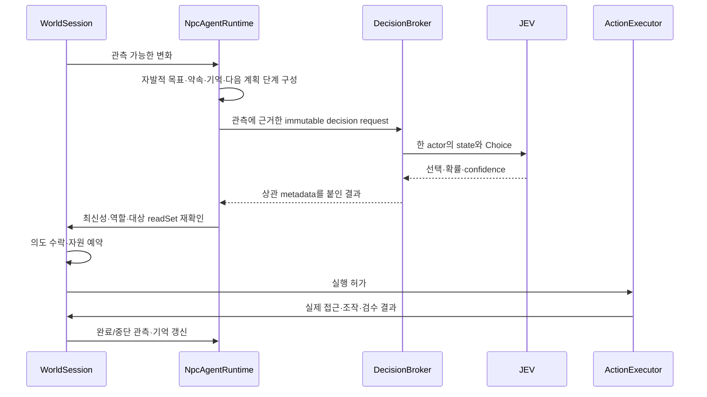

# 자율 NPC·JEV 동적 미래·인과적 비상상황 정밀 설계

**설계 제안, 미구현.** 사용자 결정·전체 책임은 [DESIGN.md](DESIGN.md), OSS 판정은 [OSS_INTEGRATION.md](OSS_INTEGRATION.md), 단계별 구현은 [EXECUTION_PLAN.md](EXECUTION_PLAN.md)를 따른다. 수백 NPC를 이번에 실행했다는 문서가 아니다.

## 1. 인물과 화면의 분리

인물 registry는 run 생성 시 안정된 `actorId`를 부여한다. solver integer ID·GameObject instance ID·prefab variant는 adapter 내부 매핑이다. 삭제·재생성·층간 이동·렌더 LOD에서도 같은 actor의 기억과 책임을 유지한다.

| 상태 | 내용 | 갱신 주체 |
|---|---|---|
| 정체성 | 직무/시민, profile revision, 일정, 이동지원 필요, 동행 관계 | content와 실제 역할 전환 |
| 생활 | 욕구·자발적 목표·일정·약속·보유품·진행 과업 | 인물의 목표 선택과 실제 행동 결과 |
| 지각 | 시야/가림·청각 수신·직접 대화·표지·전달받은 정보 | 지역 관측 수집기 |
| 믿음 | 관측/보고/추정/미확인/상충 | 인지·기억 계층 |
| 인지 과업 | 목표/계획 revision·candidate basis·판단 요청 seq·미처리 trigger·재계획 이유 | 개인 agent runtime과 공통 scheduler |
| 물리 과업 | 예약·접근·조작·검수·중단·책임 인계 | 공통 executor |
| 생애 | active / travelling / offscreen / departed / assistance / unresolved | 실제 이동·업무·사건 결과 |

`departed`를 `safe`와 같은 enum 값으로 만들지 않는다. solver 출구에서 삭제된 인물도 최종 위치/인계 결과가 미확인일 수 있다. 화면 밖은 ‘시뮬레이션 없음’이 아니라 더 낮은 시각/감지 상세도다.

### 1.1 배경 배우가 아닌 자율 AI 에이전트

본게임의 기본 인물은 `관측 → 자기 목표 형성/선택 → 계획 → 행동 → 결과 관측 → 유지/재계획`을 반복한다. 플레이어가 말을 걸거나 사건 director가 호출해야만 움직이는 구조가 아니다. 일정·지원 필요·목격한 위험·자원 부족·약속·동행 관계가 스스로 판단을 시작할 수 있는 근거다.

- **목표:** `GoalPlan`은 goal ID, owner, 생성 이유/관측 refs, 완료 predicate, 약속/기한, plan revision, 현재 단계와 포기/수정 이유를 가진다. ‘현실적으로 행동하라’라는 무한 목표 대신 지원 대상 찾기·합의한 인계·직무 작업·이동 등의 검증 가능한 목표를 쓴다.
- **계획:** 현재 물건·통로·타인·자격으로 목표-다음 단계 후보를 동적으로 구성한다. JEV는 실제 관측·관련 기억에서 후보를 판단한다. 완성된 NPC 인생/사건 대본을 선택하지 않는다. 선택 후보의 로컬 binding이 goal/plan/action을 연결하며 기존 `/npc/decision`의 action 후보 의미를 임의 world patch로 확장하지 않는다.
- **실행:** 인물은 스스로 접근·관찰·도구 확보·도움 요청·거절·재전달·협업을 시작할 수 있다. NPC끼리의 수락/협상은 해당 인물의 판단이며 매번 플레이어 승인을 요구하지 않는다. 역할·동의·물리·실제 책임은 실행기가 검사한다.
- **피드백:** 길 차단·도구 점유·목표 달성·새 정보·약속 변경이 기존 계획을 수정한다. 입력이 바뀌지 않은 실패를 매 프레임 재질문하지 않는다. 무의미한 목표 교체는 최소 유지 조건/변경 이유로 억제하고, 실제 새로운 위험은 유지 조건보다 우선한다.
- **한계:** 독립 목표 선택은 호스트 파일/프로세스/네트워크를 임의 조작할 권한이 아니다. agent의 도구는 버전 있는 게임 행동 포트다. 자기 대사·자기 평가만으로 목표를 완료 처리할 수 없다.
- **현실감:** 서로 다른 관측·오해·정보 전달 지연·관계·우선순위가 다른 행동과 새로운 경합을 만든다. 그 차이를 없애려고 모든 NPC에게 같은 world snapshot/예측 정답을 보내지 않는다.

## 2. 관측과 기억

### 2.1 관측 수집

- 공간 partition으로 근처 대상만 찾고 시야·가림·전달 범위를 확인한다. 500×500 전원 raycast와 매 프레임 JSON snapshot은 하지 않는다.
- 눈앞의 연기·도움 요청·문 상태와, 경고 방송을 실제 들었는지, 무전을 받았는지를 구분한다.
- NPC에게 FDS 전체 배열·모든 위험 위치·전체 시민 목록·아직 전파하지 않은 사건 원인을 제공하지 않는다.
- `TRUE/FALSE/UNKNOWN/CONFLICTED`는 **해당 actor의 지식 상태**다. 실제 세계 truth는 별도이고, UNKNOWN/CONFLICTED의 단일 값은 null이다.
- 사건 precondition 검사에 쓰는 숨은 world truth를 action 후보의 설명에 그대로 드러내지 않는다. 관측 가능한 실패 결과로만 새 사실을 배운다.
- 위치 변화가 매 프레임 observation revision을 증가시키지 않도록 ‘작업점 도달/시야 상실/새 위험/관계·약속 변경’ 등의 의미 변화로 증분 갱신한다.

### 2.2 기억 저장·검색

기억은 SQLite의 owner별 projection과 인메모리 최근 ring buffer를 쓴다. 초기에는 owner·participant·goal·zone·time·salience 인덱스 검색으로 충분한지 검증하며 벡터 DB를 선도입하지 않는다.

- 실제 관측/사건 참조가 있는 요약과 전해 들은 주장을 구분한다.
- 다른 NPC가 ‘끝냈다’고 말하면 `reported` 기억이며 완료 이벤트가 아니다.
- 실제 지원·약속 이행·거절 등에 근거해 관계를 갱신한다. 우호도 수치를 현실 심리 척도로 주장하지 않는다.
- 요청당 기억 최대 16개, 관측 최대 64개는 전송 경계의 실험상 한도다. 무작정 최신 16개가 아니라 현재 약속/도움 대상/작업 관련성을 우선한다.
- 긴 대사 원문을 전부 prompt에 쌓지 않는다. 원문 저장은 기본 비활성, 플레이어 개인정보는 외부 전송 전에 배제한다.
- run 간 인물/관계 유지 범위는 아직 제품 결정이 아니다. 기록된 run 내 기억 변화와 학습 실험은 독립적으로 구현한다.

## 3. JEV 판단 loop

### 3.1 후보 생성

- 행동/인과 catalog는 **가능한 동사와 조건**을 정의한다. 현재 entity·자원·목표·관계로 실행 시점의 후보 2~32개를 생성한다. 고정된 사건별 정답 선택지나 대본 목록을 후보 생성기로 사용하지 않는다. provider의 255개 한도를 그대로 게임 인지 후보 수로 쓰지 않는다.
- candidate ID는 `(action definition, targets, task intent)`에 결속된 opaque ID. JEV가 좌표·도구 토크·새 코드를 생성하지 않는다.
- 필요한 경우 `request_information`, `continue_current_task`, `wait_or_decline` 등 실제 실행 가능한 선택지를 포함한다. 후보가 전부 잘못된 A/B 강제 선택을 만들지 않는다.
- 이미 소유 중인 도구도 최신 상태에 따라 최종 예약/사용 검사를 한다. 후보에 있다는 사실은 실행권 부여가 아니다.
- 시민의 오판·지연·소문·약속 충돌은 모델링할 수 있다. 판단의 다양성을 만들려고 JEV 확률을 실제 인구의 행동 빈도 분포라고 취급하지 않는다.
- 사건의 원인 행동도 실행 가능한 인과 연산자의 전제·효과로 제한한다. 허용 연산자를 상황에 맞게 합성하는 것과 사전 작성 사건 전체를 선택하는 것은 다르다. 자유 텍스트가 프로그램 권한을 얻거나 임의 범죄 방법/물리식을 실행하지 않는다.

### 3.2 판단 스케줄러

trigger: 새 도움 요청, 과업 완료/막힘, 동행자 상실, 경로/문 상태 변화, 의미 있는 위험 관측, 지식 충돌, 책임 인계, 일정/목표 전환.

**제안 초기 공통 상한:** NPC 실제 판단과 `/future/step`을 **합산**해 초당 dispatch 12회, 동시 upstream 12개, pending 128개, actor당 실제 active decision 1개, forecast scope당 active step 1개, automatic retry 0. actor당 최신 trigger/dirty flag만 합쳐 보관한다. pending에 못 들어간 인물은 dirty 상태와 대기 age를 유지한다. 미래 가지마다 새 예산/큐를 만들어 상한을 우회하지 않는다.

| 우선순위 | 예 | 처리 |
|---|---|---|
| local 즉시 규칙 | 경로가 없어짐, 물리 충돌, 작업 중 실제 interlock 변화 | 원격 호출을 기다리지 않는 executor 중단/재검사 |
| foreground | 플레이어의 직접 질문·현재 지원 대상·인계 | 우선 admission. 전체 한도를 우회하지 않음 |
| 사건 관측 | 해당 actor가 새로 관측한 위험·동료 요청 | 가까운 전환부터 처리하되 age 기반으로 공정성 보정 |
| 일상 | 일정 변경·유휴·낮은 긴급도 | 기존 행동 유지, 중복 trigger 병합, 남은 capacity 사용 |
| 미래 가지 확장 | 현재 세계/개입에서 다음 상태를 가정하는 추론 | live 판단과 같은 한도 사용. 깊이/가지/시간 상한에 도달하면 명시적으로 truncated |

foreground가 계속 오더라도 routine이 영구적으로 굶지 않게 대기 age와 최소 분배를 측정한다. 구체 배분비는 실제 부하 결과로 정하고 빈 우선순위 칸을 놀려 두지 않는다.

**중요한 계산:** 300명의 새 판단을 12회/초로 모두 처리하려면 upstream 시간이 0이어도 dispatch에 최소 25초가 든다. 미래 가지 추론과 계정을 공유하면 실제 대기는 더 길어질 수 있다. ‘모든 시민이 동시에 2초 안에 재판단’이나 ‘전체 미래를 매 프레임 생성’은 이 설정에서 불가능하다. 2초 목표는 admission 가능한 foreground 단일 판단이며 전체 다단계 예측의 SLA가 아니다. 즉시 반응은 local 관측·행동 규칙과 기존 유효 과업으로 처리하고 provenance를 `local_rule`로 구별한다.

### 3.3 성능·비용

- 12 dispatch/sec = 720 RPM, 공개 1,200 RPM보다 여유가 있지만 계정 단위/동적 한도·다른 세션을 함께 고려해야 한다.
- 요청 평균 2,000 input tokens 가정 시 86.4M tokens/h × $0.042/M = **$3.6288/h**. 이는 최대 지속 dispatch 가정의 JEV 입력 비용이며 생성 대화·worker·네트워크 비용을 제외한다.
- 이번 실측 중앙값 약 0.6초를 단순 적용하면 평균 동시 처리 약 7.2개가 필요하지만, 12 concurrency의 provider 지원을 검증한 것은 아니다.
- provider quota는 실제 사용량으로 차감하고, timeout에서 usage가 없으면 ‘미청구 0’으로 단정하지 않는다. 별도 비용 한도 설정 전 장시간 유료 부하 실험을 시작하지 않는다.
- 측정 필드: trigger→admission, queue wait, upstream RTT, return→apply, stale drop, actor service age, queue depth, 429/timeouts, input/output usage, frame CPU/GPU/GC. confidence는 성능 또는 정확도 지표가 아니다.

## 4. NPC 전용 wire와 의미 검사

정식 형태는 [npc-decision.schema.json](contracts/npc-decision.schema.json), 합성 예시는 [npc-decision.examples.json](contracts/npc-decision.examples.json)이다. 이것은 JEV 공식 wire를 그대로 Unity에 노출하는 계약이 아니다.

### 4.1 요청의 의미

- `kind=decision_request`, `schemaVersion=1`.
- `runId/generation/requestId/actorId/decisionSeq`: 세션·인물·최신 판단 상관키.
- `basisTickUs/expiresAtTickUs/observationRevision`: sim 시각과 actor 지식 revision. nonnegative Int64 범위의 정규 10진 문자열. JS Number로 long을 왕복하지 않는다.
- `deadlineMs`: admission 후 caller가 허용하는 최대 벽시계 처리 시간. worker 정책과 이 값 중 짧은 deadline 사용, queue deadline도 caller가 별도 추적.
- `actor`: role/profile, persona, current action, 현재 goal 요약. 인간 발화에서 role/profile을 바꾸지 않는다.
- `observations/memories`: actor에게 허용된 지식만 포함. 각각 출처·시점·신뢰 구분 유지.
- `candidates`: ID/action ID/target ID/설명. 동일 candidate ID 중복 금지.
- `readSet`: 결정 적용 시 검사할 관련 entity revision. 전 세계 revision 하나 때문에 무관한 사람의 이동이 답을 계속 폐기시키지 않음.

JEV에는 관측·기억·목표·후보 설명을 전송한다. 권한·reservation의 실제 검사는 로컬 코드이며, actor private context를 다른 actor와 한 shared state에 합치지 않는다.

### 4.2 응답의 의미

- `kind=decision_result`, 동일 상관키 + `requestSha256`.
- `status=ok`: 실제 성공한 upstream, exact configured model, 선택 후보 ID, 후보별 probabilities와 confidence, latency/usage.
- `status=unavailable`: 선택/확률/confidence는 모두 null. 이유는 enum이며 로컬 기본 행동을 JEV 답변으로 만들어 넣지 않는다.
- `upstreamLatencyMs`는 upstream 요청 시작→읽기/파싱 완료까지이고, queue wait·Unity 적용 지연과 별도.
- `usage=null`은 알 수 없음. token 0이라는 의미가 아니다.
- metadata/hash는 proxy가 원요청으로부터 작성한다. prompt에서 복창한 문자열을 인증 근거로 사용하지 않는다.

### 4.3 transport·오류

설계 경로 `POST /npc/decision`. 기존 `/turnaround`와 같은 기능의 alias가 아니다.

| HTTP | 의미 |
|---|---|
| 200 | 유효한 성공 결과 |
| 400 / 413 / 422 | malformed/oversized/shape 또는 semantic request 위반. 상관 가능한 유효 request가 없으면 짧은 `{error:{code}}` transport error만 반환 |
| 401 / 403 | local session capability 또는 관리형 서비스 인증/권한 실패 |
| 409 | 보존된 request identity와 같은 key에 다른 request ID/body hash가 들어옴. 새 추론 금지 |
| 410 | 이미 지난 decisionSeq인데 결과/identity window가 소진됨. `unavailable/request_expired`; 새 추론 금지 |
| 429 | 계정/세션 한도. 유효 request에 대해서는 `unavailable/rate_limited` |
| 502 / 503 / 504 | upstream 실패/queue·budget 불가/timeout. 유효 request에 대해서는 typed unavailable |

기본 최대 body/response 64KiB, depth 16, decoded key 중복·NaN/Infinity·trailing bytes·고립 surrogate 금지. Schema가 모두 잡아준다고 가정하지 않는다. 모든 `$ref`는 같은 schema 안이며 network resolver를 쓰지 않는다.

초기 개발은 로컬 Node worker가 env/보호된 stdin으로 개발자 본인 credential을 받는다. Unity asset·PlayerPrefs·command argv·로그·checkpoint에는 저장하지 않는다. loopback만 bind하고 프로세스 시작 때 별도 일회 session capability를 전달하며 Origin/Content-Type/크기 제한을 적용한다. loopback 자체가 인증은 아니다. 배포형 공용 credential은 서버에서만 보관하고 계정별 권한/요금 한도 뒤에 둔다. 공용 비밀을 PC 바이너리에 넣는 배포는 제외한다.

### 4.4 적용 전 관계 검사 — schema로 대체 불가

1. lexical/shape 검사 뒤 **실제 전송 기록**의 run/generation/actor/requestId/decisionSeq와 body hash로 상관시킨다. 이것은 현재 세계에 적용 가능한지의 검사와 다르다. 전송 기록이 없는 응답은 신뢰하지 않는다.
2. 신뢰할 수 있는 proxy의 known usage는 request key당 한 번 회계에 반영한다. 취소·deadline 초과·옛 generation의 응답도 실제 청구 가능성을 지우지 않는다. usage가 없으면 unknown이다.
3. **`status=unavailable`이면 여기서 분기한다.** reason/usage/latency를 기록하고 그 요청의 active slot만 종료한다. 최신 다른 요청의 slot은 해제하지 않는다. 선택·model·probabilities가 null인 유효 실패를 성공 경로로 검사하지 않으며 action을 만들지 않는다. 기존 local 행동/보류 상태는 실제 상태에 따라 유지한다.
4. 이후는 **`status=ok`에만 적용**한다. 활성 run/generation/actor·최신 decisionSeq와 일치하고, 취소/role 전환/pause 복원으로 폐기되지 않았으며 wall deadline·sim expiry가 모두 유효해야 한다. 늦은 성공은 적용하지 않지만 2번의 회계 기록은 유지한다.
5. observation revision과 관련 readSet을 재검사하고 대상 도달/가림 조건도 확인한다. model이 설정한 direct model과 일치하고 응답의 후보 집합이 요청 후보 집합과 정확히 같아야 한다.
6. ID 중복 없음, 선택이 후보 집합 안, 확률 모두 finite [0,1], 총합 1±1e-6, 선택 확률이 최댓값(동률 허용). confidence 범위 검사. 임의로 확률을 재정규화해 오류를 숨기지 않음.
7. 정보가 없어 강제 선택한 경우 실제 실행 가능한 문의/보류로 전환하고 그 출처를 local rule로 남긴다. confidence로 역할·truth·예약 검사를 생략하지 않는다. threshold는 holdout 보정 전 정확도 보증값으로 사용하지 않는다.
8. 공통 executor가 역할·자원·대상·동의·선행조건 재검사 후 **하나의 예약/효과 commit**.

### 4.5 중복과 cache 수명

- 추론 키는 **`(runId, generation, actorId, decisionSeq)`**이며 해당 key의 `requestId`와 exact-body SHA-256은 불변이다. 인증된 세션에 등록된 actor만 요청할 수 있다.
- actor별 generation-scoped **sequence high-water mark를 active generation 동안 반드시 유지**한다. admission 시 먼저 갱신한 뒤 upstream을 호출하며 감소시키지 않는다. actor당 한 active 요청, in-flight coalescing, bounded completed-result/identity cache를 함께 사용한다. coalescing만으로 완료 후 중복을 막는다고 가정하지 않는다.
- identity가 남은 key는 ID/hash가 다르면 409, 같고 진행 중이면 같은 flight에 결합, 완료 결과가 남으면 같은 결과 반환이다. 어느 경우도 새 추론을 호출하지 않는다.
- `seq <= high-water mark`인데 결과/identity가 이미 제거됐으면 410 `request_expired`다. hash까지 소진된 과거 요청은 같은 body인지 다른 body인지 확정하지 않지만 **둘 다 새 요청과 구별해 거부**한다. 결과 cache eviction이 과금 재추론을 허용하지 않는다.
- 새로운 판단은 현재 세계에서 만든 `seq > high-water mark` 요청이다. 만료된 요청을 같은 key로 재전송하는 HTTP retry와 구별한다.
- worker 재시작으로 high-water mark를 잃었으면 그 active generation을 그대로 재개하지 않는다. 세션 owner가 새 generation을 등록하고 현재 세계에서 새 요청을 발행한다. 이전 generation은 접수하지 않는다.
- action 중복 키는 추론 키와 별개인 `(runId, generation, actorId, intentId)`다. 모델 결과 cache의 수명으로 도구 소비/인계의 중복 여부를 결정하지 않는다.

## 5. 행동·협업·자원 경합

예: 직원 A/B가 카트 하나를 각각 선택.

1. JEV는 두 요청에 각각 카트 사용 후보를 선택할 수 있다.
2. world writer가 A의 reservation을 먼저 commit해 cart revision을 증가시킨다.
3. B는 stale read set 또는 자원 점유로 `BLOCKED`. 소유권을 동시에 받지 못한다.
4. B는 다른 실제 대안이 생기거나 예약이 해제될 때 재계획한다. 같은 실패를 매 프레임 JEV에 재질문하지 않는다.
5. 취소 시 예약과 실제 부품/재고 상태를 구분해 해제한다. 실행 중 이미 소비된 소모품을 원상 복구하지 않는다.

협업 지원: `REQUESTED → ACKNOWLEDGED → ACCEPTED → EN_ROUTE → ONSITE → HANDOFF_ACCEPTED`.

`ACKNOWLEDGED`는 수신, `ACCEPTED`는 맡겠다는 약속, 마지막 상태가 책임 이전이다. 이전 담당자가 인계 전에 이탈하면 미인계가 남는다. 상대가 도착 전에 취소하면 기존 담당자가 책임을 유지한다. consent가 필요한 지원은 동의 상태와 철회가 실제 과업 조건이다.

## 6. 대화 모델의 적용 범위

생성 대화 제공자는 아직 선정하지 않는다. 한국어·직무 약어·부정·정정·존대·관계 연속성과 비용/지연을 같은 사례로 비교한 뒤 하나를 pin한다. 여러 vendor fallback을 미리 구현하지 않는다.

- 대화 입력: 발화자/청자, **발화자가 알고 있고 청자에게 공유하도록 허용된 사실**, 발화 의도, 발화자의 관련 약속/기억, 발화자가 파악한 과업 상태. 보고/추정의 지위를 유지한다. 청자만 알고 있는 비공개 사실을 발화자 prompt에 넣지 않는다. 청자는 실제 전달된 발화를 통해 새 `reported` 관측을 얻으며, 발화자만 본 사실도 허용된 보고로 전달할 수 있다.
- 대화 출력: 대사와 참조한 fact IDs, 제안된 대화 행위(질문/요청/동의/거절/정정). 대사에 포함된 command를 바로 실행하지 않는다.
- 도움 요청·수락·동의·인계는 명시적 대화 행위로 해석하고 행위 주체의 선택에 따라 typed intent를 만든다. 플레이어의 동의는 플레이어가, NPC의 수락/거절은 해당 agent가 결정한다. 생성 문장만으로 수락·동의가 자동 생성되거나 모든 NPC 행동에 사람 승인이 필요해지지 않는다.
- **안내 위치·현재 과업 상태·인계 완료·안전/운행 재개 등 중요한 사실은 검증된 slot/template로 표현**한다. 자유 텍스트 검출기만으로 모든 환각을 차단할 수 있다고 주장하지 않는다.
- 자유 대화/성격 표현에는 별도 모델을 쓰되 관측 밖 정보나 새 공식 절차를 발명한 문장은 사용하지 않는다. 불확실한 사실은 불확실성을 표시한다.
- 모델 실패 시 자막을 지우거나 작업을 성공 처리하지 않는다. 중요한 상태는 실제 사실 기반 기본 문구로 전달하고 `template` 출처를 기록한다.
- 음성 STT/TTS는 미확정. 기본 계약은 텍스트/자막이며 음성이 없는 상태에서도 모든 핵심 상호작용이 가능해야 한다.

## 7. 현재 상황에서 JEV로 미래 전개를 계속 합성

### 7.1 고정하는 것은 법칙이며, 미래 대본이 아니다

`TransitionDefinition`은 관찰·이동·지원·문/통로 상태·설비 영향처럼 게임에서 실행할 수 있는 인과 연산자와 검증 범위다. 특정 사건 전체의 발생 시각·인물 행동·정답·결말을 정한 목록이 아니다. `AffordanceBuilder`가 **현재** 사물·인물·관계·자원·상태로 대상과 매개변수를 결속해 후보를 만든다. JEV 추론과 실행 결과를 다시 입력으로 삼아, 저작자가 개별적으로 쓰지 않은 행동/사건 조합이 이어져야 한다.

Scenic은 **선택적인 오프라인 초기 조건·제약·holdout 표본 도구**다. 기본 runtime은 Scenic 없이도 초기 세계와 인과 규칙, 자율 agent, JEV로 진행할 수 있어야 한다. 사전 생성 JSON pack이 본게임의 미래를 공급하거나 사건 ID 목록 중 하나를 선택하는 것으로 동적 미래를 대체하지 않는다.

JEV의 Choice/Score/Noul 출력이 다음 추론을 구동하며, 새 문장·임의 수치·물리 방정식을 출력한다고 가정하지 않는다. 같은 요청의 질문은 독립 평가다. 앞 답을 조건으로 삼는 다음 단계는 **갱신된 상태의 다음 요청**으로 구성한다. 이는 공식 [합성 방식](https://docs.typesafe.ai/concepts/how-to-build-with-system-one.md)에 따른 설계이며, [수치/생성 한계](https://docs.typesafe.ai/model-jaggedness/jev-1.13.md)를 없앴다는 뜻이 아니다.

### 7.2 두 개의 연결된 루프

**실제 세계 루프:** 플레이어의 직접 행동 + NPC 각자의 자율 행동 + 인과가 성립한 환경 전이 → 공통 실행/물리 → 실제 새 상태 → 인물별 관측·목표/계획 수정.

**미래 합성 루프:**

1. 현재 상태의 immutable snapshot과 관련 read set을 잡는다. 플레이어의 이미 실행한 개입과 ‘만약 이 행동을 한다면’이라는 가정은 분리한다.
2. snapshot에서 시작하는 격리된 branch를 만든다. branch마다 독립된 가상 예약·인물 계획·물리 지원 범위와 clock을 갖고 실제 세계의 값을 쓰지 않는다. 전체 세계를 매 프레임 복사하지 않고 bounded 의미 snapshot/변경분을 사용한다.
3. 각 단계에서 현재 branch의 인과/행동 후보를 새로 구성해 `/future/step`으로 JEV에 묻는다. 세계의 환경 전이는 world perspective, 가정한 NPC 선택은 **그 가상 인물의 관측/기억만** 포함한 actor perspective를 사용한다.
4. 응답을 검증하고 같은 `TransitionKernel`/행동 규칙으로 다음 가상 상태를 계산한다. 수치·이동 시간·자원 소모는 해당 규칙/지원 solver가 계산한다. JEV Score를 초·거리·온도·손상량으로 보간하지 않는다.
5. 새 가상 상태가 다음 질문의 입력이 된다. 관련 대안이 있으면 다른 intervention/선택으로 조건부 branch를 확장한다. 서로 상충하는 독립 답을 한 사실로 합치거나 단계별 확률을 곱해 실세계 결말 확률이라고 표시하지 않는다.
6. 실제 플레이어/NPC 개입·관련 revision·새 관측이 바뀌면 영향받은 branch를 stale로 표시하고 현재 상태에서 다시 구성한다. 무관한 pose 변화만으로 모든 미래를 매 프레임 폐기하지 않는다.

첫 실험은 한 forecast당 최대 4개 유지 가지, 가지 깊이 3단계, 의미 시간 horizon 최대 30초를 **조정 가능한 예산**으로 시작한다. 이보다 짧게 종료될 수 있으며 horizon 도달·목표 판단 가능·지원 모델 없음·deadline/예산 소진을 구별한다. 수백 NPC의 모든 가능한 미래를 전수 탐색하지 않는다.

### 7.3 예측을 실제로 적용하는 경계

- **가상 미래는 실제 기록이 아니다.** 가상 도구 소비·대피·인계·목표 달성은 현재 재고·기억·예약·completion/receipt·live actor decisionSeq를 바꾸지 않는다. 가상 계산의 실제 API 사용료만 공통 회계에 기록한다.
- 미래 가지는 인간의 다음 행동을 가정할 수 있지만 플레이어 대신 입력하지 않는다. 가정한 NPC 계획도 실제 agent에게 강제하지 않는다. 각 실제 NPC가 현재 관측과 목표에서 자기 행동을 결정한다.
- 원인/시간 조건이 **현재 실제 세계에서** 성립한 바로 다음 환경 전이만 `EnvironmentTransitionIntent`로 제안할 수 있다. root snapshot/read set, ruleset, 실제 원인 event refs, 적용 시각과 소비 자원을 다시 검증한다. 가상 단계에서만 생긴 원인을 가져와 실제 사건을 발생시키지 않는다.
- 환경 전이의 중복 키는 `(runId,generation,transitionIntentId)`이고 적용 효과·원인 refs·매개변수 fingerprint를 결속한다. 현재 generation 검사 후 동일 fingerprint는 같은 결과, 상이한 fingerprint는 충돌이다. actor action/기관 receipt와 구별하며 한 writer에서 원자적으로 적용한다.
- 사용자에게 예측을 보여 주는 UI는 별도 확정하지 않는다. 내부 추론 결과가 NPC에게 주어질 때도 해당 인물이 알 수 있는 근거와 `inferred/hypothetical` 지위를 유지한다. world perspective의 숨은 사실을 공유하지 않는다.
- API가 unavailable이면 이미 유효한 행동·알려진 인과·물리는 지속한다. 새 JEV 고차 판단/미래는 unavailable/truncated로 남긴다. 고정 사건 대본을 몰래 재생하며 ‘실시간 AI 미래 생성’이 정상이라고 표시하지 않는다.

### 7.4 `/future/step` 계약과 한 단계의 의미

규범적 형태는 [future-step.schema.json](contracts/future-step.schema.json), 합성 예시는 [future-step.examples.json](contracts/future-step.examples.json)이다. 아직 endpoint 구현이나 실제 세계 예측 시험은 없다.

- 식별: `runId/generation/requestId/forecastId/branchId/stepSeq`. 순번은 actor 실제 decisionSeq와 별개다. key는 `(runId,generation,forecastId,branchId,stepSeq)`이고 요청 원문 hash를 결속한다.
- 근거: `basisSnapshotId`, `basisTickUs`, `stepTickUs`, `horizonEndTickUs`, `expiresAtTickUs`, `rulesetId/rulesetRevision`, 관련 `readSet`, bounded `stateFacts`.
- 관점: `perspective.kind=world`이면 actor ID/knowledge revision 및 모든 후보의 actorId는 null이며 환경 전이만 평가한다. `actor`이면 owner/knowledge revision과 후보 actorId가 필요하고 **모든 후보 actorId가 그 owner와 같아야** 한다. 미래 NPC 입력의 실제 격리는 schema 필드만으로 보장되지 않으며 snapshot builder가 수행한다. world 관점의 숨은 사실로 NPC 행동을 대신 선택하지 않는다.
- 용도: `purpose=next_environment`는 world 관점의 depth 0 후보에만 허용한다. `counterfactual`은 격리 미래 계산이다. `next_environment` 응답도 즉시 실행 허가가 아니며 7.3의 실제 세계 재검사를 거친다.
- 후보: 현재 상태에서 만든 candidate ID, transition ID, 대상 slot binding, 코드 소유 parameter set ID, cause fact refs, 상황 설명. **완성 사건 ID/결말 ID나 실행할 자유 코드는 없다.** JEV가 숫자를 발명하지 않으며 parameter set의 단위/범위/근거는 로컬 registry가 검증한다.
- 응답: 선택 candidate ID·확률·confidence·model/usage/latency·request hash. 후보에 없는 전이를 반환하거나 world patch를 포함하면 거부한다. Choice 확률은 후보 사이 상대 평가이지 실세계 미래의 보정된 결합 확률이 아니다.
- 형태 이후 의미 검사: 등록된 snapshot/branch/perspective와 key 일치, 원문 hash, canonical Int64 범위, `basisTickUs <= stepTickUs <= horizonEndTickUs`, horizon 예산, expiry/deadline, 현재 ruleset/read set, cause refs·slot 중복·후보 membership, branch 소유권, 선택/분포 일치. `next_environment`는 `stepTickUs=basisTickUs`이고 모든 원인이 실제 fact여야 한다.
- `/npc/decision`과 같은 strict JSON·64KiB·depth16·model pin·usage 회계·unavailable 선분기·HTTP 409/410 정책을 적용하되, forecast별 branch high-water mark/tombstone 수명은 live actor와 분리한다. 종료된 forecast는 generation 동안 compact terminal 기록으로 재접수를 막고, 기록 재구성이 불가하면 새 generation 없이는 재개하지 않는다. bounded active forecast 수와 terminal 기록 상한에 도달하면 admission을 중단하며 삭제 후 동일 ID를 새 요청으로 취급하지 않는다.

### 7.5 실제 사건과 미래 가지의 생애

실제 사건: `QUIESCENT → EMERGING → ACTIVE → CONTAINED → RECOVERY → CLOSED`. 이름은 관측된 인과 상태의 분류이지 이 순서로 강제 재생할 대본이 아니다. 억제된 원인은 발생하지 않을 수 있고, 동시 사건은 실제 자원·경로·정보·업무를 공유한다.

미래 가지: `CREATED → EXPANDING → READY / TRUNCATED / UNAVAILABLE`, 이후 `STALE / CANCELLED / EXPIRED`. READY는 현재 가정/범위에서 계산을 마쳤다는 뜻이지 미래가 확정됐다는 뜻이 아니다. 특정 인물이 출구에 도달할 것이라는 예측으로 실제 사건을 닫지 않는다.

`MODEL_INCOMPLETE`는 과학 solver의 지원 공간·시간·coupling 범위를 넘었음을 뜻한다. 그 부분의 정량 판정을 중단하고 마지막 값은 과거 관측으로 남긴다. 실제 피해/구조 안전/운행 재개를 모델의 자신감으로 인증하지 않는다.

### 7.6 사건군과 인과 연산자의 범위

| 사건군 | 동적으로 결합되는 원인/상태 | 플레이어·자율 NPC의 실제 개입 | 근거 경계 |
|---|---|---|---|
| 설비/운영 사고 | 현재 고장·문/통로·작업·정보 상태와 사용 행동 | 관찰·전파·접근 통제·우회·직무 조치·전문 인계 | 수치·수리 순서는 승인 작업자료가 있어야 공식 판정 |
| 연기/화재 | 지원하는 hazard driver의 현재 상태·영향·노출 | 관측·방송·도움·이동·경로 통제·인계 | FDS reference를 실제 역/쌍방향 CFD로 확장 주장하지 않음 |
| 자연재해 | 외부 조건과 그때의 portal/설비/인물 상태 | 정보 전달·경로 재판단·지원·기관 인계 | 구조물/홍수/지진 solver 미구현이면 게임용 인과 표현과 과학 예측을 구별 |
| 의심물품/의도적 위해 | 현재 인물·환경의 제한된 원인 연산자와 보고·불확실성 | 보호·신고·대피 협력·통제·전문기관 인계 | 공격 제작·최적화나 직원의 해체 권한을 생성하지 않음 |
| 군중/지원 필요 | 각 agent의 일정·동행·정보·목표·이동·지원 선택 | 자발적 재전달·동행·동의·우회·실제 인계 | JuPedSim 지표를 임상/압착력·인간 심리 기준으로 읽지 않음 |

초기 조건·환경 연산자·생활 선택의 RNG stream을 분리한다. **플레이어가 원인과 결과를 추론할 수 있는 일관성**과 ‘같은 seed로 JEV를 다시 호출하면 같은 답’은 다르다. 원 요청/응답·선택·bindings·규칙 버전·실제 commit을 기록해 의미 전이를 재생한다. fresh API의 완전 결정론이나 전체 물리 프레임의 동일성을 약속하지 않는다.

검증 장면은 같은 초기 세계에서 통로의 실제 가용성을 바꾸거나 지원 책임을 달리했을 때, 기존 예측의 불가능한 경로가 제거되고 NPC가 현재 정보로 재계획하며 실제 다음 상태가 인과적으로 달라지는지 확인한다. 임의 개입마다 JEV의 선택이 반드시 바뀐다고 요구하지 않는다. 대사·seed·branch ID만 달라지고 행동/세계가 고정 대본대로면 실패다.

## 8. 군중·기하·물리의 통합

- 기존 DotRecast route 데이터를 유지·확장한다. 층/portal/동적 문/이동지원 path filter는 새로 구현·검증해야 한다.
- 일반 NPC는 한 local mover가 경로와 local avoidance를 적용한다. DetourCrowd 추가 여부/버전 검증은 OSS 부록 기준. 단순 직선 MoveTowards를 다중층·혼잡의 완성 구현으로 재사용하지 않는다.
- portal에는 actor capacity·방향·문 상태·접근성·geometry revision을 두고 실패/폐쇄 시 경로를 invalidate한다. 순간 teleport로 계단·승강기 결과를 대체하지 않는다.
- JuPedSim은 geometry 검증된 과학 profile에서 해당 인물 위치를 소유한다. 기존 worker의 200명 capability·1초 advance/보간·inline payload를 수백 NPC 실시간 소유자로 그대로 사용하지 않는다.
- FDS case에는 좌표 변환·도메인·grid·sample height·단위·유효 시간·해석 provenance가 필요하다. domain 밖/시간 소진은 값 0 또는 마지막 값 연장으로 처리하지 않는다.
- 환기·문·소화 조작이 실제 CFD 결과를 바꾼다고 표현하려면 해당 coupling이 검증돼야 한다. 기존 단방향 참조장을 시각적으로 변형해 실제 solver 반응이라고 주장하지 않는다.

## 9. 정책 학습 연구

기억/관계 변화와 가중치 학습을 분리한다. **JEV의 고객별 fine-tuning API가 있다는 전제는 사용하지 않는다.**

초기 외부 연구 도구는 Gymnasium + Stable-Baselines3(PPO) 후보를 사용한다. 버전/의존성은 [OSS 부록](OSS_INTEGRATION.md)을 따른다. 학습용 Python 환경은 physics worker 환경과 격리한다.

### 환경 계약

- `reset(seed, initialWorldSeed)` → 같은 content/인과 규칙 판본으로 초기 세계를 구성한다. actor identities/seed streams/관측 범위를 기록하며 미래 사건 순서를 함께 고정하지 않는다.
- `step(action)` → 실제 C# domain/executor가 정해진 simulation 구간을 진행하고 ego actor 관측·보상 항목·종료 이유를 반환. Python에서 다른 규칙의 ‘간이 철도 세계’를 만들고 본게임 성능이라고 평가하지 않는다.
- 첫 연구 비교는 **버전이 고정된 background policies 속 한 직원/시민의 고수준 행동**을 학습한다. 정책 버전 고정은 NPC의 행동 순서를 대본으로 고정한다는 뜻이 아니다. 본게임의 자율성 요구와 구별하며, 동료 전체의 동시 MARL은 별도 연구 설정이다.
- PPO용 action space는 고정된 고수준 skill 집합. variable candidate array index를 매 step 다른 의미로 재사용하지 않는다. 불가능한 행동은 domain에서 상태 변경 없이 거부하고 관측/보상 항목에 남긴다. 기본 PPO가 action masking을 제공한다고 가정하지 않는다.
- 학습 observation은 해당 actor의 정보만 포함. 숨은 world truth는 validator/평가 metric에만 사용하며 policy 입력에 누출하지 않는다.
- terminated(정의된 목표/실패)와 truncated(시간/모델 범위/서비스 한도)를 구분한다.

### 보상·비교

보상 구성은 실제 과업 완료·인계·약속 준수·자원 충돌·허용되지 않은 효과·미완료를 분리해 보고한다. JEV가 자기 행동에 주는 점수를 단독 보상/정답으로 쓰지 않는다. 계수는 연구 설정이며 현장 안전/인간 가치의 측정값이 아니다.

같은 holdout scenario와 관측으로 rule baseline / frozen JEV / learned policy를 비교한다. 미지 seed뿐 아니라 다른 배치·역할·언어·지원 필요·API 단절을 포함한다. 평균 보상 하나보다 위반 횟수·도움 완료·교착·응답 age·비용을 함께 본다.

학습 중 모델은 라이브 플레이에 자동 배포하지 않는다. artifact version·학습 scenario 분리·holdout 결과가 있는 고정 policy만 명시적 연구 profile에 넣는다. 본게임의 JEV NPC 기본 구성을 무단 대체하지 않는다.

## 10. 중요한 실패 상황의 설계 결과

| 상황 | 기대하는 실제 동작 | 금지되는 동작 |
|---|---|---|
| API가 3초 지연 | 현재 유효 행동 유지/정의된 local 반응, deadline 후 typed unavailable | 프레임 정지·늦은 답 무조건 적용 |
| 역할 변경 직후 예전 답 도착 | seq/generation/role read set으로 폐기 | 예전 직무 권한 실행 |
| 300명이 동시에 위험 관측 | local 반응 + bounded admission + age 관측 | 무제한 호출·모두2초 처리 주장 |
| 선택한 카트가 다른 사람에게 예약됨 | blocked/conflict, 실제 대안 생길 때 재계획 | 이중 소유·텔레포트 획득 |
| 무전은 수신했지만 담당자가 도착하지 않음 | 기존 담당자 책임 유지 | ACK를 인계 완료로 표시 |
| 대사가 ‘안전하다/끝났다’고 주장 | 실제 상태/근거와 구분, 중요 문구는 template | 말로 hazard/완료 flag 변경 |
| 연기장 120초를 초과 | 계산 범위 초과, 정량 판정 미완료 | 과거 field를 현재로 사용 |
| 저장 실패 | 의미 효과 commit 중단/오류 기록, 이미 발생한 연속 물리를 거짓 undo하지 않음 | 성공 receipt 생성 |
| run 재시작·튜토리얼 rewind | generation 증가·pending 취소·isolated restore | 이전 호출/기억을 새 세계에 섞음 |
| 플레이어가 예측의 원인/통로를 실제로 변경 | 영향받은 branch를 stale 처리하고 현재 상태에서 재합성 | 예측 결말을 맞추려고 물건/인물을 되돌리거나 강제 이동 |
| 가상 가지에서 인계·도구 소비가 일어남 | branch에만 기록, 실제 인물 기억/자원/receipt 불변 | 예측 상태를 live 완료로 commit |
| 플레이어가 아무 지시도 하지 않음 | NPC가 자기 목표·관측·약속으로 활동·협력·재계획 | 대화/사건 script가 호출할 때까지 전원 유휴 |
| 관측이 안 바뀐 채 agent 계획이 반복 실패 | 동일 원인 재호출 억제·정보 탐색/실제 대안/명시적 blocked | 무한 replan·요금 폭증·자기 대사로 성공 판정 |

이 표는 앞으로 실행할 수용 시나리오다. 이번 문서 작성에서 실제 NPC runtime을 검증한 결과가 아니다.
