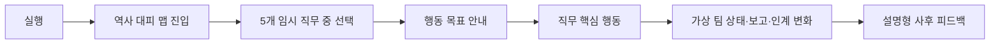
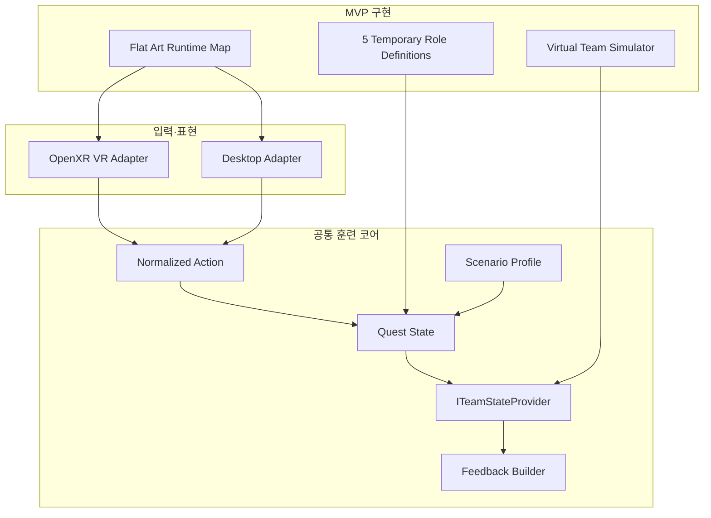
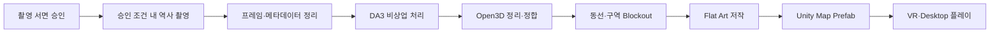
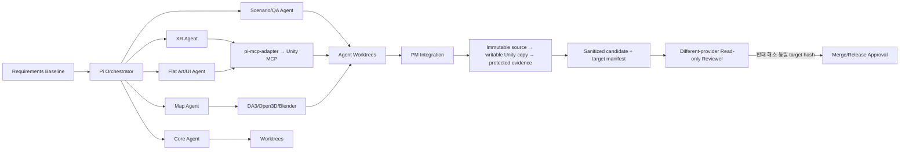

# choo guard Platform Architecture v4.2

> 대회 MVP 중심 아키텍처
>
> 작성일: 2026-09-05 · 상태: Requirements-aligned Baseline · v3 대체

## 0. 결론

v4는 KORAIL 운영환경을 미리 가정하지 않는다. 대회 MVP에서 검증할 것은 다음 한 문장이다.

> **사전 승인된 역사 촬영 자료로 만든 Flat Art 맵에서, 사용자가 자유롭게 직무를 선택하고 VR 또는 Desktop으로 핵심 행동을 수행하며 가상 팀의 상태 변화와 설명형 피드백을 경험한다.**

MVP는 실제 멀티플레이, 공식 점수, 전용 서버, SSO·LMS, 폐쇄망 배포를 구현하지 않는다. 해당 항목은 KORAIL 회신 후 운영판 아키텍처에서 결정한다.

## 1. 범위 분리

| 구분 | 대회 MVP | 운영판 |
|---|---|---|
| 맵 | 승인된 역사 촬영 → DA3·Open3D → Flat Art 플레이 맵 | 실제 도면·촬영·설비·치수를 KORAIL 기준으로 검수 |
| 역할 | 5개 임시 역할, 자유 선택 | 실제 직무 체계와 권한을 KORAIL 답변으로 확정 |
| 싱글 | 다른 직무 절차를 단순화 | 실제 매뉴얼에 따라 단순화 허용 범위 재검토 |
| 멀티 | 가상 팀 상태로 협업 흐름 시연 | 실제 네트워크·세션 규모·권위 구조를 폐쇄망 조건에 맞게 설계 |
| 클라이언트 | Unity VR + Desktop | 기준 HMD·PC·OS에 맞춰 지원 범위 확정 |
| 평가 | 설명형 행동 피드백 | 승인 매뉴얼 기반 점수·이수 여부 검토 |
| 배포 | 개발 PC의 시연 빌드 | 폐쇄망·내부망·독립 PC 중 KORAIL 답변으로 확정 |

## 2. MVP 사용자 흐름



### 대표 직무

대표 직무 한 개는 위 전체 흐름을 완주한다.

### 나머지 네 직무

- 각 직무의 차이를 보여 주는 핵심 행동 한 개를 구현한다.
- 해당 행동은 VR과 Desktop에서 동작한다.
- 모든 직무를 완전한 별도 시나리오로 확장하지 않는다.

## 3. 런타임 구조



### 모듈

```text
ChooGuard.Contracts       Role, Action, Quest, Feedback DTO
ChooGuard.Simulation      입력 검증, 퀘스트 상태, 가상 팀 상태
ChooGuard.Scenarios       역사 대피 ScenarioProfile, 임시 5직무 데이터
ChooGuard.XR              OpenXR·XRI 입력 어댑터
ChooGuard.Desktop         키보드·마우스 입력 어댑터
ChooGuard.Presentation    Flat Art 환경, 역할 UI, 팀 상태, 피드백
ChooGuard.Maps            런타임 맵·Anchor·Zone 조회
ChooGuard.Evidence        이벤트·성능·시연 증거 기록
ChooGuard.Editor          맵·시나리오 import 및 검증 도구
```

### 공통 행동 계약

VR과 Desktop은 직접 퀘스트 상태를 바꾸지 않고 동일한 행동 계약을 제출한다.

```csharp
public readonly record struct TrainingAction(
    string AttemptId,
    string ScenarioVersion,
    string RoleId,
    string PreStateHash,
    string ActionId,
    string TargetAnchorId,
    InputModality Modality); // VR | Desktop

public interface ITrainingActionHandler
{
    ActionResult Submit(in TrainingAction action);
}
```

수용 기준은 입력 장치의 동일성이 아니다. 같은 `ScenarioVersion / RoleId / PreStateHash / ActionId / TargetAnchorId` 조건에서 VR과 Desktop이 같은 기대 Quest 상태·가상 팀 이벤트·피드백 의미를 만드는지 비교한다.

판정 데이터는 다음 고정 fixture를 사용한다.

```text
RoleActionFixture
 ├─ roleId
 ├─ representative
 ├─ scenarioVersion
 ├─ actionId
 ├─ targetAnchorId
 ├─ preStateHash
 ├─ expectedQuestState
 ├─ expectedVirtualTeamEvents[]
 └─ expectedFeedbackCode
```

대표 직무는 VR·Desktop 전체 흐름 2개 경로를, 나머지 네 직무는 각각 VR·Desktop 핵심 행동 8개 경로를 검증한다. 가상 팀 상태는 단순히 ‘변화함’이 아니라 fixture에 정의된 상태·보고·인계 이벤트와 일치해야 한다.

## 4. 싱글과 멀티의 경계

### MVP 싱글

- 선택한 직무의 핵심 행동만 사용자에게 요구한다.
- 다른 직무의 실제 조작은 생략한다.
- NPC가 퀘스트 행동을 대신하지 않는다.
- 팀 상태는 사용자 행동에 대한 규칙 기반 반응으로 바뀐다.

### MVP 멀티 시연

`ITeamStateProvider`의 MVP 구현은 `VirtualTeamSimulator`다.

```text
사용자 행동
  → 사전 정의된 팀 이벤트
  → 다른 직무 상태 변경
  → 보고·인계 UI 갱신
  → 설명형 피드백
```

실제 소켓, Relay, 전용 서버, 동기화는 사용하지 않는다.

### 운영판 확장점

KORAIL이 실제 멀티플레이를 요구하면 `ITeamStateProvider` 뒤에 네트워크 구현을 추가한다. 다음은 현재 미결정이다.

- 한 세션의 실제 인원
- LAN·내부망·전용 서버 여부
- 호스트 또는 서버 권위
- 재접속·역할 인계
- 방화벽·포트·지연 요구
- 훈련 로그 저장 위치

## 5. 콘텐츠 구조

```text
ScenarioProfile
 ├─ scenarioId: station-evacuation-demo
 ├─ provisional: true
 ├─ disclaimer: KORAIL 검증 전 예시
 ├─ mapId
 ├─ representativeRoleId
 ├─ roles[5]
 ├─ virtualTeamRules[]
 └─ feedbackRules[]

RoleDefinition
 ├─ roleId
 ├─ temporaryDisplayName
 ├─ briefing
 ├─ coreAction
 ├─ targetAnchor
 ├─ virtualHandoff
 └─ feedback
```

- 직무 수는 다섯 개로 유지한다.
- 명칭·책임·행동·인계 순서는 데이터로 분리한다.
- 이미 구현된 행동 종류 안에서는 역할 명칭·설명·행동 매핑·인계 규칙을 데이터로 교체한다. 새로운 행동 종류가 필요하면 요구사항 변경 영향 분석 후 코드를 수정한다.
- 공식 매뉴얼을 받기 전에는 실제 절차 또는 공식 평가라고 표시하지 않는다.

## 6. 맵 제작 파이프라인



### 필수 경계

1. 촬영 서면 승인 전에는 역사 촬영을 시작하지 않는다.
2. 승인서는 구역·기기·시간·용도·저장 위치·외부 공개 범위를 포함해야 한다.
3. 원본 촬영물과 중간 결과의 저장 위치는 KORAIL 정책 확인 전 임의 확정하지 않는다.
4. 공개 GitHub에는 승인되지 않은 원본·중간 결과·메타데이터를 올리지 않는다.
5. 촬영물·맵·스크린샷·도구 출력은 별도 자료 전송 승인이 없으면 외부 모델·MCP·API로 보내지 않는다. 공개 전 정제는 모델 전송 승인을 대신하지 않는다.
6. DA3 실행 전 체크포인트 ID·리비전·가중치 해시·라이선스 URL·필수 고지와 대회 이용 조건의 비상업 적합성을 기록한다.
7. CC BY-NC 4.0 DA3 가중치는 확인된 비상업 시연에만 사용한다.
8. 운영판 전환 시 권리자 서면 허가 또는 허용 가능한 대체 모델을 요구한다.

### MVP 맵 기준

- 출입구·주요 구역·대피 동선의 연결관계가 플레이에 사용된다.
- 맵은 VR·Desktop 양쪽에서 동일한 Anchor ID를 사용한다.
- 고정밀 치수와 실제 안전설비 위치는 운영판 검수 항목이다.
- DA3 처리 자체를 사용자에게 별도 기능으로 노출하지 않는다.

## 7. 피드백과 증거

MVP는 공식 점수를 계산하지 않는다.

```text
AttemptEvidence
 ├─ attemptId
 ├─ buildHash
 ├─ mapHash
 ├─ scenarioVersion
 ├─ roleId
 ├─ modality
 ├─ acceptedActions[]
 ├─ missedActions[]
 ├─ virtualTeamEvents[]
 ├─ feedback[]
 └─ performanceSampleRef
```

피드백 예시:

- 수행한 핵심 행동
- 누락된 안내 단계
- 행동 후 변경된 팀 상태
- 공식 매뉴얼 검수 전 예시라는 표시

## 8. 성능

MVP는 숫자를 합격 게이트로 사용하지 않지만 다음을 측정한다.

- 실행 장비 CPU·GPU·RAM·OS·HMD
- 평균·중앙·95백분위 프레임시간
- 최저·평균 FPS
- 메모리 사용량과 GC 할당
- 대표 직무 전체 흐름 중 측정 구간

KORAIL 장비 정보를 받으면 별도 NFR로 최소 사양과 품질 프로필을 정의한다.

## 9. AI-native 개발 제어면

제품 런타임과 개발 에이전트 제어면을 분리한다.



상세 권한·모델·기록 정책은 `choo-guard-ai-native-pipeline-v1.md`를 따른다. 검증기는 불변 통합 소스에서 격리된 쓰기 가능 Unity 실행 사본을 만들고, 생성 폴더·빌드·임시 로그만 그 사본에 쓴다. 확정 결과는 작성 에이전트가 수정·삭제할 수 없는 증거 경로에 보존한다.

## 10. 테스트 전략

### EditMode

- `TrainingAction` 검증
- 역할 데이터 로딩
- Quest 상태 전이
- 가상 팀 규칙
- VR·Desktop 입력 정규화 결과의 동일성
- provisional 경고 표시 조건

### PlayMode

- 맵 로딩과 Anchor 조회
- 대표 직무 전체 흐름
- 나머지 네 직무의 핵심 행동
- 역할 선택과 전환
- 가상 팀 상태 UI
- 사후 피드백 화면

### 실제 기기

- OpenXR 입력
- 이동·도달 가능성
- UI 가독성
- 대표 직무 전체 흐름의 조작성
- 나머지 네 직무 핵심 행동의 VR 조작성
- 프레임·메모리 측정

### 독립 검토

- 작성 에이전트와 다른 모델 제공자·모델을 반드시 사용
- 검토 전체를 읽기 전용으로 수행
- 요구사항 ID별 구현·테스트·증거 추적
- PM 통합 커밋, 빌드, 맵, 테스트와 검토 입력의 해시가 manifest에서 일치하는지 확인
- 반대가 남아 있거나 검토 후 해시가 바뀌면 완료 차단 및 영향 테스트·재검토

## 11. MVP 완료 정의

1. `choo-guard-requirements-baseline-v1.md`의 P0와 P1 필수 기준을 모두 만족한다.
2. 대표 직무의 VR·Desktop 전체 흐름 2개 경로가 fixture 기대값과 일치한다.
3. 나머지 네 직무의 VR·Desktop 핵심 행동 8개 경로가 fixture 기대값과 일치한다.
4. 가상 팀 상태·보고·인계가 사전 정의된 기대 이벤트와 일치한다.
5. 플레이 맵이 승인 촬영 자료의 처리 이력과 연결된다.
6. 공식 점수를 제공하지 않고 provisional 표시가 보인다.
7. 필수 EditMode·PlayMode·Standalone·실제 HMD 검증이 실행되어 통과한다.
8. 화면·성능·라이선스·정제 기록·독립 리뷰 증거가 통합 manifest에 연결된다. 성능 수치는 합격선이 아니지만 측정 증거는 필수다.
9. 공개 후보 target manifest는 독립 리뷰 전에 고정된다. 독립 검토와 최종 승인 영수증은 같은 target manifest 해시를 참조하며 대상 manifest에 소급 삽입하지 않는다.

## 12. 요구사항 추적 기준

| 요구사항 | 아키텍처 | 주요 백로그 | 완료 증거 |
|---|---|---|---|
| FR-03~05, RUN-01 | §2·3·10·11 | M2-02, M2-03, M4-02, M4-03, M5-01, M5-02 | 대표 2개 완주 경로, 나머지 8개 행동 경로, fixture 기대값 일치 |
| FR-07~08 | §4 | M2-04, M4-04 | 사용자 행동→기대 가상 팀 이벤트, NPC·네트워크 비의존 |
| FR-09~10 | §5·7 | M2-03, M4-01, M4-04 | 공식 점수 부재, 설명형 피드백, provisional 표시 |
| MAP-01~06 | §6 | M0-02a·b, M3-01~04, M5-04 | 승인 조건, 입력→처리→플레이 맵 해시 연결 |
| MAP-07 | §6 | M0-03, M3-03, M5-04 | 체크포인트·리비전·가중치 해시·라이선스·이용 조건·고지 |
| RUN-04 | §8 | M5-02, M5-04 | 장비·측정 구간·프레임·프레임시간·메모리 기록 |
| AI-native 통제 | §9·10·11 | M0-03, M1-01~07, M5-04→M5-03→M5-05 | 권한 우회 테스트, 불변 소스·쓰기 가능 실행 사본·보호 증거, 공개 후보 target manifest, 독립 검토·승인 영수증 |

검토 대상 해시가 바뀌면 해당 행의 테스트·검토·승인을 다시 수행한다.

## 13. 운영판 결정 게이트

다음 답변을 받기 전에는 운영판 아키텍처를 확정하지 않는다.

- 실제 직무·매뉴얼·평가 기준
- 촬영·도면·보안자료 제공 범위
- 원본·중간·정제 데이터 저장·반출 정책
- 폐쇄망 실행 위치와 외부 의존성 허용 여부
- PC·서버·VR 장비 사양과 수량
- 실제 동시 사용자와 내부 네트워크 제약
- 설치·업데이트·보안검토·로그 정책

## 14. v3 폐기 사유

v3는 조직 전개형 운영판을 선행 설계하면서 NPC, 실제 네트워크 멀티플레이, 전용 서버, SSO·LMS, 72 FPS 게이트를 사실상 전제로 삼았다. 사용자 역질의 결과 이 항목들은 MVP 요구와 다르거나 KORAIL 회신 전 확정할 수 없음이 확인되었다. 따라서 v3는 이력으로만 남기고 구현 기준으로 사용하지 않는다.
