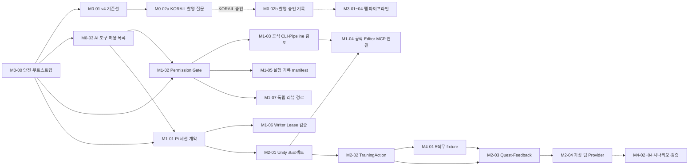

# choo guard 작업 단위 그래프 v1.0

> Foundation 결과물은 임시 맵·3D 오브젝트·싱글플레이 비상대응 시나리오가 연결된 실제 게임이다. 공통 소스/검사는 내부 기반이며 [첫 playable 완료 기준](choo-guard-foundation-v1.md)을 적용한다.
> 현행 소스 착수 경로: [Foundation 개발 기준](choo-guard-foundation-v1.md). 2026-09-06 사용자 지시에 따라 KORAIL 비의존 합성 코드·데이터·mock 개발을 병렬로 진행한다. 아래 통합/도구 그래프를 그 소스 작성의 전역 차단 조건으로 해석하지 않는다. 실제 도구 실행·자료 취급·최종 검증 조건은 각 범위에 유지한다.

- 목적: 백로그 v1.3의 작업 단위를 그래프 노드로, 선행 관계를 간선으로 고정하고, 각 노드에 실행 머신·워크플로·리뷰어·증거 경로를 붙인다.
- 예정 실행 엔진은 pi-agents 워크플로(`.pi/workflows/`)다. 코드 단위의 현 `wu-develop`은 scout → implementer → adversarial-review → 수정·재검토 → verifier 순서다. 초기 검토와 최대 3회 수정 루프는 총 3라운드 목표와 다르며 미승인 verifier 진입도 차단·시험해야 한다.
- 문서 단위의 목표 경로는 `plan-review`다. 현재 YAML은 실패 차단·라운드·판정 저장 결함으로 운영 보류다. 아래 그래프는 예정 의존성이지 실행·승인 완료 기록이 아니다.

## 1. 그래프

실선은 저장소 안에서 검증 가능한 선행 관계, 점선은 외부 승인 또는 실물 자원(HMD, 촬영)이 필요한 관계다.

## 2. 노드 표

| 노드 | 머신 | 워크플로 | 작성자 | 리뷰어(제공자) | 검증 | 증거 |
|---|---|---|---|---|---|---|
| M0-00 | local + school-pc | plan-review(명세) → 사람 실행 | 사람(PM) | spec/adversarial/safety (openai-codex) | 두 머신의 FR-001~003 사람 분류·위생·OS 점검, 전체 정책 해시·소유권·승인 기록. 현 영수증만으로 통과 불가 | `docs/evidence/M0-00/` |
| M0-01 | local | plan-review(문서, 운영 보류) | implementer(anthropic) | 3 리뷰어 | 링크 검사 | `docs/evidence/M0-01/` |
| M0-02a | local | plan-review(문서, 운영 보류) | implementer | 3 리뷰어 + PM 체크리스트 | 질문 추적·합성 입력 사람 확인·전송 및 변경 부정 시험 | `docs/evidence/M0-02a/` |
| M0-03 | local | plan-review(문서, 운영 보류) | implementer | 3 리뷰어 | 해시·라이선스 표 | `docs/evidence/M0-03/` |
| M1-02 | local + school-pc | wu-develop | implementer | 3 리뷰어 | 명세 004 FR-008의 보호 대상·우회 경로 BT 매트릭스 | `docs/evidence/M1-02/` |
| M1-03 | local | plan-review(검토 문서, 운영 보류) | implementer | safety-auditor 가중 | 공급망 표 | `docs/evidence/M1-03/` |
| M1-05 | local | wu-develop | implementer | 3 리뷰어 | manifest 스키마 검증 | `docs/evidence/M1-05/` |
| M1-01 | school-pc | wu-develop | implementer | 3 리뷰어 | Pi 버전·세션 계약·Writer Lease 기준선 | `docs/evidence/M1-01/` |
| M1-06 | school-pc | wu-develop | implementer | 3 리뷰어 | Writer Lease 충돌 테스트 | `docs/evidence/M1-06/` |
| M1-07 | local | wu-develop | implementer | 3 리뷰어 + Codex CLI 비교 | 제공자 우회 차단 테스트 | `docs/evidence/M1-07/` |
| M1-04 | school-pc | wu-develop | implementer | safety-auditor 가중 | 공식 unity mcp + Pipeline 연결 스모크 | `docs/evidence/M1-04/` |
| M2-01 | school-pc | wu-develop | implementer | 3 리뷰어 | EditMode 테스트 | `docs/evidence/M2-01/` |
| M2-02 | school-pc | wu-develop | implementer | 3 리뷰어 | 계약 테스트 | `docs/evidence/M2-02/` |
| M4-01 | local + school-pc | wu-develop | implementer | 3 리뷰어 | fixture 스키마 검증 | `docs/evidence/M4-01/` |
| M2-03 | school-pc | wu-develop | implementer | 3 리뷰어 | PlayMode 테스트 | `docs/evidence/M2-03/` |
| M2-04 | school-pc | wu-develop | implementer | 3 리뷰어 | PlayMode 테스트 | `docs/evidence/M2-04/` |

## 3. 실행 규칙

1. 노드는 선행 노드의 PR이 develop에 병합된 뒤에만 시작한다. 병합 전 병렬 착수는 PM이 명시적으로 허용한 경우만.
2. 한 노드는 한 `feature/<unit>` 브랜치, 한 PR. PR 본문에 명세 경로·백로그 ID·증거 경로·판정 파일을 적는다.
3. 리뷰어는 작성자와 다른 제공자를 사용해야 한다. 실제 pi-agents 호출에서 modelScope·watchdog이 적용되는지는 M1-07 검증 전까지 미확인이다.
4. 필수 관점 오류·누락은 `cannot_proceed`다. 총 3라운드 목표와 현 초기 리뷰+최대 3회 재검토의 불일치를 해소해야 한다. 상한 도달도 승인으로 전환하지 않는다. 사람의 수정·반박 뒤 새 대상 manifest로 독립 재검토하고, 그전에는 영향 노드를 시작하지 않는다. 현재 YAML의 오류 수집·나머지 결과 승인 동작은 이 요구와 충돌하므로 운영 사용을 보류한다.
5. 학교 PC 노드는 Unity Editor 쓰기 에이전트를 하나만 둔다.

## 변경 이력

| 버전 | 날짜 | 내용 |
|---|---|---|
| 1.0 | 2026-09-06 | 최초 작성. M1-04 배치는 analysis F-05 참조 |

## 상시 현장 모드 추가 (2026-09-07)

- [FND-05 #59](https://github.com/xrlab-dau/CHOOGuard/issues/59): 동일 NPC 순회·직접 인솔·도착/복구.
- [FND-06 #60](https://github.com/xrlab-dau/CHOOGuard/issues/60): 평상시 운영 → 불시 사건 → 관측/조건부 대응 → 복기/복구 → 다음 사건. 기본 선택형 드릴 흐름을 대체한다.
- 공간·매뉴얼·운영 데이터의 실제 대조와 현장 전이 검증은 [상시 현장 설계의 검증 범위](choo-guard-open-world-training.md)를 따른다. 합성 완료와 자동 시험만으로 디지털 트윈·현장 효용 또는 Done을 선언하지 않는다.
