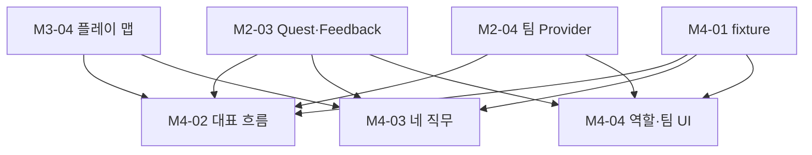

# choo guard 작업 단위 그래프 v1.1

> Foundation 결과물은 임시 맵·3D 오브젝트·싱글플레이 비상대응 시나리오가 연결된 실제 게임이다. 공통 소스/검사는 내부 기반이며 [첫 playable 완료 기준](choo-guard-foundation-v1.md)을 적용한다.
> 현행 소스 착수 경로: [Foundation 개발 기준](choo-guard-foundation-v1.md). 2026-09-06 사용자 지시에 따라 KORAIL 비의존 합성 코드·데이터·mock 개발을 병렬로 진행한다. 아래 통합/도구 그래프를 그 소스 작성의 전역 차단 조건으로 해석하지 않는다. 실제 도구 실행·자료 취급·최종 검증 조건은 각 범위에 유지한다.

- 목적: 현행 백로그의 작업 단위를 그래프 노드로, 선행 관계를 간선으로 고정하고, 각 노드에 실행 머신·워크플로·리뷰어·증거 경로를 붙인다.
- 예정 실행 엔진은 pi-agents 워크플로(`.pi/workflows/`)다. 코드 단위의 현 `wu-develop`은 scout → implementer → adversarial-review → 수정·재검토 → verifier 순서다. 초기 검토와 최대 3회 수정 루프는 총 3라운드 목표와 다르며 미승인 verifier 진입도 차단·시험해야 한다.
- 문서 단위의 목표 경로는 `plan-review`다. 현재 YAML은 실패 차단·라운드·판정 저장 결함으로 운영 보류다. 아래 그래프는 예정 의존성이지 실행·승인 완료 기록이 아니다.

## 1. 정확한 선행 관계

정정 단위: **R-07-GRAPH**, #52 항목 8. 기준 커밋은 `e7a6bb7a7fff0c301c04f93aeea8850dbde34779`이다. 검증기 구현과 별도의 문서 변경·대상 manifest로 검토한다. 기존 집계 노드·간선은 아래 개별 노드 표로 대체한다.

[현행 백로그](choo-guard-execution-backlog-v1.md)의 각 `선행` 항목을 전개한 **실제 통합·완료 검증 관계**다. `명시 없음`은 입력·권한·DoD 면제가 아니다. 백로그에 없는 추가 선행 간선을 만들지 않는다. 승인된 합성 소스·mock 병렬 착수는 문서 상단의 기존 사용자 결정을 따른다.

| 작업 | 선행 노드 | 추가 조건 또는 입력 |
|---|---|---|
| M0-00 · 사람 주도 안전 부트스트랩 | 명시 없음 | 명시 없음; 작업 입력·권한·DoD 적용 |
| M0-01 · v3 폐기와 v4 기준선 등록 | 명시 없음 | 명시 없음; 작업 입력·권한·DoD 적용 |
| M0-02a · KORAIL 촬영 승인 질문 준비 | 명시 없음 | 명시 없음; 작업 입력·권한·DoD 적용 |
| M0-02b · KORAIL 촬영 서면 승인 수신 | M0-02a | M0-02a |
| M0-03 · AI 도구·검토·승인 허용목록 | 명시 없음 | 명시 없음; 작업 입력·권한·DoD 적용 |
| M1-01 · Pi 버전·세션 계약·Writer Lease 기준선 | M0-00, M0-03 | M0-00, M0-03 |
| M1-02 · Permission Gate와 실행 경계 | M0-00, M0-03 | M0-00, M0-03 |
| M1-03 · 공식 Unity CLI·Pipeline 공급망·호출 경로 검토 | M0-03, M1-02 | M0-03, M1-02 |
| M1-04 · 공식 Unity Editor MCP 연결 | M1-03, M2-01 | M1-03, M2-01 |
| M1-05 · 실행 기록·정제·공개 manifest | M0-00, M0-03 | M0-00, M0-03 |
| M1-06 · Agent Team 세션·Writer Lease 검증 | M1-01, M1-02 | M1-01, M1-02 |
| M1-07 · 외부 검증기·독립 리뷰 경로 | M0-00, M0-03, M1-02 | M0-00, M0-03, M1-02 |
| M2-01 · Unity 프로젝트·패키지 기준선 | M1-02, M1-07 | M1-02, M1-07 |
| M2-02 · 공통 TrainingAction 계약 | M2-01 | M2-01 |
| M2-03 · Quest·Feedback 역할 연동 | M2-02, M4-01 | M2-02, M4-01 |
| M2-04 · 가상 팀 상태 Provider | M2-02, M4-01 | M2-02, M4-01 |
| M3-01 · 촬영 계획·체크리스트 | M0-02b | M0-02b 서면 승인 |
| M3-02 · 승인 역사 촬영 | M3-01 | M3-01 |
| M3-03 · DA3·Open3D 처리 | M3-02, M0-03, M1-02, M1-03 | M3-02, M0-03, M1-02~03의 해당 실행 프로파일 차단 시험 PASS, 자료 권위자의 접근·전송 범위 확인 |
| M3-04 · Station Art 플레이 맵 | M3-03, M1-04 | M3-03, M1-04의 Unity/Blender 해당 경로 시험 PASS |
| M4-01 · 임시 5직무·판정 fixture 정의 | 명시 없음 | 명시 없음; 작업 입력·권한·DoD 적용 |
| M4-02 · 대표 직무 전체 흐름 | M2-03, M2-04, M3-04, M4-01 | M2-03, M2-04, M3-04, M4-01 |
| M4-03 · 나머지 네 직무 핵심 행동 | M2-03, M3-04, M4-01 | M2-03, M3-04, M4-01 |
| M4-04 · 역할·팀·피드백 UI | M2-03, M2-04, M4-01 | M2-03, M2-04, M4-01 |
| M5-01 · 자동 테스트 세트 실행 | M1-07, M4-02, M4-03, M4-04 | M1-07, M4-02~04 |
| M5-02 · 실제 HMD·성능 검증 | M4-02, M4-03, M4-04, M5-01 | M4-02~04, M5-01 |
| M5-03 · 독립 에이전트 검토 | M1-07, M5-04 | M1-07, M5-04의 불변 공개 후보 target manifest 고정, PM 통합 커밋 고정 |
| M5-04 · 시연 증거·공개 후보 패키지 | M3-03, M3-04, M5-01, M5-02 | M3-03~04, M5-01~02 |
| M5-05 · 최종 빌드·발표 승인 | M5-03, M5-04 | M5-03 PASS, M5-04 target manifest 고정 |

M3-03의 자료 권위자 접근·전송 범위 확인, M3-04의 해당 도구 경로 시험, M5-03의 PM 통합 커밋 고정은 노드 완료로 대체할 수 없다. M5-03 검토 영수증을 M5-04 공개 후보 manifest에 소급 삽입하지 않는다.

다음은 오류가 있었던 콘텐츠 연결의 발췌다. 모든 화살표는 내부 작업 의존성이다. 외부 승인·HMD 조건과 전체 관계는 위 표 및 백로그 본문을 따른다.

## 2. 실행·증거 메타데이터

작성자·필수 검토 관점·머신·실제 도구 실행 조건은 각 백로그 작업과 최신 GitHub 이슈를 따른다. 위 표는 담당자·머신·실행을 새로 승인하지 않는다. 기본 증거 위치는 `docs/evidence/<작업 ID>/`다. 실제 관측 없이 경로 존재만으로 PASS를 판단하지 않는다.

M4-01의 합성 계약은 `schemas/foundation-scenario.schema.json`, `scripts/foundation/validate.py`, `scripts/foundation/tests/test_validate.py`가 강제한다. 임의 역할·행동·Anchor ID와 `provisional=false`를 거부한다. 이 검사 통과는 대표 역할 전체 흐름·네 직무 행동·실제 절차를 포함하는 전체 DoD 완료가 아니다.

## 3. 실행 규칙

1. 실제 통합·완료 검증은 위 표와 해당 백로그의 선행 산출물을 확인한다. 합성 소스·mock 병렬 개발은 상단의 기존 사용자 승인 범위를 적용한다.
2. 한 노드는 한 `feature/<unit>` 브랜치, 한 PR. PR 본문에 명세 경로·백로그 ID·증거 경로·판정 파일을 적는다.
3. 리뷰어는 작성자와 다른 제공자를 사용해야 한다. 실제 pi-agents 호출에서 modelScope·watchdog이 적용되는지는 M1-07 검증 전까지 미확인이다.
4. 필수 관점 오류·누락은 `cannot_proceed`다. 총 3라운드 목표와 현 초기 리뷰+최대 3회 재검토의 불일치를 해소해야 한다. 상한 도달도 승인으로 전환하지 않는다. 사람의 수정·반박 뒤 새 대상 manifest로 독립 재검토하고, 그전에는 영향 노드를 시작하지 않는다. 현재 YAML의 오류 수집·나머지 결과 승인 동작은 이 요구와 충돌하므로 운영 사용을 보류한다.
5. 학교 PC 노드는 Unity Editor 쓰기 에이전트를 하나만 둔다.

## 변경 이력

| 버전 | 날짜 | 내용 |
|---|---|---|
| 1.0 | 2026-09-06 | 최초 작성. M1-04 배치는 analysis F-05 참조 |
| 1.1 | 2026-09-08 | R-07-GRAPH: 29개 개별 노드, M5-01~05 추가, 백로그 선행 관계 전개, 집계 간선·점선 범례 정정. 실행 승인·독립 검토 상태는 갱신하지 않음 |

## 상시 현장 모드 추가 (2026-09-07)

- [FND-05 #59](https://github.com/xrlab-dau/CHOOGuard/issues/59): 동일 NPC 순회·직접 인솔·도착/복구.
- [FND-06 #60](https://github.com/xrlab-dau/CHOOGuard/issues/60): 평상시 운영 → 불시 사건 → 관측/조건부 대응 → 복기/복구 → 다음 사건. 기본 선택형 드릴 흐름을 대체한다.
- 공간·매뉴얼·운영 데이터의 실제 대조와 현장 전이 검증은 [상시 현장 설계의 검증 범위](choo-guard-open-world-training.md)를 따른다. 합성 완료와 자동 시험만으로 디지털 트윈·현장 효용 또는 Done을 선언하지 않는다.
